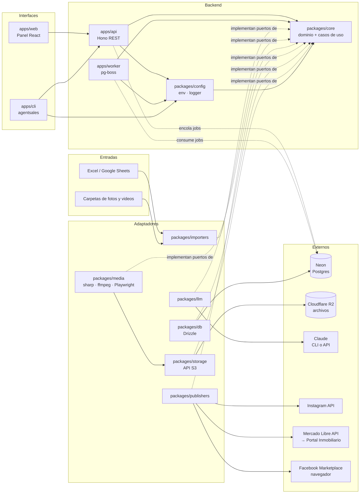
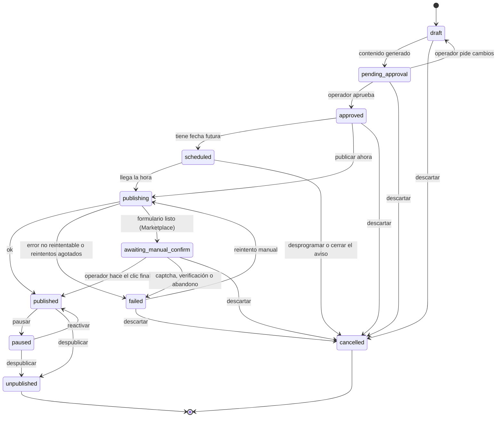

# 01 · Arquitectura

## Vista general



## Estilo: puertos y adaptadores

- `packages/core` contiene el **dominio**: entidades, esquemas zod, máquina de estados y casos de uso. No importa librerías de infraestructura.
- Core define **puertos** (interfaces): `ListingRepository`, `MediaStorage`, `LLMProvider`, `Publisher`, `Importer`, `JobQueue`.
- Los demás paquetes son **adaptadores** que implementan esos puertos.
- Las apps (`api`, `worker`, `cli`, `web`) solo **componen** adaptadores y llaman casos de uso.

Esto permite cambiar Claude CLI por la API de Anthropic, o agregar una plataforma nueva, sin tocar el dominio.

## Estructura del monorepo

```
agentsales/
├── apps/
│   ├── api/          Hono REST API; tipos exportados para el cliente RPC
│   ├── web/          React + Vite + Tailwind; panel de operación
│   ├── cli/          CLI `agentsales` (commander); usa el cliente RPC de la API
│   └── worker/       Procesa jobs: medios, contenido, publicación, sincronización
├── packages/
│   ├── core/         Dominio, esquemas zod, estados, casos de uso, puertos
│   ├── db/           Esquema Drizzle, migraciones, repositorios
│   ├── storage/      Archivos en Cloudflare R2 (API S3): subir, leer, borrar, URLs prefirmadas
│   ├── importers/    xlsx, google-sheets, carpetas de medios
│   ├── llm/          Proveedores: claude-cli, anthropic-api, fake
│   ├── media/        Procesamiento de imagen/video y render de plantillas
│   ├── templates/    Plantillas HTML/CSS de posts (portada, ficha, etc.)
│   ├── publishers/   instagram, mercadolibre, fb-marketplace
│   └── config/       Variables de entorno validadas (zod), logger pino y redactor de secretos
├── docs/             Documentación (esta carpeta)
├── data/             Plantillas y datos de prueba (los datos reales no van a git)
└── .claude/          Configuración de Claude Code: skills y subagentes
```

Los paquetes se crean **cuando la fase que los necesita comienza**, no antes (ver `06-roadmap.md`).

## Flujos principales

### 1. Carga

```
Excel + carpetas → importer valida contra field_definitions
  → upsert de listings (idempotente por broker + external_ref)
  → sube medios originales a R2 → registra media
  → import_run con reporte de errores por fila
```

### 2. Preparación de contenido (job `content.prepare`)

```
listing → media: normaliza, recorta por formato, elige portada
        → templates: renderiza portada y ficha técnica (PNG)
        → video: reel 9:16 (recorte + tope 90 s)
        → llm: genera textos por plataforma (JSON validado con zod)
        → crea contents y publications en estado pending_approval
          (o approved si el corredor tiene auto_publish)
```

### 3. Publicación (job `publication.publish`)

```
publication approved/scheduled → worker toma el job
  → publisher.validate() → publisher.publish()   (o dry-run)
  → guarda external_id/url → estado published
  → error reintentable: pg-boss reintenta con backoff; la publicación sigue en
    publishing (sube attempts y se registra un publish_attempt)
  → error no reintentable o reintentos agotados: failed
  → cada transición queda en publication_events
```

### 4. Seguimiento (job `publication.sync`, periódico)

```
publicaciones activas → publisher.getStatus() → actualiza estado
listing cerrado (vendido/arrendado) → publisher.unpublish() en todas
```

## Máquina de estados de una publicación



Para Marketplace (semiautomático) existe además `awaiting_manual_confirm` entre `publishing` y `published`: el formulario queda listo y el operador hace el clic final. Si aparece un captcha o una verificación, el sistema se detiene y la publicación pasa a `failed` (ADR-0004).

Estados iniciales (`INITIAL_PUBLICATION_STATUSES`): una publicación se crea en `draft`, en `pending_approval` (flujo normal: el contenido ya está generado) o en `approved` (corredor con `auto_publish`).

Estados terminales (`TERMINAL_PUBLICATION_STATUSES`): `unpublished` (estuvo en la plataforma y se bajó) y `cancelled` (nunca llegó a la plataforma). Todos los demás cuentan como **activos** (`ACTIVE_PUBLICATION_STATUSES`), incluido `failed`; por eso un `failed` se reintenta o se cancela antes de crear otra publicación del mismo aviso en la misma cuenta.

`transition()` no conoce la plataforma: el caso de uso solo lleva a `awaiting_manual_confirm` a publishers con `capabilities.manualStep`, y solo pausa en plataformas que lo soportan.

La máquina de estados vive en `packages/core` (`PUBLICATION_TRANSITIONS`, `canTransition`, `transition`) como función pura con tests: toda transición inválida lanza `AppError("INVALID_TRANSITION")`.

## Contrato de un Publisher

```ts
interface Publisher {
  platform: Platform;
  capabilities: { carousel: boolean; video: boolean; unpublish: boolean; statusSync: boolean; manualStep: boolean };
  validate(input: PublishInput): ValidationResult;          // requisitos de la plataforma
  publish(input: PublishInput, account: PlatformAccount): Promise<PublishResult>;
  unpublish(ref: ExternalRef, account: PlatformAccount): Promise<void>;
  getStatus(ref: ExternalRef, account: PlatformAccount): Promise<ExternalStatus>;
}
```

Con `PUBLISH_MODE=dry-run`, un decorador envuelve cualquier publisher: ejecuta `validate()`, registra lo que *habría* enviado y devuelve un resultado simulado.

## Contrato de almacenamiento de archivos

```ts
interface MediaStorage {
  put(path: string, body: Uint8Array, contentType: string): Promise<void>;   // sobrescribe
  get(path: string): Promise<Uint8Array>;                                     // STORAGE_NOT_FOUND si no existe
  head(path: string): Promise<{ size: number; contentType?: string } | null>; // null si no existe
  delete(path: string): Promise<void>;                                        // idempotente
  signedReadUrl(path: string, ttlSeconds?: number): Promise<string>;
}
```

- Implementación: `packages/storage` (Cloudflare R2 vía API S3, ADR-0007).
- Errores como `AppError`: `STORAGE_NOT_FOUND`, `STORAGE_UNAVAILABLE` (reintentable) y `STORAGE_ERROR`.
- Hoy trabaja con archivos completos en memoria; F1 lo amplía con streams para videos grandes.

## Contrato del proveedor de IA

```ts
interface LLMProvider {
  generateStructured<T>(req: { system: string; prompt: string; images?: ImageRef[]; schema: ZodSchema<T> }): Promise<T>;
}
```

- `claude-cli`: invoca `claude -p ... --output-format json` como subproceso. Usa el plan Max. **Solo para uso propio.**
- `anthropic-api`: SDK oficial con `ANTHROPIC_API_KEY`. Obligatorio cuando el sistema lo usen terceros.
- `fake`: respuestas fijas para tests.

Los prompts viven versionados en `packages/llm/prompts/` y cada `content` guarda `prompt_version`.

## Seguridad

- Tokens de plataformas cifrados en reposo con AES-256-GCM. La clave de 32 bytes se deriva de `APP_ENCRYPTION_KEY` con HKDF-SHA256 (se implementa en F3).
- Nunca se loguean tokens, contraseñas ni `.env`.
- El bucket de R2 es privado; se usan URLs prefirmadas de corta duración para que Instagram descargue los medios.
- La base de datos solo acepta conexiones con credenciales y TLS (`sslmode=require`); no se expone ninguna API HTTP de datos.
- Marketplace: la sesión del corredor vive en un perfil de navegador local por corredor; el sistema nunca guarda su contraseña.

## Decisiones

Las decisiones de arquitectura están en `docs/adr/`. Antes de cambiar algo de esta página, se escribe o actualiza un ADR.
