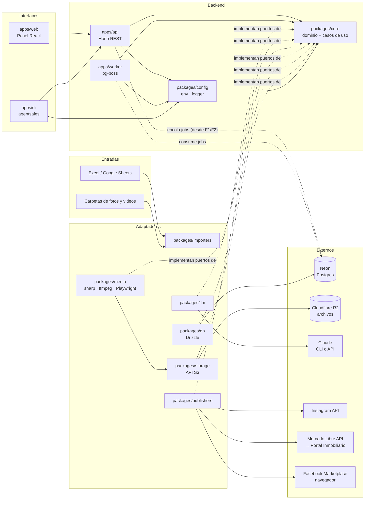
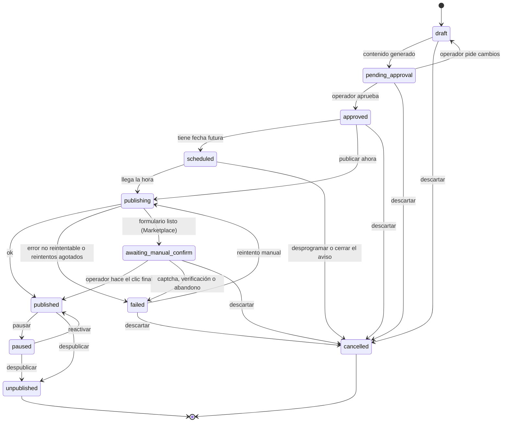

# 01 · Arquitectura

## Vista general



## Estilo: puertos y adaptadores

- `packages/core` contiene el **dominio**: entidades, esquemas zod, máquina de estados y casos de uso. No importa librerías de infraestructura.
- Core define **puertos** (interfaces): repositorios (`ListingRepository` y compañía), `MediaStorage`, `MediaFileSource`, `JobQueue`, `LLMProvider` y `Publisher`. Hoy existen `MediaStorage` y `FieldDefinitionRepository` (`packages/core/src/ports/`); el resto llega en su fase (F1: los demás repositorios, `MediaFileSource` y `JobQueue`).
- Cola (ADR-0005): en F0 el adaptador de pg-boss vive en `apps/worker/src/queue.ts`, porque solo lo usan el worker y su script de prueba. **En F1**, cuando la API empieza a encolar `import.run`, se extrae a `packages/queue` implementando `JobQueue`, y con él `QUEUE_SCHEMA` y `checkQueueSchema` (hoy en `@agentsales/db`). La API, como `producer`, arranca pg-boss de forma diferida en el primer `enqueue`, y su check de `/health` solo consulta que exista el esquema `pgboss`. Ver "Cola de trabajos" más abajo.
- Los demás paquetes son **adaptadores** que implementan esos puertos.
- Las apps (`api`, `worker`, `cli`, `web`) solo **componen** adaptadores y llaman casos de uso.

Esto permite cambiar Claude CLI por la API de Anthropic, o agregar una plataforma nueva, sin tocar el dominio.

## Estructura del monorepo

```
agentsales/
├── apps/
│   ├── api/          Hono REST API; tipos exportados para el cliente RPC
│   ├── web/          React + Vite + Tailwind + TanStack Query + React Router; panel de operación
│   ├── cli/          CLI `agentsales` (commander); usa el cliente RPC de la API
│   └── worker/       Procesa jobs: medios, contenido, publicación, sincronización
├── packages/
│   ├── core/         Dominio, esquemas zod, estados, casos de uso, puertos
│   ├── db/           Esquema Drizzle, migraciones y (desde F1) repositorios
│   ├── storage/      Archivos en Cloudflare R2 (API S3): subir, leer, borrar, URLs prefirmadas
│   ├── importers/    xlsx, google-sheets, carpetas de medios
│   ├── llm/          Proveedores: claude-cli, anthropic-api, fake
│   ├── media/        Procesamiento de imagen/video y render de plantillas
│   ├── templates/    Plantillas HTML/CSS de posts (portada, ficha, etc.)
│   ├── publishers/   instagram, mercadolibre, fb-marketplace
│   └── config/       Variables de entorno validadas (zod), logger pino y redactor de secretos
├── .github/          CI (GitHub Actions)
├── docs/             Documentación (esta carpeta)
├── data/             Plantillas y datos de prueba (los datos reales no van a git)
└── .claude/          Configuración de Claude Code: skills y subagentes
```

Los paquetes se crean **cuando la fase que los necesita comienza**, no antes (ver `06-roadmap.md`).

## Flujos principales

### 1. Carga

```
Excel + carpetas → importer valida contra field_definitions
  → upsert de listings (idempotente por broker + external_ref)
  → sube medios originales a R2 → registra media
  → import_run con reporte de errores por fila
```

### 2. Preparación de contenido (job `content.prepare`)

```
listing → media: normaliza, recorta por formato, elige portada
        → templates: renderiza portada y ficha técnica (PNG)
        → video: reel 9:16 (recorte + tope 90 s)
        → llm: genera textos por plataforma (JSON validado con zod)
        → crea contents y publications en estado pending_approval
          (o approved si el corredor tiene auto_publish)
```

### 3. Publicación (job `publication.publish`)

```
publication approved/scheduled → worker toma el job
  → publisher.validate() → publisher.publish()   (o dry-run)
  → guarda external_id/url → estado published
  → error reintentable: pg-boss reintenta con backoff; la publicación sigue en
    publishing (sube attempts y se registra un publish_attempt)
  → error no reintentable o reintentos agotados: failed
  → cada transición queda en publication_events
```

### 4. Seguimiento (job `publication.sync`, periódico)

```
publicaciones activas → publisher.getStatus() → actualiza estado
listing cerrado (vendido/arrendado) → publisher.unpublish() en todas
```

## Máquina de estados de una publicación



Para Marketplace (semiautomático) existe además `awaiting_manual_confirm` entre `publishing` y `published`: el formulario queda listo y el operador hace el clic final. Si aparece un captcha o una verificación, el sistema se detiene y la publicación pasa a `failed` (ADR-0004).

Estados iniciales (`INITIAL_PUBLICATION_STATUSES`): una publicación se crea en `draft`, en `pending_approval` (flujo normal: el contenido ya está generado) o en `approved` (corredor con `auto_publish`).

Estados terminales (`TERMINAL_PUBLICATION_STATUSES`): `unpublished` (estuvo en la plataforma y se bajó) y `cancelled` (nunca llegó a la plataforma). Todos los demás cuentan como **activos** (`ACTIVE_PUBLICATION_STATUSES`), incluido `failed`; por eso un `failed` se reintenta o se cancela antes de crear otra publicación del mismo aviso en la misma cuenta.

`transition()` no conoce la plataforma: el caso de uso solo lleva a `awaiting_manual_confirm` a publishers con `capabilities.manualStep`, y solo pausa en plataformas que lo soportan.

La máquina de estados vive en `packages/core` (`PUBLICATION_TRANSITIONS`, `canTransition`, `transition`) como función pura con tests: toda transición inválida lanza `AppError("INVALID_TRANSITION")`.

## Contrato de un Publisher

```ts
interface Publisher {
  platform: Platform;
  capabilities: { carousel: boolean; video: boolean; unpublish: boolean; statusSync: boolean; manualStep: boolean };
  validate(input: PublishInput): ValidationResult;          // requisitos de la plataforma
  publish(input: PublishInput, account: PlatformAccount): Promise<PublishResult>;
  unpublish(ref: ExternalRef, account: PlatformAccount): Promise<void>;
  getStatus(ref: ExternalRef, account: PlatformAccount): Promise<ExternalStatus>;
}
```

Con `PUBLISH_MODE=dry-run`, un decorador envuelve cualquier publisher: ejecuta `validate()`, registra lo que *habría* enviado y devuelve un resultado simulado.

## Cola de trabajos

Hoy (F0, `apps/worker/src/jobs/`):
- Cada job se declara con `defineJob({ name, schema, queue, handler })`:
  - **`schema`:** zod valida los datos antes del handler. Los datos vienen de la base, escritos por otro proceso, así que son un borde. Si son inválidos, lanza `JOB_PAYLOAD_INVALID`, que no se reintenta.
  - **`queue`:** política de la cola (`retryLimit`, `retryDelay`, `retryBackoff`, `expireInSeconds`). Solo el worker la aplica al arrancar (`createQueue` + `updateQueue`), así que el código es la fuente de verdad. Los productores no crean colas.
- **Payloads con solo ids** (`publicationId`, `mediaId`…), nunca secretos ni estado. El handler recarga el estado desde la base y verifica `external_id` y `status` antes de actuar, lo que lo hace idempotente (ADR-0005).
- **Errores:**
  - Un `AppError` no reintentable se registra y el job se da por cerrado. El caso de uso ya dejó el estado de dominio, por ejemplo la publicación en `failed`.
  - Cualquier otro error se propaga y pg-boss reintenta según la política.
  - `batchSize: 1`: un fallo nunca repite jobs ajenos.
- Los handlers son delgados: validan, arman dependencias y llaman un caso de uso de `core`. Cuando necesiten db, storage o llm, `JOBS` pasa a `buildJobs(deps)`.

Cuando la API encole (extracción a `packages/queue`):
- **Contrato compartido en `core/src/jobs.ts`:** `JOB_NAMES` como tupla `as const` y `JOB_PAYLOADS`, esquemas zod por nombre. Así la API y el worker comparten el contrato sin repetir literales.
- **Puerto `JobQueue`** en `core/src/ports/job-queue.ts`: `enqueue<N extends JobName>(name: N, data: JobPayload<N>, opts?: { startAfter?: Date; singletonKey?: string }): Promise<string>`.

Política objetivo por cola (cada fase la confirma en su spec):

| Cola | Unicidad | Reintentos | Backoff | Expira |
|---|---|---|---|---|
| `system.ping` (F0) | — | 0 | no | 60 s |
| `import.run` (F1) | `singletonKey = importRunId`; en el último intento deja el run en `failed` | 2 | sí, desde 30 s | 2 h (videos grandes) |
| `media.process` | `singletonKey = mediaId` | 3 | sí, desde 30 s | ~15 min (ffmpeg) |
| `content.prepare` | `singletonKey = listingId` | 2 | sí, desde 60 s | ~10 min (LLM) |
| `publication.publish` | `singletonKey = publicationId`; dead-letter que lleva a `failed` | 3 | sí, desde 60 s | ~5 min (Marketplace termina en `awaiting_manual_confirm`) |
| `publication.sync` | cron, sin solaparse | 1 | no | ~10 min |
| `tokens.refresh` | cron | 3 | sí | ~5 min |

Con el worker apagado (ADR-0007), los jobs con `startAfter` vencido corren al arrancar y los cron del período apagado se pierden. Eso afecta al calendario de F6.

`queue: ok` en `/health` significa que la cola se inicializó alguna vez, **no** que el worker esté corriendo.

## Contratos HTTP compartidos (ADR-0011)

- **Entidades de dominio** (`listing`, `media`, `broker`, `importRun`, `importReport`) y `healthReportSchema`: en `packages/core`.
- **Contratos HTTP:** en la salida `@agentsales/api/contracts` (`apps/api/src/contracts/`). Incluye el cuerpo de error (`errorBodySchema`), los parámetros, los formularios y los sobres de respuesta. Biome la limita a `zod`, `@agentsales/core` e imports relativos (desde F1-T10).
- La API tipa sus respuestas y valida su entrada con esos esquemas. La CLI y el panel validan con los mismos esquemas lo que reciben.
- **Lo único que el panel importa de la API en tiempo de ejecución es `@agentsales/api/contracts`.** De la raíz de `@agentsales/api` solo importa `import type { AppType }`, porque en tiempo de ejecución arrastraría el servidor.

## Tipos alcanzables desde `AppType`

La CLI y el panel importan `type AppType = ReturnType<typeof createApp>`, que arrastra la firma de `createApp(deps: AppDeps)` y todo tipo que se alcance desde ahí. Por eso:
- En esos tipos no puede aparecer pino, drizzle, pg-boss, `@hono/node-server` ni `NodeJS.*`.
- Se usan los puertos de `core` o tipos mínimos locales. Por ejemplo, `AppLogger` en vez del `Logger` de pino.
- TypeScript puede compilar el panel contra el **código fuente** de la API, no solo contra sus `.d.ts`; pasa, por ejemplo, en un clon limpio. Por eso la regla vale para todo módulo de `apps/api/src` alcanzable desde `index.ts`: no puede importar `@agentsales/config`, `node:*` ni usar `NodeJS.*`. Solo `server.ts`, el punto de entrada, compone lo que depende de Node. Las utilidades puras que comparten, como `redactText`, viven en `core`.
- El panel tiene una guardia (`apps/web/src/no-node-types.ts`): si se filtran los tipos de Node, `tsc -b` falla. La CI la ejerce en un clon limpio.

## Contrato de repositorios

- El puerto vive en `packages/core/src/ports/` y devuelve **entidades de core**, validadas con su esquema zod (ADR-0011). Una fila que no calza con el esquema, por ejemplo un jsonb corrupto, es un `AppError` no reintentable (`FIELD_DEFINITION_INVALID`…), no un `ZodError`.
- La implementación Drizzle vive en `packages/db/src/repositories/` y recibe `SchemaDatabase`: sirve con node-postgres en las apps y con PGlite en los tests. No usa nada propio del driver.
- Los fallos de conexión se traducen con `withDbErrors` a `AppError("DB_UNAVAILABLE", { retriable: true })`, que la API responde como 503 y el job reintenta. El resto de los errores pasa tal cual. `sqlStateOf` lee el SQLSTATE a través de la cadena de `cause` (drizzle envuelve el error del driver en `DrizzleQueryError`).
- Hay un doble en memoria con la misma semántica en `@agentsales/core/testing`, que solo se importa desde tests. Los dos se prueban con los mismos fixtures, por ejemplo `fieldDefinitionOrderFixture`.
- `FieldDefinitionRepository.list` devuelve las definiciones activas e inactivas. La precedencia (la del corredor sobre la global) y el filtro de `active` los resuelve `buildListingValidator` en core (`resolveEffectiveDefinitions`).

## Validador de filas (`buildListingValidator`, core)

- Se construye desde las definiciones (ADR-0006): agregar un campo es insertar una fila, sin cambiar código.
- **Configuración inválida:** si con las definiciones no se puede armar un `listing`, lanza `FIELD_CONFIG_INVALID` al construirse, una vez por carga. Pasa en estos casos:
  - falta `id_propiedad`, `precio` o `moneda`;
  - una `key` no está en snake_case (`_extra` queda reservada);
  - un `is_core` no tiene destino en `CORE_FIELD_TARGETS`, o una `key` de destino fijo no es `is_core` (así `notas_internas` nunca termina en `attributes`);
  - un destino tiene otro tipo;
  - una opción de un campo mapeado (`operacion`, `moneda`, `estado_carga`) no tiene equivalente;
  - hay un enum sin opciones;
  - dos campos leen la misma columna.
- **Por fila:** `validate(row)` empareja los encabezados sin mayúsculas, tildes ni espacios extra, y normaliza cada celda según su tipo.
  - Una columna opcional ausente no hace fallar la fila, y una obligatoria ausente es `FIELD_REQUIRED`.
  - Acumula los errores (`FieldIssue`: columna, `key`, código y motivo) sin detenerse en el primero. La fila la agrega quien llama.
  - `fieldIssueSchema` es el contrato zod de ese error, porque viaja en el reporte y por HTTP.
- **Salida:** `core` (columnas de `listings`), `control` (`estado_carga`, `carpeta_medios`, `foto_portada`) y `attributes` (con `_extra` para las columnas desconocidas).
- **Encabezados y filas ignoradas:**
  - `checkHeaders(headers)` revisa los encabezados una vez por hoja: desconocidos, obligatorios faltantes y repetidos. Ignora los vacíos.
  - `isIgnored(row)` marca la fila `EJEMPLO` y las de `Borrador`.
- **`schema`:** es el esquema zod por `key` que usa `validate`. No lo reemplaza, porque no empareja columnas ni arma `_extra`.
- Es código puro: sin red, base ni archivos.

## Contrato de almacenamiento de archivos

```ts
interface MediaStorage {
  put(path: string, body: Uint8Array, contentType: string): Promise<void>;   // sobrescribe
  get(path: string): Promise<Uint8Array>;                                     // STORAGE_NOT_FOUND si no existe
  head(path: string): Promise<{ size: number; contentType: string | undefined } | null>; // null si no existe
  delete(path: string): Promise<void>;                                        // idempotente
  signedReadUrl(path: string, ttlSeconds?: number): Promise<string>;
}
```

- Implementación: `packages/storage` (Cloudflare R2 vía API S3, ADR-0007).
- Errores como `AppError`: `STORAGE_NOT_FOUND`, `STORAGE_UNAVAILABLE` (reintentable) y `STORAGE_ERROR`.
- Hoy trabaja con archivos completos en memoria; F1 lo amplía con streams para videos grandes.

## Contrato del proveedor de IA

```ts
interface LLMProvider {
  generateStructured<T>(req: { system: string; prompt: string; images?: ImageRef[]; schema: ZodSchema<T> }): Promise<T>;
}
```

- `claude-cli`: invoca `claude -p ... --output-format json` como subproceso. Usa el plan Max. **Solo para uso propio.**
- `anthropic-api`: SDK oficial con `ANTHROPIC_API_KEY`. Obligatorio cuando el sistema lo usen terceros.
- `fake`: respuestas fijas para tests.

Los prompts viven versionados en `packages/llm/prompts/` y cada `content` guarda `prompt_version`.

## Seguridad

- Tokens de plataformas cifrados en reposo con AES-256-GCM. La clave de 32 bytes se deriva de `APP_ENCRYPTION_KEY` con HKDF-SHA256 (se implementa en F3).
- Nunca se loguean tokens, contraseñas ni `.env`.
- El bucket de R2 es privado; se usan URLs prefirmadas de corta duración para que Instagram descargue los medios.
- La base de datos solo acepta conexiones con credenciales y TLS. `.env` usa `sslmode=require` y el cliente lo convierte en `verify-full`, que además verifica el certificado (`toPgConnectionString`, también para pg-boss). No se expone ninguna API HTTP de datos.
- Marketplace: la sesión del corredor vive en un perfil de navegador local por corredor; el sistema nunca guarda su contraseña.
- La API no tiene autenticación hasta F7, así que solo escucha en `127.0.0.1`. Como eso no protege del navegador del propio operador (cualquier página abierta puede apuntar a `127.0.0.1:8787`):
  - rechaza cualquier `Host` que no sea local (defensa contra DNS rebinding): `127.0.0.1` o `localhost` en `API_PORT` o `WEB_PORT`;
  - aplica `csrf()` de Hono: formularios y `multipart` solo desde el origen del panel.

## Decisiones

Las decisiones de arquitectura están en `docs/adr/`. Antes de cambiar algo de esta página, se escribe o actualiza un ADR.
