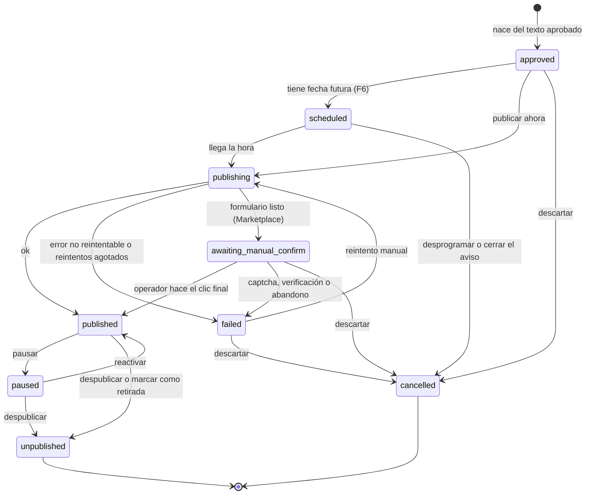

# 01 · Arquitectura

## Vista general

```mermaid
flowchart LR
  subgraph Entradas
    XLSX[Excel / Google Sheets]
    MED[Carpetas de fotos y videos]
  end

  subgraph Interfaces
    WEB[apps/web<br/>Panel React]
    CLI[apps/cli<br/>agentsales]
  end

  subgraph Backend
    API[apps/api<br/>Hono REST]
    WRK[apps/worker<br/>pg-boss]
    CORE[packages/core<br/>dominio + casos de uso]
    CFG[packages/config<br/>env · logger]
  end

  subgraph Adaptadores
    IMP[packages/importers]
    LLM[packages/llm]
    MEDIA[packages/media<br/>sharp · ffmpeg · Playwright]
    TPL[packages/templates<br/>HTML de portada, ficha y texto del reel]
    PUB[packages/publishers]
    DB[packages/db<br/>Drizzle]
    STO[packages/storage<br/>API S3]
    QUE[packages/queue<br/>pg-boss]
  end

  subgraph Externos
    NEON[(Neon<br/>Postgres)]
    R2[(Cloudflare R2<br/>archivos)]
    CL[Claude<br/>CLI o API]
    IG[Instagram API]
    ML[Mercado Libre API<br/>→ Portal Inmobiliario]
    FB[Facebook Marketplace<br/>navegador]
  end

  XLSX --> IMP
  MED --> IMP
  WEB --> API
  CLI --> API
  API --> CORE
  WRK --> CORE
  IMP & LLM & MEDIA & TPL & PUB & DB & STO & QUE -. implementan puertos de .-> CORE
  API & WRK & CLI --> CFG
  CFG --> CORE
  DB --> NEON
  STO --> R2
  LLM --> CL
  PUB --> IG & ML & FB
  API -. solo conectar y refrescar a pedido (ADR-0014 p.9) .-> PUB
  API -. encola jobs (desde F1) .-> NEON
  API --> IMP
  WRK -. consume jobs .-> NEON
```

## Estilo: puertos y adaptadores

- `packages/core` contiene el **dominio**: entidades, esquemas zod, máquina de estados y casos de uso. No importa librerías de infraestructura.
- Core define **puertos** (interfaces): repositorios (`ListingRepository` y compañía), `MediaStorage`, `MediaFileSource`, `JobQueue`, `LLMProvider`, `MediaProcessor`, `SlideTemplates`, `HtmlRenderer` y `Publisher`. Hoy existen `MediaStorage`, `MediaFileSource`, `MediaRepository`, `JobQueue`, `FieldDefinitionRepository`, `BrokerRepository`, `ListingRepository`, `ImportRunRepository`, `ContentRunRepository`, `ContentRepository`, `PlatformAccountRepository` y `SecretBox` (F3-T03), `PublicationRepository` y `ListingLock` (F3-T04; `PlatformAccountRepository.upsertConnected` suma `revokeOthers` en F3-T13), `Publisher` (F3-T07), `InstagramAuth` (F3-T08), `MercadoLibreAuth` (F4-T03), `LLMProvider`, `MediaProcessor`, `SlideTemplates` y `HtmlRenderer` (`packages/core/src/ports/`). `MediaProcessor` (F2-T07) lo implementa `createMediaProcessor` de `packages/media` con sharp y ffmpeg: las fotos (también HEIC, que ffmpeg 8.1 o más nuevo arma desde sus mosaicos) salen rotadas, en sRGB, sin metadatos y en las variantes `thumb`, `ig_4x5` y `pi_4x3`, con su sha256; los parámetros y su versión (`MEDIA_PIPELINE_VERSION`) viven en `packages/media/src/pipeline.ts`. Los videos (F2-T08) se miden con ffprobe, dan su `thumb` y, en la etapa `reel`, el reel de Instagram. Contrato en "Procesador de medios", más abajo. `SlideTemplates` (F2-T09) lo implementa `createSlideTemplates` de `packages/templates` y `HtmlRenderer`, `createHtmlRenderer` de `packages/media`: ver "Plantillas y render".
- Cola (ADR-0005): el adaptador de pg-boss vive en `packages/queue` desde F1-T08 (en F0 estaba en el worker). Implementa `JobQueue` e incluye `QUEUE_SCHEMA` y `checkQueueSchema`. La API, como `producer`, arranca pg-boss de forma diferida en el primer `enqueue`, y su check de `/health` solo consulta que exista el esquema `pgboss`. Ver "Cola de trabajos" más abajo.
- Los demás paquetes son **adaptadores** que implementan esos puertos.
- Las apps (`api`, `worker`, `cli`, `web`) solo **componen** adaptadores y llaman casos de uso.

Esto permite cambiar Claude CLI por la API de Anthropic, o agregar una plataforma nueva, sin tocar el dominio.

## Estructura del monorepo

```
agentsales/
├── apps/
│   ├── api/          Hono REST API; tipos exportados para el cliente RPC
│   ├── web/          React + Vite + Tailwind + TanStack Query + React Router; panel de operación
│   ├── cli/          CLI `agentsales` (commander); usa el cliente RPC de la API
│   └── worker/       Procesa jobs: importación (F1), contenido (F2: medios, renders, reel y textos), publicación y sincronización
├── packages/
│   ├── core/         Dominio, esquemas zod, estados, casos de uso, puertos
│   ├── db/           Esquema Drizzle, migraciones y (desde F1) repositorios
│   ├── storage/      Archivos en Cloudflare R2 (API S3): subir, leer, borrar, URLs prefirmadas
│   ├── importers/    xlsx, carpetas de medios, zip y staging de cargas (`./staging`); Google Sheets directo, después del MVP
│   ├── queue/        Cola de trabajos (pg-boss): productor `JobQueue`, `createBoss` y check de `/health`
│   ├── llm/          Proveedores (solo transporte): claude-cli, anthropic-api, fake. Los prompts viven en core (ADR-0013)
│   ├── media/        Procesamiento de imagen y video (sharp, ffmpeg) y render de HTML (Playwright)
│   ├── templates/    Plantillas HTML/CSS de posts (portada, ficha y texto del reel)
│   ├── publishers/   instagram (F3: cliente de la Graph API, OAuth, errores, validación y publisher); mercadolibre (F4: OAuth, usuario, errores, ítems, fotos, catálogo con caché y `validate`; publisher después); fb-marketplace en F5
│   └── config/       Variables de entorno validadas (zod), logger pino, redactor de secretos, resumen de errores repetidos y, desde F3, cifrado y firma (crypto.ts)
├── .github/          CI (GitHub Actions)
├── docs/             Documentación (esta carpeta)
├── data/             Plantillas y datos de prueba (los datos reales no van a git)
└── .claude/          Configuración de Claude Code: skills y subagentes
```

Los paquetes se crean **cuando la fase que los necesita comienza**, no antes (ver `06-roadmap.md`).

## Flujos principales

### 1. Carga

```
CLI (POST /imports/local, rutas del disco) o panel (POST /imports, multipart)
  → requestImport (core): crea el import_run en queued y encola import.run
  → el worker corre runImport: markRunning
  → xlsx-reader (importers) lee la planilla, sin validar ni filtrar
  → importListings (core) filtra EJEMPLO/Borrador y valida contra field_definitions
  → upsert de listings (idempotente por broker + external_ref)
  → openMedia (importers, inyectado): la carpeta en su lugar, o el zip extraído en el staging del intento
  → ingestMedia (core): por carpeta, deduplica por sha256, sube a R2 → registra media,
    ordena, elige portada y pasa a ready con `estado_carga = Listo` y al menos una foto (solo desde draft)
  → import_run en succeeded o failed, con reporte de errores y advertencias por fila
```

### 2. Preparación de contenido (job `content.prepare`, F2)

```
CLI (prepare) o panel (Preparar contenido)
  → requestContentRun (core, con el candado del aviso): crea el content_run en queued y,
    ya confirmado, encola content.prepare
    (si el aviso ya tiene una corrida activa, la devuelve)
  → el worker corre prepareContent, por etapas idempotentes:
    1. media:   mide, pasa HEIC a JPEG, borra metadatos y crea thumb, ig_4x5 y pi_4x3
                (la portada es la del operador: foto_portada o la primera foto)
    2. renders: portada y ficha (plantillas HTML → Playwright → JPEG)
    3. reel:    9:16 con fondo desenfocado, tope de 90 s y el texto de los primeros 2 s
    4. texts:   brief sin datos privados → IA (frases, JSON validado con zod)
                → ensamblado con los datos por código → contents en draft
  → content_run en succeeded o failed, con reporte por etapa
```

En F2 no se crean `publications` (ADR-0012). Desde F3 (ADR-0014) nacen aprobadas del texto aprobado de un canal: al aprobarlo, si hay una cuenta conectada, o al publicar. Detalle en el spec F2 §4.2 a §4.6 y en el spec F3 §4.2.

### 3. Aprobación y publicación (job `publication.publish`, F3, ADR-0014)

```
CLI (approve) o panel (Aprobar)
  → approveContent (core, con el candado del aviso): el texto vigente del canal → approved
  → con cuenta conectada: una publicación por formato (Instagram: post y, con video, reel)
    nace en approved, con content_id y media_ids fijos
CLI (publish) o panel (Publicar)
  → publishListing (core, con el candado): abre las que falten, approved/failed → publishing
    (fija dry_run con PUBLISH_MODE) y, ya confirmado, encola publication.publish
    (una sola: startPublication; las que ya están en publishing se reencolan)
  → el worker corre publishPublication: solo si sigue en publishing
  → checkPublishInput() → publisher.publish()   (withDryRun si publication.dry_run)
    guardando el progreso (contenedores) antes del paso que publica
  → guarda external_id/url → published (el aviso pasa a active si fue en live)
  → error reintentable: pg-boss reintenta con backoff; la publicación sigue en
    publishing y el reintento retoma desde el progreso, sin publicar dos veces
  → error no reintentable o reintentos agotados: failed con causa legible
  → cada transición queda en publication_events
CLI o panel: descartar (cancelPublication: approved/failed → cancelled) y marcar como
  retirada (retirePublication: published → unpublished; en live con la confirmación de que
  se borró a mano; la última en live devuelve el aviso de active a ready)
```

### 4. Seguimiento (job `publication.sync`, periódico)

```
publicaciones activas → publisher.getStatus() → actualiza estado
listing cerrado (vendido/arrendado) → publisher.unpublish() en todas
```

## Máquina de estados de una publicación

Desde F3 (ADR-0014), lo que se aprueba es el texto de un canal (`contents.status = approved`) y la publicación nace aprobada. Se quitaron `draft` y `pending_approval`.



Para Marketplace (semiautomático) existe además `awaiting_manual_confirm` entre `publishing` y `published`: el formulario queda listo y el operador hace el clic final. Si aparece un captcha o una verificación, el sistema se detiene y la publicación pasa a `failed` (ADR-0004).

Estado inicial (`INITIAL_PUBLICATION_STATUSES`): `approved`, siempre desde un texto aprobado (también con `auto_publish` en F6, que aprueba el texto solo).

Estados terminales (`TERMINAL_PUBLICATION_STATUSES`): `unpublished` (estuvo en la plataforma y se bajó) y `cancelled` (nunca llegó a la plataforma). Todos los demás cuentan como **activos** (`ACTIVE_PUBLICATION_STATUSES`), incluido `failed`; por eso un `failed` se reintenta o se cancela antes de crear otra publicación del mismo aviso, cuenta y formato. Los activos que aún no están en la plataforma (`approved`, `scheduled`, `publishing`, `failed`, `awaiting_manual_confirm`) son **pendientes** (`PENDING_PUBLICATION_STATUSES`): mientras un aviso tenga uno, no se vuelve a preparar su contenido (spec F3, §4.2).

`transition()` no conoce la plataforma: el caso de uso solo lleva a `awaiting_manual_confirm` a publishers con paso manual, y solo pausa en plataformas que lo soportan.

La máquina de estados vive en `packages/core` (`PUBLICATION_TRANSITIONS`, `canTransition`, `transition`) como función pura con tests: toda transición inválida lanza `AppError("INVALID_TRANSITION")`. Cada transición guarda la fila y su evento en una sola transacción, de forma condicional.

## Contrato de un Publisher

Desde F3 (ADR-0014, spec F3 §4.5):

```ts
interface Publisher {
  readonly platform: Platform;
  readonly formats: readonly PublicationFormat[];          // Instagram: post y reel
  validate(input: PublishInput): PublishValidation;        // requisitos de la plataforma
  publish(input: PublishInput, ctx: PublishContext): Promise<PublishResult>;
}
type PublishContext = {
  account: PlatformAccount;
  credentials: PlatformCredentials;                         // descifradas, solo en memoria
  progress: unknown | null;                                  // lo creado por un intento anterior
  saveProgress(progress: unknown): Promise<void>;           // antes del paso que publica
  signal?: AbortSignalLike;
};
type PublishResult = { externalId: string; externalUrl: string | null; simulated: boolean };
```

`unpublish` y `getStatus` se suman cuando un canal los use (F4 y F6). Desde F3-T07 (`packages/core/src/ports/publisher.ts` y `packages/core/src/publish/`):
- **`PublishInput`** = `publicationId`, `platform`, `format`, `title` (siempre `null` en Instagram), `caption` y `media` (cada uno con `mediaId`, `kind`, `mime`, `storagePath`, `url` firmada, `bytes`, medidas y `durationS`). Lo arma `buildPublishInput`: el caption con `instagramCaption` (en los otros canales, el cuerpo) y los medios de `media_ids` en su orden, con URLs firmadas nuevas por 1 hora (`PUBLISH_MEDIA_URL_TTL_S`). Un texto que no es el de la publicación (otro id o canal) es `PUBLICATION_CONTENT_MISMATCH`; uno que ya no está aprobado, `CONTENT_NOT_APPROVED`; y un medio fijado que falta, `PUBLICATION_MEDIA_MISSING` (los tres no reintentables, antes de firmar nada).
- **`publish` recibe un input que ya pasó `checkPublishInput`** (el intento la corre en `live` y `withDryRun` en `dry-run`); un adaptador puede volver a correrla, porque es pura y barata (el de Instagram lo hace).
- **`checkPublishInput(publisher, input)`** revisa la plataforma, el formato (`publisher.formats`) y `publisher.validate` (un rechazo sin motivos cuenta como rechazo); si algo falla, `PUBLISH_INPUT_INVALID` (no reintentable) con los motivos (`{ code, message }`, en español y sin datos del aviso) en el mensaje y en `details.issues`. En `live` la llama el intento (T11) antes de `publish`; en `dry-run`, `withDryRun`.
- **`withDryRun(publisher)`** (con `dry_run` en la publicación): `publish` corre `checkPublishInput` y devuelve `{ externalId: "dry-run:<publicationId>", externalUrl: null, simulated: true }`. Nunca llama a `publish` del envuelto ni a `saveProgress`.
- **`publishAttemptRecord(input, account)`**: lo que se envió en un intento, o lo que se habría enviado en `dry-run` (formato, título, caption completo, medios con su ruta de R2, tipo, tamaño y medidas, y la cuenta con su `@usuario`). Va en el evento `publish_attempt` de cada intento, en los dos modos (ADR-0014: después de publicada, una corrida nueva puede reemplazar los medios). Nunca va al log y nunca lleva URLs firmadas ni credenciales: se arma campo por campo.
- El de Instagram es `createInstagramPublisher` (`@agentsales/publishers`, F3-T09): recibe el cliente de la Graph API de forma perezosa (validar y simular no lo construyen), revisa el cupo, crea los contenedores, guarda el progreso antes de sondear y otra vez antes de `media_publish` (con la hora del pedido), y retoma desde él sin publicar dos veces (spec F3 §4.4); todo el intento tiene un tope de 12 min.
- **Cliente de Mercado Libre** (`packages/publishers/src/mercadolibre/`, F4-T03): `createMercadoLibreAuth` (puerto `MercadoLibreAuth` de core) arma la URL de autorización de `auth.mercadolibre.cl` sin PKCE, canjea el código y refresca en `POST /oauth/token` con los parámetros en el cuerpo (nunca en la URL), y lee `GET /users/me` con la cabecera `Bearer`. Devuelve el vencimiento del `access_token` leído de `expires_in`, los permisos y el `refresh_token` (`null` en el canje si no vino; el refresco lo exige, porque el anterior ya no sirve). `mercadoLibreRequest` (`http.ts`) es la base de las llamadas: tope por llamada (30 s por defecto; la API pasa 10 s), señal, y los errores `ML_*` de `mercadoLibreError` (`errors.ts`, spec F4 §4.8): primero por el campo `error` del OAuth, después por el status y, en un 4xx, por las causas que bloquean (`cause[]` en español, sin el `message` de Mercado Libre ni datos del aviso). Un 401 es `ML_AUTH_INVALID` con `httpStatus: 401` (quien llama refresca una vez y repite; lo reconoce `isMercadoLibreTokenRejected`, de core); `invalid_grant`, también `ML_AUTH_INVALID`; `invalid_client` y `unauthorized_client`, `ML_APP_CREDENTIALS_INVALID` (la cuenta no cambia); `invalid_operator_user_id` (autorizó un colaborador), `ML_PERMISSION_DENIED`. El refresco tiene un tope de 10 s aunque el cliente tenga uno mayor (corre dentro del candado de la cuenta) y solo exige el par: sin `user_id` ni `expires_in` válidos no se descarta, y el vencimiento se supone de 1 h. No sigue redirecciones (un 307 reenviaría el formulario con el secret) y no guarda del cuerpo nada con forma de token. Ningún error lleva la URL, el formulario, los tokens ni el secret, y el cliente no escribe logs. Desde F4-T04, la base acepta un formulario, JSON o `multipart` (`RequestBody`) y un `classify` propio, y hay dos clientes más: `createMercadoLibreItems` (crear, leer, cambiar el estado solo a `paused`, `active` o `closed` con el `seller_contact` completo, cargar la descripción, ocultar la dirección y buscar por `seller_custom_field` con `?sku=`; devuelve las advertencias sin bloquear; un id que va en la ruta y no tiene la forma de Mercado Libre es `ML_ID_INVALID`, sin llamar) y `createMercadoLibrePictures` (subida `multipart` con el campo `file`; un 400 sin causas que bloqueen y con `error` vacío o `bad_request` es el límite por minuto, `ML_RATE_LIMITED`; una foto vacía o que no es JPEG ni PNG no se sube). Los ítems también leen la descripción (`getDescription`, para retomar sin repetir el `POST`), validan las fechas (ISO con zona) y rechazan la respuesta de otro ítem. `itemCreationOutcome` dice si un `POST /items` fallido no creó el ítem (4xx salvo 408 y 425, o pedido no enviado) o si no se sabe (hay que buscarlo antes de repetir), y `hasMercadoLibreCause` reconoce 508 y 509. Desde F4-T05, `createMercadoLibreCatalogApi` lee una categoría (hijas y `settings`: título, fotos, descripción, monedas y precios), los atributos de una hoja (obligatorios, condicionales, valores y unidades) y las ubicaciones de clasificados (Chile con sus estados, un estado con sus ciudades, una ciudad con sus barrios), y `createMercadoLibreValidator` llama a `POST /items/validate`: el rechazo del aviso (un 400 o 422 con causas que bloquean) vuelve como resultado (`valid: false` con `issues` de código y motivo en español), no como error. Los dos solo leen o validan (ADR-0016). El catálogo es estricto donde un dato perdido cambiaría el resultado (las hijas de una categoría, los estados y ciudades, los atributos y sus `tags`, que se guardan para no exigir los que completa la categoría) y tolerante en los `settings`, que quedan `null` sin inventar. Ninguno borra: no hay `DELETE` en la base ni la marca de borrado, y un test lo revisa también en el código.
- **`pnpm ig:smoke [--broker <slug>] [--listing <id_propiedad>]`** (`apps/worker/src/scripts/ig-smoke.ts`, delgado; la lógica en `src/smoke/ig-smoke.ts`, F3-T19): con la cuenta de Instagram conectada, firma por 1 h (`PUBLISH_MEDIA_URL_TTL_S`) la portada renderizada (`rendered`/`cover`) del primer aviso del corredor por `id_propiedad` (o el pedido), crea **un** contenedor de imagen y lo sondea con el ritmo del publisher hasta `FINISHED` (sale con 0) o error (sale con 1, con el código `IG_*` y el código y subcódigo de Meta). **Nunca** publica: recibe el cliente sin `publishContainer` (`media_publish`), en los tipos y al ejecutar (`smokeGraph`), y el contenedor vence solo en 24 h. No depende de `PUBLISH_MODE`: habla con Meta también en `dry-run`, porque no publica. Antes de firmar revisa con `head` que la portada esté en R2 (`STORAGE_NOT_FOUND` si falta), así un objeto faltante no se confunde con un rechazo de la URL. Por defecto elige entre los avisos `ready`, `active` o `paused`; con `--listing`, cualquiera. Lee la base directo (no necesita `pnpm dev`), no escribe en ella y nunca imprime el token ni la URL firmada. Habla con Meta: lo corre el operador.
- Para los tests, `createFakePublisher` (`@agentsales/core/testing`): `validate` y `publish` guionados (progreso, error o resultado por llamada) y registrados.

## Cola de trabajos

Los jobs del worker (`apps/worker/src/jobs/`):
- Cada job se declara con `defineJob({ name, queue, handler })`, con `name` de `JOB_NAMES` (core):
  - **Datos:** se validan con `JOB_PAYLOADS[name]`, el mismo esquema que usa quien encola. Los datos vienen de la base, escritos por otro proceso, así que son un borde. Si son inválidos, lanza `JOB_PAYLOAD_INVALID`, que no se reintenta.
  - **`queue`:** política de la cola (`policy`, `retryLimit`, `retryDelay`, `retryBackoff`, `expireInSeconds`). Solo el worker la aplica al arrancar, así que el código es la fuente de verdad. Los productores no crean colas.
    - `createQueue` recibe todo.
    - `updateQueue` recibe todo **menos `policy`**, que es inmutable.
  - **Contexto:** el handler recibe `isLastAttempt` (`retryCount >= retryLimit`, de `work` con `includeMetadata`), para dejar el estado de dominio en `failed` antes del último error, y desde F3-T12 `retryCount` (el reintento, para la bitácora de una publicación).
  - **`schedule` (desde F3-T14):** cron opcional (`JobSchedule<N>`: expresión, zona horaria, datos con el tipo de `JOB_PAYLOADS[N]` y `singletonKey`). `registerJobs` lo programa con `schedule` de pg-boss después de crear la cola y registrar su worker (pg-boss exige la cola), con `missed: "skip"`. pg-boss guarda una fila por cola, así que registrarlo en cada arranque la actualiza; si un job deja de tener cron, su fila sigue disparando y hay que borrarla a mano (`unschedule`). Lo usa `tokens.refresh`.
- **Payloads con solo ids** (`publicationId`, `mediaId`…), nunca secretos ni estado. El handler recarga el estado desde la base y verifica `external_id` y `status` antes de actuar, lo que lo hace idempotente (ADR-0005).
- **Errores:**
  - Un `AppError` no reintentable se registra y el job se da por cerrado. El caso de uso ya dejó el estado de dominio, por ejemplo la publicación en `failed`.
  - Cualquier otro error se propaga y pg-boss reintenta según la política.
  - `batchSize: 1`: un fallo nunca repite jobs ajenos.
- Los handlers son delgados: validan, arman dependencias y llaman un caso de uso de `core`. `buildJobs(deps)` arma la lista con las dependencias que compone `worker.ts` (db, R2, lector de xlsx y staging; desde F2-T11, también plantillas, renderizador, IA y el procesador de cada intento; desde F3-T12, los repositorios de publicaciones y cuentas, este último con el `SecretBox` de `APP_ENCRYPTION_KEY`, y el publisher de Instagram, registrado en los dos modos con su cliente perezoso y sus notas al log; desde F3-T14, Instagram Login para el refresco).
- **El log de cada intento** lleva los datos del job, que son solo ids: así cada error queda con, por ejemplo, su `importRunId`. Un job puede fijar `errorLogFields` para registrar menos que el error completo: `content.prepare` registra solo el código (el mensaje o la causa pueden traer datos del aviso).
- **Apagado (desde F2-T11, `stopWorker` en `apps/worker/src/shutdown.ts`):** en SIGINT o SIGTERM, el worker dispara el `AbortController` de los handlers, espera a que pg-boss los detenga (`stop` con `graceful`, hasta 30 s) y recién después cierra el Chromium del renderizador (también si detener pg-boss falla) y la base. `tsx watch` (`pnpm dev`) corta al worker sin esperar ese cierre si recibe la señal él solo; con Ctrl+C en la terminal la señal llega a los dos.

### Job `publication.publish` (F3-T12)

- Corre `publishPublication` (ver "Intento de publicación") con la señal de apagado, `isLastAttempt` y `retryCount`. El publisher de Instagram se registra en los dos modos (lo necesita también una publicación en `dry_run`) y arma su cliente recién al primer intento en `live`; sus notas (`onNote`) van al log con el `publicationId`.
- **De a una:** el worker toma un job de `publication.publish` a la vez, así que el carrusel y el reel de un aviso salen uno después del otro (en la prueba en `live`, cerca de 1 min el carrusel de 5 imágenes y 2 min el reel). Mientras tanto la CLI puede avisar "Sigue en cola" aunque el worker corra (deuda en ESTADO).
- **Log:** el resultado (`publicación publicada` o `publicación simulada`), los avisos de pasos secundarios con su paso y código, y de un error solo `code` y `retriable`. Nunca tokens, URLs firmadas ni el caption.
- **Al arrancar,** después de crear las colas, reencola todas las publicaciones en `publishing`. Un job reencolado parte de nuevo con `retryCount = 0`: en la bitácora, `retry` vuelve a 0 con el mismo `attempt`, y no es un intento duplicado.
- **Hasta el próximo arranque:** un corte por apagado (`PUBLISH_ABORTED`) o un resultado sin guardar (`PUBLISH_RESULT_NOT_SAVED`) en el último intento dejan la publicación en `publishing` sin job; la recupera el reencolado al arrancar (o publicarla de nuevo).
- **El modo del worker importa al reencolar** (D11): una publicación que quedó en `publishing` en `live` y se reencola con el worker en `dry-run` pasa a `failed` con `PUBLISH_MODE_MISMATCH`, sin publicar nada; se reintenta en `live` y retoma desde su progreso. Por eso "worker listo" registra el `publishMode`.

### Job `content.prepare` (F2-T11)
- **Cola:** `exclusive` (un solo job por `singletonKey = contentRunId`), 2 reintentos con backoff desde 30 s, y expira a los 30 min.
- **Handler:** corre `prepareContent` (core) con `isLastAttempt` y el `signal` de apagado. Cada intento arma su procesador de medios (`createMediaProcessor` sin `threads`: ffmpeg usa todos los núcleos) con su temporal `<workspace>/tmp/content/{contentRunId}/{uuid}/`, que se borra en un `finally` (y el de la corrida, si queda vacío). Lo demás es del proceso: repositorios, R2, plantillas, un renderizador (`createHtmlRenderer`) y el proveedor de IA según `LLM_PROVIDER` (con `fake`, `SAMPLE_CONTENT_DRAFT`).
- **Corte por apagado:** la corrida queda en `running`, también en el último intento, y el error sube como reintentable (core convierte uno no reintentable en `CONTENT_RUN_ABORTED`). La retoma el siguiente intento de pg-boss; si era el último, un nuevo pedido (`requestContentRun` la reencola) o, pasadas 2 h, la limpieza de abandonadas al arrancar.
- **Sin temporal:** si el worker no puede crear la carpeta del intento (disco lleno, permisos), es `CONTENT_TMP_UNAVAILABLE` (reintentable); en el último intento deja la corrida en `failed`.
- **Logs:** un error por intento, con `contentRunId` y solo el código. Al terminar, solo conteos (medios, renders, reel, cantidad de advertencias y la llamada a la IA), nunca las advertencias ni la revisión. Un objeto viejo de R2 que no se pudo borrar (`onCleanupFailed`) va al log como `objectPath` (solo ids).
- **Al arrancar:**
  - antes de conectar, borra los temporales de más de 24 h (solo directorios con nombre de uuid);
  - ya conectado, cierra como `failed` (`CONTENT_RUN_ABANDONED`) las corridas `running` con `started_at` de hace más de 2 h (3 intentos de 30 min y media hora de margen);
  - con las colas creadas, reencola **todas** las `queued` (`enqueueContentRun`, idempotente por `singletonKey`) con la conexión del worker (`jobQueueFromBoss`); una que falla no corta las demás.

### Job `import.run` (F1-T09)
- **Cola:** `exclusive` (un solo job por `singletonKey = importRunId`), 2 reintentos con backoff desde 30 s, y expira a las 2 h.
- **`requestImport` (core):** crea el run en `queued` y encola.
  - Si la cola no está disponible (`QUEUE_UNAVAILABLE`), deja el run en `failed` y borra su staging.
  - Cualquier otro error se propaga sin tocar el run.
- **`runImport` (core), el handler:**
  1. Un run terminal no hace nada.
  2. `markRunning`, lee el xlsx, corre `importListings`, prepara los medios (`openMedia`), corre `ingestMedia` y deja el run en `succeeded`.
  3. Con un error no reintentable, o en el último intento, `markFailed` **antes** de relanzar. Si `markFailed` falla, se lanza ese error con el original como `cause`.
  4. Los medios se liberan siempre, y el staging se borra al llegar a un estado terminal.
  5. Si `markSucceeded` no cambia nada (otro intento ya lo dejó terminal), informa `skipped`.
  - Un error que no es `AppError` se normaliza a `INTERNAL_ERROR`, no reintentable y con un mensaje genérico: el run queda en `failed` y el job se cierra.
- **Runs abandonados:** al arrancar, el worker cierra como `failed` (`IMPORT_ABANDONED`) los runs en `running` de hace más de 7 h (`failAbandoned`). Cubre un proceso que murió, o una base caída en el último intento. Los `queued` no se tocan.
- **Política de la cola:** al arrancar, el worker compara la política guardada con la del código, y avisa en el log si difiere (`createQueue` no cambia una cola existente).
- **Staging (`@agentsales/importers/staging`, compartido por la API y el worker), en `<workspace>/tmp/imports/{runId}/`:**
  - `input/` lo escribe la API (T11) y se conserva hasta el estado terminal.
  - `extracted-{uuid}/` es el zip de **un** intento: se crea al empezar y se borra al terminar, falle o no. Dos intentos solapados no se pisan.
  - **Zip con una sola carpeta en la raíz** (macOS → Comprimir "medios"): si ninguna de las carpetas que la carga pide está en la raíz, pero sí dentro de esa única carpeta, la raíz pasa a ser esa carpeta. Un zip con una sola propiedad en su raíz no se desenvuelve.
  - **Al arrancar,** el worker borra:
    - los directorios de más de 24 h, antes de conectarse a la base;
    - ya conectado, los de runs terminados, y los sin run de más de 10 minutos (la API escribe `input/` antes de crear el run, T11).

    Solo toca directorios con nombre de uuid, y un error en uno no corta el barrido.
  - La API guarda los archivos subidos con `saveInput` (solo el último tramo del nombre, dentro de `input/`), y la raíz se compone igual en las dos apps. La subruta no carga exceljs.
  - **Los medios de la CLI** (`--media <dir>`) se leen en su lugar: el staging nunca borra archivos del operador.

Para encolar (`packages/queue`, desde F1-T08):
- **Contrato compartido en `core/src/jobs.ts`:** `JOB_NAMES` como tupla `as const` (`system.ping`, `import.run`, desde F2-T02 `content.prepare`, desde F3-T10 `publication.publish` y desde F3-T14 `tokens.refresh`) y `JOB_PAYLOADS`, esquemas zod por nombre. Así la API, los scripts y el worker comparten el contrato sin repetir literales.
- **Puerto `JobQueue`** en `core/src/ports/job-queue.ts`: `enqueue<N extends JobName>(name: N, data: JobPayload<N>, opts?: { startAfter?: Date; singletonKey?: string }): Promise<string | null>`. Devuelve `null` si ya había un job activo con el mismo `singletonKey`.
- **Adaptador `createJobQueue({ connectionString, onError })`**, sobre pg-boss en rol `producer`:
  - Arranca pg-boss recién en el primer `enqueue`, así la API levanta aunque el esquema `pgboss` no exista. Si el arranque falla, el siguiente `enqueue` lo reintenta.
  - Valida los datos con `JOB_PAYLOADS` antes de conectar (`JOB_PAYLOAD_INVALID`).
  - Cualquier falla de la cola (sin conexión, sin esquema, o una cola que el worker todavía no creó) es `QUEUE_UNAVAILABLE`, reintentable: la API responde 503. Antes, el esquema faltante era `QUEUE_NOT_INITIALIZED`. El mensaje "arranca el worker" solo sale con los errores exactos de pg-boss (sin esquema, esquema viejo, cola inexistente), no con un `database "x" does not exist`.
  - Refresca su caché de colas una vez al día, no cada 60 s, para no mantener Neon despierto (ADR-0007).
  - `stop()` cierra la conexión, también si el arranque está en curso. Después, `enqueue` da `QUEUE_UNAVAILABLE`.
  - Los errores de fondo de pg-boss van a `onError`. La API los resume con `createErrorThrottle` (`@agentsales/config`, el mismo del worker) y llama a `stop()` al apagarse.
- **Deduplicación con `singletonKey`:** depende de la **política de la cola**. En pg-boss 12 solo deduplican `singleton`, `stately`, `exclusive`, `short` y `key_strict_fifo`; con la estándar, `singletonKey` es solo una etiqueta. La política **no se puede cambiar después de crear la cola**: `updateQueue` falla si recibe `policy`, y cambiarla exige borrar la cola. T09 agrega `policy` a `QueuePolicy`, que solo se pasa a `createQueue`, y le da `exclusive` a `import.run`.
- **También en `packages/queue`:**
  - `createBoss({ connectionString, role })`, que usa el worker;
  - `jobQueueFromBoss(boss)` (F2-T11): un `JobQueue` sobre un pg-boss ya arrancado (el del worker, para reencolar al arrancar), con la misma validación y los mismos errores que `createJobQueue`, sin arrancarlo ni detenerlo;
  - `QUEUE_SCHEMA`;
  - `checkQueueSchema`, el check de `/health`, que solo lee el catálogo.
- **Conexión:** el paquete no depende de `@agentsales/db`, porque los adaptadores no dependen entre sí. Quien lo usa pasa la conexión ya convertida con `toPgConnectionString`.

Política objetivo por cola (cada fase la confirma en su spec):

| Cola | Unicidad | Reintentos | Backoff | Expira |
|---|---|---|---|---|
| `system.ping` (F0) | — | 0 | no | 60 s |
| `import.run` (F1) | `singletonKey = importRunId`; en el último intento deja el run en `failed` | 2 | sí, desde 30 s | 2 h (videos grandes) |
| `content.prepare` (F2-T11) | `exclusive`, `singletonKey = contentRunId`; en el último intento deja la corrida en `failed`, salvo un corte por apagado. Reemplaza a `media.process` (ADR-0012, enmienda de ADR-0005) | 2 | sí, desde 30 s | 30 min (video, render e IA) |
| `publication.publish` (F3-T12) | `exclusive`, `singletonKey = publicationId`; en el último intento deja la publicación en `failed`; al arrancar se reencolan las `publishing`; registra solo el código y si se reintenta | 2 | sí, desde 60 s | 15 min (el intento tiene su propio tope de 12 min) |
| `publication.sync` | cron, sin solaparse | 1 | no | ~10 min |
| `tokens.refresh` (F3-T14; Mercado Libre desde F4-T08) | `exclusive`, `singletonKey` fijo (`tokens.refresh`): el job del arranque y el del cron (12:00, `America/Santiago`) no se pisan ni se acumulan; falla con `TOKENS_REFRESH_INCOMPLETE` si una cuenta falló por algo pasajero, y el reintento salta las ya refrescadas | 3 | sí, desde 60 s | 5 min |

Con el worker apagado (ADR-0007), los jobs con `startAfter` vencido corren al arrancar y los cron del período apagado se pierden. Eso afecta al calendario de F6.

`queue: ok` en `/health` significa que la cola se inicializó alguna vez, **no** que el worker esté corriendo.

## Contratos HTTP compartidos (ADR-0011)

- **Entidades de dominio** (`listing`, `broker`, `importRun`, `importReport`; desde F2-T02, `contentRun`, `contentRunReport` y `content`; y desde F2-T03, `media`) y `healthReportSchema`: en `packages/core`. La vista HTTP de un medio es `mediaItemSchema`, en `contracts` (ver "Proyecciones"), y la de un medio de un canal (render, variante o reel), `contentMediaSchema` (F2-T12).
- **Contratos HTTP:** en la salida `@agentsales/api/contracts` (`apps/api/src/contracts/`). Incluye:
  - el cuerpo de error (`errorBodySchema`);
  - los parámetros (`idParamSchema`: uuid);
  - los filtros (`listingQuerySchema`);
  - los cuerpos (`listingStatusBodySchema`; desde F2-T12, `contentRunRequestBodySchema` y `contentEditBodySchema`);
  - los formularios y cuerpos de importación (`importUploadFormSchema`, `localImportBodySchema`);
  - los sobres de respuesta (`listingListResponseSchema`, `listingDetailResponseSchema`, `brokerListResponseSchema`, `importRunResponseSchema` e `importRunListResponseSchema`; desde F2-T12, `contentRunRequestResponseSchema`, `contentRunResponseSchema`, `listingContentResponseSchema` y `contentEditResponseSchema`, con las vistas `contentRunViewSchema`, `contentCheckSchema`, `contentViewSchema` y `contentMediaSchema`; desde F3-T13 y T14, los de cuentas; desde F3-T15, los de aprobar y publicar, con las vistas `publicationViewSchema`, `listingPublicationSchema` y `publicationEventViewSchema`, y la cabecera `CLIENT_HEADER`). Las fechas llegan como texto ISO y se vuelven `Date` (`z.coerce.date`).
- **Frontera:** Biome la limita a `zod`, `@agentsales/core` e imports de `./` (no `../`, que sale al código del servidor), y un test (`apps/api/test/contracts-boundary.test.ts`) prueba que rechaza `@agentsales/config`, `node:*` y `hono`.
- **Validación de entrada:** `validated(target, schema)` (`apps/api/src/validation.ts`, sobre `hono/validator`). Un valor inválido es `REQUEST_INVALID` (400), con los campos en el mensaje.
- **Importación (F1-T11, `apps/api/src/routes/imports.ts`):** la API solo crea el run y encola (`requestImport`, ADR-0005), y responde `202`.
  - **`POST /imports` (panel):**
    - multipart con `file` (.xlsx de hasta 10 MB, si no `REQUEST_INVALID`), `media` (.zip, opcional), `broker` y `dryRun`;
    - todo el cuerpo tiene un tope, `MAX_IMPORT_UPLOAD_MB` (`bodyLimit`): si lo pasa, `413 REQUEST_TOO_LARGE`;
    - el id del run lo genera la API (`newId`), para guardar los archivos en `input/` antes de crear el run;
    - si algo falla después de guardar, borra lo guardado. Con la cola caída, `503 QUEUE_UNAVAILABLE` y el run queda en `failed`.
  - **`POST /imports/local` (la CLI):** recibe rutas absolutas del disco del operador. Solo existe con `localImports` (`NODE_ENV=development`): si no, `404`, aunque el cuerpo sea inválido. `NODE_ENV` vale `development` por defecto, así que la ruta está activa en local; F7 fija `production` al desplegar.
  - **`GET /imports` (las 50 más recientes) y `/imports/:id`:** muestran `input` solo con nombres de archivo (`importRunViewSchema`), nunca las rutas completas. La lista va sin `report` (`importRunSummarySchema`), y en el detalle `report` puede ser `null`.
  - **Memoria:** Hono lee el multipart completo, y los archivos se escriben a disco en streaming (`File.stream()`). El pico ronda las 2 veces el cuerpo, de ahí el default de `MAX_IMPORT_UPLOAD_MB` en 512. En F7 se cambia por la subida directa a R2.
  - **Formulario del panel:** un campo de archivo vacío o un corredor vacío cuentan como no enviados.
  - **`AppDeps`:** recibe `importRuns`, `queue`, `uploads` (`save` y `discard`, que `server.ts` compone con el staging), `newId`, `localImports` y `maxUploadBytes`.
- **Rutas (F1-T10):**
  - `GET /listings` (filtros exactos, también `externalRef` desde F1-T12, con la portada como URL firmada; desde F2-T12, la miniatura `thumb` de la portada si existe, con `listCovers` y `listVariants`: dos consultas para toda la lista);
  - `GET /listings/:id` (con sus medios en orden y URLs firmadas, y desde F1-T13 `fields`: las etiquetas de sus atributos; desde F2-T12, cada original con `thumbUrl` y sus medidas, en una consulta con `listByListing`);
  - `PATCH /listings/:id/status` (`changeListingStatus`);
  - `GET /brokers`.

  Van en `apps/api/src/routes/`, montadas con `.route()`. `AppDeps` recibe puertos de core (`listings`, `brokers`, `media`, `fieldDefinitions` y `storage.signedReadUrl`; desde F2-T12, `contentRuns` y `contents`), no adaptadores.
- **Rutas de contenido (F2-T12, `apps/api/src/routes/content.ts`):**
  - `POST /listings/:id/content-runs` (`requestContentRun`): `202` con `{ contentRun, reused }`;
  - `GET /content-runs/:id`: estado, etapa, reporte y error;
  - `GET /listings/:id/content` (`getListingContent`): el texto vigente de cada canal con su revisión (`checks`), el carrusel, las fotos de Portal y Marketplace y el reel con URLs firmadas, y la última corrida;
  - `PATCH /contents/:id` (`editContent`): el texto con su revisión.

  La vista del texto no lleva `rawOutput`, `llmProvider` ni `llmModel` (solo `promptVersion`), y la de la corrida tampoco: su `report.llm` sale sin `provider` ni `model` (`contentRunView`). De la revisión solo salen los `checks`: el contexto con lo privado del aviso (`ContentCheckContext.private`) se queda en el servidor. Los esquemas usan `CONTENT_CHECK_CODES` y `CONTENT_CHECK_SEVERITY_LEVELS` de core. La revisión al leer usa `loadCheckContext` (`packages/core/src/content/check-context.ts`), el mismo que arma el contexto de la corrida. Las URLs se firman en la API (R2 es privado, ADR-0007), como en `/listings`.
- **Páginas del panel** (`apps/web/src/routes.tsx`, cada una con `React.lazy`): `/` (Estado), `/propiedades`, `/propiedades/:id`, `/importar`, `/importar/:id` y `/cuentas` (F3-T17).
  - **Sección Contenido del detalle (F2-T14, `apps/web/src/components/content/`):** "Preparar contenido" y "Rehacer imágenes" (`texts: false`), con una confirmación si hay textos editados a mano (`CONTENT_EDITED` → rehacer solo imágenes o reemplazar); el avance por etapa; el error de la última corrida; y pestañas por canal: Instagram (carrusel deslizable, caption con "ver más" medido con `instagramCaption`, reel), Portal Inmobiliario y Marketplace (título, descripción y fotos 4:3), cada una con su revisión editorial (errores en rojo, advertencias en ámbar y un punto en la pestaña si hay errores). La galería usa `thumbUrl` (las fotos HEIC se ven) y el `poster` de los videos. Los botones se desactivan con `canPrepareContent` (core, el mismo que usa `requestContentRun`) y mientras hay una corrida en curso, que puede haber pedido la CLI.
  - **Edición de textos (F2-T15, `components/content/TextEditor.tsx`):** "Editar" en cada pestaña (título y descripción en Portal y Marketplace; texto y hashtags en Instagram), con un contador que mide lo mismo que la revisión: `contentLength` (core, la misma función de `TOO_LONG`) sobre el texto recortado, y los hashtags normalizados con `normalizeHashtags` (core, la misma de `editContent`) (`content/editor.ts`). Cada pestaña conserva su borrador (los tres paneles quedan montados) y, si una preparación reemplaza el texto mientras se edita, el borrador se conserva y se elige entre guardarlo sobre el texto nuevo o descartarlo. Guarda con `PATCH /contents/:id` (`useEditContent`), y la revisión nueva llega con la respuesta: el panel nunca corre `checkContent` (necesitaría lo privado del aviso). Mientras se regeneran los textos, "Editar" se bloquea con el motivo, y un editor abierto conserva lo escrito sin poder guardar. `CONTENT_NOT_CURRENT` y `CONTENT_RUN_ACTIVE` se explican, el primero con "Recargar el contenido". Regenerar textos sobre una edición se confirma antes de pedir ("se reemplazará tu edición") y envía `replaceEdits`.
  - **Sondeo de corridas (`apps/web/src/queries/run-poll.ts`):** `usePolledRun` (con la regla de "terminada" de cada corrida: `isTerminalImportRun` o `isTerminalContentRun`) y `pollStop` (`RUN_WAIT`: cada 2 s, aviso a los 20 s, tope de 2 h y de 3 fallas seguidas) los comparten las cargas (`useImportRun`) y las preparaciones (`useContentRun`). Cuando una preparación termina mientras se mira, se vuelven a pedir el contenido, el detalle y la lista (miniaturas nuevas).
- **Cambios manuales de estado (`LISTING_MANUAL_TRANSITIONS`, core):**
  - `draft` → `ready` o `archived`;
  - `ready` → `paused` o `archived`;
  - `paused` → `ready` o `archived`;
  - `archived` → `ready`.

  `ready` exige al menos una foto, y el cambio es condicional (`ListingRepository.changeStatus`). `active` y `closed` no se cambian a mano en F1. Una transición no permitida es `409 INVALID_TRANSITION`, también pasar al mismo estado (la tabla no tiene `x → x`). `LISTING_MANUAL_TARGETS` (core) son los destinos, y la API valida con ellos.
  - **Provisional:** en F6 (spec F3, §3) la tabla se redefine con su diagrama, como la de las publicaciones, y `changeListingStatus` pasa a orquestar las publicaciones: pausar al pasar a `paused`, despublicar al archivar, `active` ↔ `paused` y `closed` con `close_reason`.
- La API tipa sus respuestas y valida su entrada con esos esquemas. La CLI y el panel validan con los mismos esquemas lo que reciben.
- **Lo único que el panel importa de la API en tiempo de ejecución es `@agentsales/api/contracts`.** De la raíz de `@agentsales/api` solo importa `import type { AppType }`, porque en tiempo de ejecución arrastraría el servidor. Biome no distingue `import type`, así que lo revisa un test (`apps/web/src/api-imports.test.ts`).
- **Clientes HTTP de la CLI y el panel:** cada uno tiene el suyo a propósito (`apps/cli/src/api-client.ts` y `apps/web/src/api/client.ts`). Difieren en el transporte: la CLI va por puerto y reconoce `ECONNREFUSED`; el panel va por el proxy `/api`, trata un 5xx sin JSON como `UNREACHABLE` y deja pasar las cancelaciones. Compartirlos exigiría una salida de runtime con `hono/client`, fuera de lo que permite ADR-0011. Los dos deben mantener la misma semántica: `code` y `status` del error, `TIMEOUT`, `UNEXPECTED_RESPONSE`, la respuesta validada con `contracts` y, desde F3-T16, `Content-Type: application/json` en un pedido que cambia algo y va sin cuerpo (sin él, el CSRF da 403; desde T17, también el panel). Solo la CLI manda `X-AgentSales-Client: cli`: sin esa cabecera, el actor de la bitácora es `operator`. Solo el panel tiene `UPLOAD_TIMEOUT_MS` (10 min), porque la CLI nunca manda multipart: usa `/imports/local` con rutas.
- **Textos para el operador** (`LISTING_STATUS_TEXT`, `OPERATION_TEXT`, `IMPORT_RUN_STATUS_TEXT`, `IMPORT_BROKER_OUTCOME_TEXT`, `IMPORT_ROW_OUTCOME_TEXT`; desde F2-T13, `PLATFORM_TEXT`, `CONTENT_RUN_STATUS_TEXT`, `CONTENT_RUN_STAGE_TEXT`, `CONTENT_STATUS_TEXT`, `CONTENT_REEL_OUTCOME_TEXT`, `contentRunProgressText` (la etapa mientras corre, si no el estado), `RUN_QUEUED_WARNING_TEXT` y, desde F2-T14, `LISTING_NOT_PREPARABLE_TEXT` con `canPrepareContent` y `PREPARABLE_LISTING_STATUSES`) y formatos (`formatPrice`, `formatListingPrice`, `formatNumber`, `describeAttributes`, `importReportIssues`): en core, compartidos por la CLI, el panel y las plantillas de F2. También la espera de una corrida, sea una carga o una preparación de contenido (`RUN_WAIT` en `run-wait.ts`, que hasta F2-T13 era `IMPORT_WAIT`: cada 2 s, aviso a los 20 s, tope de 2 h y de 3 fallas seguidas), para que la CLI y el panel no diverjan. Desde F3-T16, también `PUBLICATION_STATUS_TEXT`, `PUBLICATION_FORMAT_TEXT`, `publicationModeText`, `PUBLISH_ATTEMPT_RESULT_TEXT`, `PUBLICATION_ACTOR_TEXT` y `PLATFORM_ACCOUNT_STATUS_TEXT`.
- **CLI de aprobación, publicaciones y cuentas (F3-T16):**
  - `approve <propiedad>` intenta aprobar el texto vigente de cada canal (o el de `--platform`) e informa cada uno; los que tienen errores los rechaza la API (`CONTENT_HAS_ERRORS`), con qué hacer. `--undo` quita la aprobación de los aprobados. Un canal que falla no corta los demás, y sale con 1.
  - `publish <propiedad>` lee el `publishMode` de `/health` y, en `live`, pide confirmación (`--yes` la salta; sin terminal interactiva, no publica). Publica el canal y espera el carrusel y el reel a la vez con `GET /publications/:id` (`waitForRun` con un `PublishWait` que junta las dos); el aviso de "sigue en cola" usa el predicado `isQueued`: las que empezaron ahora siguen en `publishing` y sin cambios en `updatedAt` (las reencoladas no cuentan, porque ya estaban en curso). Es una heurística: con la plataforma lenta, el primer contenedor puede tardar más de 20 s. La cabecera muestra el modo de cada una ("modo mixto" si difieren). Sale con 1 salvo que todas queden `published`, o si deja de esperar. Un 503 explica que quedaron en curso y que el worker las retoma.
  - `publications [<propiedad>] [--events]` (sin propiedad, todas las que tienen), `publications cancel <id>` y `publications retire <id> [--yes]`: retirar lee antes `GET /publications/:id` y, si está publicada en vivo, pregunta si se borró a mano y manda `removedByHand: true` (en otro estado no pregunta: la API explica por qué no se puede). La bitácora se lee con `publishAttemptPayloadSchema`.
  - `accounts`, `accounts connect instagram --broker <slug> --token-stdin` (lee el token de la entrada estándar, `pbpaste | …`, hasta 16 kB; desde una terminal sin tubería pide la tubería; un pegado con espacios o de más de 4096 caracteres es `TOKEN_INVALID`; nunca lo muestra) y `accounts refresh <id> [--force]`. Sin `--token-stdin`, solo si la API ofrece el OAuth, imprime y abre `connect.instagram.startUrl` de `GET /accounts` con `?broker=` (desde T17). El comando de conexión lo arma `tokenStdinCommand` (core), el mismo que muestra el panel.
  - El cliente (`api-client.ts`) manda `X-AgentSales-Client: cli` en toda petición y `Content-Type: application/json` en un pedido que cambia algo y va sin cuerpo (sin él, el CSRF da 403); confirmar (Ctrl+C es un "no"), leer la entrada estándar y abrir el navegador van en `Terminal` (`context.ts`), que los tests reemplazan. `--platform` se lee con `platformOption` (`commands/shared.ts`).
- **CLI de contenido (F2-T13):** `agentsales prepare <propiedad>` pide la preparación y la espera con `waitForRun` (`apps/cli/src/commands/wait-run.ts`, la misma espera de `import`), mostrando la etapa, y termina con el resumen de la corrida y la revisión editorial de los textos vigentes (sale con 1 si la corrida falló o si deja de esperar, como `import`; una revisión con errores no cambia el código). `CONTENT_EDITED` y `LISTING_NOT_READY` se explican con qué hacer (`--no-texts`, `--replace-edits`). `agentsales content <propiedad> [--platform] [--json]` muestra los textos con su revisión; los nombres cortos de `--platform` se traducen con `PLATFORM_SHORT_NAMES` (core). Las dos resuelven la propiedad por `id_propiedad` como `listing` (`resolveListingId`, `commands/shared.ts`).

## Tipos alcanzables desde `AppType`

La CLI y el panel importan `type AppType = ReturnType<typeof createApp>`, que arrastra la firma de `createApp(deps: AppDeps)` y todo tipo que se alcance desde ahí. Por eso:
- En esos tipos no puede aparecer pino, drizzle, pg-boss, `@hono/node-server` ni `NodeJS.*`.
- **Globales que Node también define** (`File`, `Blob`, `ReadableStream`): se nombran como tipo (`z.custom<File>`), no se infieren de su valor. `z.instanceof(File)` toma la clase de `node:buffer` al compilar la API, y el panel la recibe como `import("node:buffer").File`; la guardia de `process` no lo ve. Lo detectan un test que rechaza `z.instanceof(` en `apps/api/src/contracts` (`contracts-boundary.test.ts`) y el formulario de Importar, que deja de compilar (F1-T14).
- Se usan los puertos de `core` o tipos mínimos locales. Por ejemplo, `AppLogger` en vez del `Logger` de pino.
- TypeScript puede compilar el panel contra el **código fuente** de la API, no solo contra sus `.d.ts`; pasa, por ejemplo, en un clon limpio. Por eso la regla vale para todo módulo de `apps/api/src` alcanzable desde `index.ts`: no puede importar `@agentsales/config`, `node:*` ni usar `NodeJS.*`. Solo `server.ts`, el punto de entrada, y lo que únicamente él importa (`version.ts`) componen lo que depende de Node. La excepción es `src/testing/` (`@agentsales/api/testing`): es una salida aparte, solo para tests, que `index.ts` no importa. Las utilidades puras que comparten, como `redactText`, viven en `core`.
- El panel tiene una guardia (`apps/web/src/no-node-types.ts`): si se filtran los tipos de Node, `tsc -b` falla. La CI la ejerce en un clon limpio.

## Contrato de repositorios

- El puerto vive en `packages/core/src/ports/` y devuelve **entidades de core**, validadas con su esquema zod (ADR-0011). Una fila que no calza con el esquema, por ejemplo un jsonb corrupto, es un `AppError` no reintentable (`FIELD_DEFINITION_INVALID`…), no un `ZodError`.
- La implementación Drizzle vive en `packages/db/src/repositories/` y recibe `SchemaDatabase`: sirve con node-postgres en las apps y con PGlite en los tests. No usa nada propio del driver.
- **Errores (`withDbErrors`):**
  - Un fallo de conexión es `AppError("DB_UNAVAILABLE", { retriable: true })`: la API responde 503 y el job reintenta.
  - Otro error de una consulta es `DB_QUERY_FAILED`, no reintentable, con el SQLSTATE en `details`.
  - En los dos casos, `cause` es un **resumen sin datos** del error del driver (`safeDriverError`): un mensaje fijo y solo `code`, `constraint`, `table`, `column` y `schema`. El `DrizzleQueryError` lleva los parámetros de la consulta, y el error de pg lleva la fila en `detail`; los dos terminarían en los logs con datos de clientes.
  - `sqlStateOf` lee el SQLSTATE a través de la cadena de `cause`.
- **Conflictos:** un `create` que choca con un único (`slug`, `(broker_id, external_ref)`, o los de `media`: `media_original_listing_checksum_unique` y `media_storage_path_unique`) es `BROKER_CONFLICT`, `LISTING_CONFLICT` o `MEDIA_CONFLICT`, **reintentable**, porque dos intentos del job pueden solaparse y el reintento reclasifica la fila o encuentra el medio. Desde F2-T02, una segunda corrida activa del mismo aviso es `CONTENT_RUN_CONFLICT`, también reintentable: quien la pide busca la activa con `findActive`. Desde F2-T03, `upsertDerivative` da `MEDIA_CONFLICT` si choca con `media_processed_parent_variant_unique`, `media_rendered_listing_variant_unique` o la clave de otro medio, o si el vigente se borró mientras se reemplazaba. Un `update` de un id que no existe es `*_NOT_FOUND`.
- **`MediaRepository.arrange`:**
  - `checkArrangement` (core) rechaza ids repetidos, más de una portada o un `sortOrder` inválido (`MEDIA_ARRANGE_INVALID`), y un id que no es original del aviso da `MEDIA_NOT_FOUND`. En los dos casos no cambia nada.
  - En Postgres va en una transacción que bloquea el aviso (`FOR NO KEY UPDATE`): dos `arrange` del mismo aviso se serializan, y queda una sola portada sin deadlocks. PGlite no puede probar la concurrencia, porque tiene una sola conexión; el rollback sí está probado.
- **`MediaRepository.upsertDerivative` y `deleteDerivative` (F2-T03):**
  - `checkDerivative` (core) rechaza una variante que no es de su rol, un padre que no corresponde al rol o un tipo que no calza (el reel es video; lo demás, imagen): `MEDIA_DERIVATIVE_INVALID`, sin cambiar nada.
  - El padre de una variante debe ser un original del mismo aviso y corredor, y el aviso de un render debe existir y ser del corredor: si no, `MEDIA_NOT_FOUND`.
  - En Postgres va en una transacción que bloquea el original (o el aviso, si es un render) con `FOR NO KEY UPDATE`, así dos intentos solapados reemplazan de a uno. PGlite no puede probar la concurrencia.
  - El vigente se reemplaza en su lugar y se devuelve la clave anterior (`previousPath`) para borrarla de R2. `deleteDerivative` devuelve la clave borrada y nunca borra un original.
  - `get(id)` lee cualquier medio (por ejemplo, el logo) y `listVariants(ids, variante)` trae una variante de varios originales en una consulta (las miniaturas de la lista de avisos).
- **`BrokerRepository.findById`** (F2-T10): el corredor de un aviso, para preparar su contenido.
- **`PlatformAccountRepository` (F3-T03):** `createPlatformAccountRepository(db, { secretBox })` cifra las credenciales al guardar (`upsertConnected`, `updateToken`) con la AAD `platform:broker_id:external_account_id`, armada solo en el repositorio, y las descifra solo en `getCredentials`. La entidad nunca las lleva (trae `hasCredentials`).
  - `upsertConnected` crea o actualiza por `(broker_id, platform, external_account_id)` (un `ON CONFLICT DO UPDATE` que conserva `created_at`) y deja la cuenta en `connected`, también si estaba desconectada. Con `revokeOthers` (F3-T13), en la misma transacción bloquea la fila del corredor (`FOR NO KEY UPDATE`: las conexiones de un corredor van de a una) y deja `revoked` y sin credenciales a las demás cuentas del corredor en esa plataforma, también las `expired` o `error`; no toca otras plataformas ni otros corredores.
  - Condicionales, como `ListingRepository.changeStatus`: `updateToken` solo escribe si la cuenta sigue `connected` y con credenciales (si no, `ACCOUNT_NOT_CONNECTED`), y `changeStatus(id, from, to)` devuelve `false` si la cuenta ya no está en `from`. `updateToken` mezcla `meta` en la base (`||` de jsonb, a un nivel) y no cambia el estado. `disconnect` pasa a `revoked` y borra las credenciales.
  - Validación en los dos repositorios: credenciales vacías o con otra forma son `CREDENTIALS_INVALID` (sin el valor en el error) y `meta` se guarda como JSON (`normalizeAccountMeta`: sin `undefined`, las fechas como texto).
  - Errores: `BROKER_NOT_FOUND` (la FK, por su nombre; en el doble en memoria, solo si recibe `brokers`), `ACCOUNT_NOT_FOUND`, `ACCOUNT_NOT_CONNECTED`, `CREDENTIALS_UNREADABLE` (otra clave, otra AAD, alteradas u otra forma) y `PLATFORM_ACCOUNT_ROW_INVALID`.
  - El doble en memoria guarda las credenciales sin cifrar y simula un cifrado ilegible con `corruptCredentials`.
- **`PublicationRepository` (F3-T04):** `create` hace nacer la publicación en `approved` con su evento (`null` → `approved`); `transition(id, { from, to, changes }, event)` es condicional (solo desde `from` y si la máquina lo permite; si no, `INVALID_TRANSITION` sin escribir) y guarda la fila y su evento `status_changed` en una transacción. `changes` lleva `dryRun`, `incrementAttempts`, `externalId`, `externalUrl`, `publishedAt`, `lastError`, `progress` y, desde F4-T01, `remoteState`. **`setRemoteState(id, remoteState, event?)`** (F4-T01, ADR-0015) guarda lo que informó la plataforma sin cambiar el estado, en cualquier estado, con su evento `sync` opcional (solo ese tipo) en la misma transacción (`checkRemoteState`: `PUBLICATION_REMOTE_STATE_INVALID`). `create` recibe `listingSourceHash` (opcional hasta F4-T16). Nace en `dry_run = true`, y pasar a `publishing` exige fijar el modo (`changes.dryRun`; si falta, `PUBLICATION_MODE_REQUIRED`). `saveProgress` solo con la publicación en `publishing` (`PUBLICATION_NOT_PUBLISHING`). Los dos adaptadores revisan los datos (evento, progreso, modo) antes que el estado, así dan el mismo error. El progreso se valida antes de escribir con el esquema de su plataforma (`checkPublicationProgress`: `PUBLICATION_PROGRESS_INVALID`), así nunca queda una fila ilegible; el `payload` de un evento, con `normalizeEventPayload`. La bitácora y las publicaciones se ordenan por `created_at`, que se escribe con `clock_timestamp()`: dentro de una transacción `now()` sería la misma hora para todo. `updated_at` también con `clock_timestamp()`. Errores: `PUBLICATION_CONFLICT` (único por formato), `PUBLICATION_REFERENCE_INVALID` (una FK que no existe al crear), `PUBLICATION_NOT_FOUND`, `PUBLICATION_EVENT_INVALID`, `PUBLICATION_ROW_INVALID` y `PUBLICATION_EVENT_ROW_INVALID`.
- **`ListingLock` (F3-T04, ADR-0014):** `createListingLock(db, { secretBox })` abre una transacción, bloquea la fila del aviso (`FOR NO KEY UPDATE`) y entrega a `fn` los repositorios atados a ella (`LockedRepositories`: corredores, avisos, medios, corridas, textos, publicaciones y cuentas). Las transacciones de los repositorios pasan a ser savepoints. Si `fn` falla, se deshace todo; un aviso que no existe es `LISTING_NOT_FOUND`. `fn` no encola ni llama afuera: quien llama encola después, ya confirmado. Un `run` anidado sobre el mismo aviso se espera a sí mismo (en Postgres y en memoria): no se anida. El doble en memoria (`createInMemoryListingLock`) serializa por aviso, pero no deshace nada (el rollback se prueba en PGlite).
- **`BrokerRepository.setLogo`:** valida que el medio sea un original sin aviso del mismo corredor (`MEDIA_NOT_FOUND`); la base solo tiene la FK.
- **Proyecciones:** `ListingImportRecord` (id, `external_ref`, `status` y `source_hash`) es una proyección para la carga, sin esquema. La entidad completa es `listingSchema`, que devuelven `ListingRepository.list` y `get`. `MediaRecord` también es una proyección sin esquema, la de la carga (solo originales). Desde F2-T03, la entidad completa es `mediaSchema` (core: rol, variante, padre y medidas), que devuelve `MediaRepository.listByListing`; una fila que no calza es `MEDIA_ROW_INVALID`. La API expone `mediaItemSchema` (sin `storagePath` ni `checksum`, con la URL firmada), definido en `contracts`.
- **Ids:** son uuid. La API los valida con zod antes de llamar al repositorio; con otro formato, el adaptador de Postgres da `DB_QUERY_FAILED` (22P02) y los dobles en memoria, `null` o `*_NOT_FOUND`.
- Hay un doble en memoria con la misma semántica en `@agentsales/core/testing`, que solo se importa desde tests. Los dos se prueban con los mismos fixtures, por ejemplo `fieldDefinitionOrderFixture`.
- `FieldDefinitionRepository.list` devuelve las definiciones activas e inactivas. La precedencia (la del corredor sobre la global) y el filtro de `active` los resuelve core con `resolveEffectiveDefinitions`, que usan `buildListingValidator` y `listingFields` (core, desde F2-T05: las efectivas sin las fijas y solo las que tienen valor en `attributes`), con el que arman los `fields` del detalle de la API y el brief de la IA.

## Importación de propiedades (`importListings`, core)

- `importListings(deps, { runId, input })` recibe la hoja ya leída (`ListingSheetInput`) y un `import_run` ya creado. `dry_run`, el origen (`source`) y el `--broker` (`input.broker`) salen **del run**: es una sola fuente de verdad, así un run de simulación nunca escribe. Los pasos:
  1. Resuelve el corredor con `parseBrokerSheet` (hoja Corredor) o con `--broker`. `--broker` gana sobre el slug de la hoja, y la hoja actualiza ese corredor. Los errores son `BROKER_INVALID` (el detalle queda en el reporte, con `headers: null`) y `BROKER_NOT_FOUND`.
  2. Arma el validador con las definiciones del corredor.
  3. Por fila, `ignored`, `failed`, `created`, `updated` o `skipped`, comparando `source_hash`: el sha256 del JSON canónico de `{ core, attributes, control }`. `sha256` se inyecta, porque core no usa `node:crypto`. Si cambia esa composición, o un valor por defecto del validador, cada aviso sale `updated` una vez.
- **Estado:** un aviso nuevo nace en `draft` y la importación nunca cambia `status`. El paso a `ready` lo hace la ingesta de medios (F1-T07), con el `control` que devuelve cada fila.
- **Registro:** los contadores y el reporte (`importReportSchema`) se guardan en el run, también con `dry_run`, que solo lee y reporta lo que pasaría.
- **Errores de escritura:** un error no reintentable al escribir una fila la deja `failed`, con un motivo genérico, y la carga sigue. Uno reintentable (`DB_UNAVAILABLE`, `*_CONFLICT`) se propaga para que el job reintente.
- **Reintentos:** reintentar es seguro, porque todo se escribe por `external_ref`: lo ya creado sale `skipped`.

## Ingesta de medios (`ingestMedia`, core)

- `ingestMedia(deps, { runId, imported, source })` corre después de `importListings`, en el mismo run, con su resultado (`imported`).
  - `source` es el `MediaFileSource` de la carga, o `null` si no se pasaron medios; lo compone el job.
  - `dry_run` sale del run: solo lee y reporta lo que se subiría.
- **Logo:**
  - `_marca/<logo>` se sube a `brokers/{brokerId}/brand/{sha256}.{extension}`.
  - No se resube si ya existe (`findByStoragePath`), y se asigna con `setLogo`.
  - Las advertencias van a `broker.warnings`.
- **Por fila** `created`, `updated` y `skipped` (así, agregar fotos sin tocar el Excel las sube):
  1. **Carpeta y deduplicación:** lista `carpeta_medios`, o `id_propiedad` si viene vacía. Deduplica por sha256 contra los originales del aviso y dentro de la carpeta.
  2. **Subida:** sube a `brokers/{b}/listings/{l}/original/{sha256}.{extension}`, con el sha256 para que R2 verifique el contenido, y después inserta en `media`. Si falla entre medio, el reintento sobrescribe la misma clave.
  3. **Orden y portada:** fija orden y portada con `arrange`, solo si algo cambió.
     - El orden es el natural de la carpeta, y lo que ya no está se conserva al final.
     - La portada es `foto_portada` si es una foto de la carpeta; si no, la primera foto de la carpeta.
     - Si la carpeta no trae fotos, se conserva la portada guardada. `media` no guarda el nombre original, así que `foto_portada` solo se resuelve contra la carpeta.
     - **Sin carpeta legible** (no se pasaron medios, o `MEDIA_FOLDER_*`): no toca orden ni portada. Solo cuentan las fotos que el aviso ya tenía, para el estado.
  4. **Estado:** con `estado_carga = Listo` y al menos una foto, `promoteToReady`, que solo pasa de `draft` a `ready`. Con `Listo`, sin fotos y en `draft`, deja una advertencia. En `dry_run`, un aviso nuevo cuenta como `draft`.
- **Errores:**
  - Un problema de una carpeta (`MEDIA_FOLDER_*`) o de un archivo es una advertencia de su fila. De un archivo: `MEDIA_FILE_UNREADABLE`, o `STORAGE_CONTENT_MISMATCH` si cambió mientras se subía.
  - Lo demás se propaga para que el job reintente: `STORAGE_UNAVAILABLE`, `DB_UNAVAILABLE`, `MEDIA_CONFLICT`, y también `STORAGE_ERROR` de credenciales.
  - No hay reintentos por archivo: la deduplicación evita volver a subir lo que ya terminó.
- **Advertencias:** usan un texto fijo por código, por ejemplo "el archivo cambió mientras se subía", nunca el mensaje del error, que puede traer la clave interna en R2.
- **Reporte:** el de `importListings` más `media` (`filesUploaded`, `filesExisting`, `filesSkipped`, `filesFailed`, sin el logo) y las advertencias. Se guarda con `recordMediaResult`, que no toca contadores ni estado.

## Lector de Excel (`packages/importers`)

- `readListingsWorkbook(ruta | bytes)` lee la hoja **Propiedades** (encabezados en la fila 1) y la hoja **Corredor** (vertical, con las columnas `Campo` y `Tu valor`). Busca las hojas y las columnas sin mayúsculas ni tildes.
- Devuelve `{ headers, rows: [{ rowNumber, raw }], broker }`, con **todas** las filas no vacías y su número real de fila en Excel. **No valida ni filtra:** eso es del validador y de `importListings`.
- **Celdas:** aplana las de exceljs cuando puede: fórmula → su resultado guardado, hipervínculo → el texto visible (no la URL), texto enriquecido → texto plano. Lo que no sabe aplanar, incluidos los errores de Excel (`#REF!`), pasa tal cual y el validador lo marca `FIELD_VALUE_INVALID` en cualquier campo.
- **Casos especiales:**
  - las celdas combinadas que no son la principal se leen vacías;
  - una fórmula sin resultado guardado (un Excel generado por script) se lee vacía;
  - en `link_video`, un hipervínculo con el texto "Ver video" no sirve, porque se lee el texto: hay que escribir la URL.
- **Contrato:** entrega `ListingSheetInput` (core) y las claves de cada fila son propiedades propias, así que un encabezado como `constructor` o `__proto__` no se pierde.
- **Mensajes de error:** llevan solo el **nombre** del archivo, nunca la ruta.
- Topes: 10 MB y 1000 filas de datos. Los errores son `IMPORT_FILE_NOT_FOUND` o `IMPORT_FILE_INVALID` (no es xlsx, excede un tope, falta la hoja Propiedades o la hoja Corredor no tiene sus columnas).

## Lectores de medios (`packages/importers`)

- **`createMediaFolderSource(rootDir, { maxVideoBytes })`** implementa `MediaFileSource` (core). `list(folder)` recibe la carpeta **relativa** a la raíz (`carpeta_medios`, `id_propiedad` o `_marca`) y devuelve `{ files, skipped }`.
  - **Carpeta:**
    - Si sale de la raíz o viene vacía, `MEDIA_FOLDER_INVALID`: `carpeta_medios` viene del Excel.
      - Se verifica en el texto de la ruta y después con `realpath`, así una carpeta enlazada (`root/link -> ../afuera`) tampoco sale.
      - Un enlace que apunta dentro de la raíz sí vale.
    - Si no existe, `MEDIA_FOLDER_NOT_FOUND`.
    - Si no se puede leer, o el disco falla con un archivo (`EIO`, `EMFILE`), `MEDIA_FOLDER_UNREADABLE`. Un archivo sin permiso, o que desapareció, solo se omite (`unreadable`).
    - Ninguno de los tres es reintentable.
  - **Archivos:**
    - No recorre subcarpetas ni sigue enlaces simbólicos (`O_NOFOLLOW`).
    - Ignora sin advertencia los ocultos, `__MACOSX`, `Thumbs.db` y `desktop.ini`.
  - **Tipo:**
    - Se decide por la extensión, sin mayúsculas: jpg, jpeg, png, webp, heic, mp4 y mov.
    - Se verifica con la firma de los primeros 16 bytes.
    - HEIC, mp4 y mov comparten la caja `ftyp`. Se distinguen por la marca: las de HEIF son HEIC, las de AVIF y audio (`avif`, `M4A `…) no son video, y cualquier otra es video.
    - `extension` es la canónica (`jpeg` → `jpg`), para la clave en R2.
  - **Omitidos:** cada archivo omitido va a `skipped` con su motivo (`MEDIA_SKIP_REASONS`). Un video sobre `maxVideoBytes` se omite sin calcular su hash.
  - **Aceptados:**
    - El sha256 se calcula en streaming.
    - El orden es natural (`naturalOrder`: `Intl.Collator("es", { numeric: true })`). Con empate, decide la comparación binaria, para no depender del orden del sistema de archivos.
    - `open()` vuelve a leer el archivo, y un fallo es `MEDIA_FILE_UNREADABLE`, que `putStream` deja pasar.
    - Si el archivo cambia entre `list` y `open`, `putStream` lo detecta: el cambio de largo lo ve el adaptador, y un contenido distinto del mismo largo lo rechaza R2 con el sha256 (`ChecksumSHA256`, F1-T07b).
- **`extractZip(zipPath, destDir, { maxEntries, maxTotalBytes })`**, con yauzl, entrada por entrada:
  - **Topes:** 2000 entradas (leídas del directorio central, antes de escribir) y 4 GB descomprimidos. Los bytes se suman con lo declarado antes de escribir cada entrada, y `validateEntrySizes` corta si una entrada trae más de lo que declara.
  - **Zip-slip:** yauzl rechaza los nombres absolutos o con `..` (también con `\`), y además `entryTargetPath` verifica que el destino quede dentro de `destDir`, antes de decidir si la entrada se omite. Un zip con una entrada así se rechaza completo.
  - **Se omiten**, y se cuentan en `skipped`: los enlaces simbólicos y otras entradas especiales, `__MACOSX/` y los ocultos. `.` y `..` no cuentan como ocultos: `./p/foto.jpg` se extrae.
  - **Conflictos del propio zip:** se detectan antes de escribir, sin distinguir mayúsculas. Son nombres repetidos, o un archivo y una carpeta con el mismo nombre.
  - **Escritura:** con `wx`, así que no pisa archivos ni escribe a través de un enlace.
  - **Errores:**
    - `IMPORT_FILE_NOT_FOUND`;
    - `IMPORT_FILE_INVALID`: no es zip, corrupto, cifrado, tope superado, ruta hostil, nombres demasiado largos, repetidos o en conflicto;
    - `IMPORT_EXTRACT_FAILED`: el disco, o un `destDir` que ya tenía esos archivos.

    Ninguno es reintentable, y llevan el nombre del zip, no la ruta.
  - **Limpieza:** lo que alcanzó a escribir antes de un error lo borra quien llama.

## Validador de filas (`buildListingValidator`, core)

- Se construye desde las definiciones (ADR-0006): agregar un campo es insertar una fila, sin cambiar código.
- **Configuración inválida:** si con las definiciones no se puede armar un `listing`, lanza `FIELD_CONFIG_INVALID` al construirse, una vez por carga. Pasa en estos casos:
  - falta `id_propiedad`, `precio` o `moneda`;
  - una `key` no está en snake_case (`_extra` queda reservada);
  - un `is_core` no tiene destino en `CORE_FIELD_TARGETS`, o una `key` de destino fijo no es `is_core` (así `notas_internas` nunca termina en `attributes`);
  - un destino tiene otro tipo;
  - una opción de un campo mapeado (`operacion`, `moneda`, `estado_carga`) no tiene equivalente;
  - hay un enum sin opciones;
  - un campo que no es `number` tiene rango, su mínimo es mayor que su máximo o un extremo no es un número finito (F2-T01);
  - dos campos leen la misma columna.
- **Por fila:** `validate(row)` empareja los encabezados sin mayúsculas, tildes ni espacios extra, y normaliza cada celda según su tipo.
  - Una columna opcional ausente no hace fallar la fila, y una obligatoria ausente es `FIELD_REQUIRED`.
  - Un número fuera del rango de su definición (`minValue`, `maxValue`, extremos incluidos) es `FIELD_NUMBER_INVALID`, con el rango en el motivo ("debe estar entre 0 y 50", o "debe ser al menos 0" si solo hay mínimo). Las reglas fijas de un destino (el precio mayor que 0) se aplican además del rango. Desde F2-T01.
  - Acumula los errores (`FieldIssue`: columna, `key`, código y motivo) sin detenerse en el primero. La fila la agrega quien llama.
  - `fieldIssueSchema` es el contrato zod de ese error, porque viaja en el reporte y por HTTP.
- **Salida:** `core` (columnas de `listings`), `control` (`estado_carga`, `carpeta_medios`, `foto_portada`) y `attributes` (con `_extra` para las columnas desconocidas).
- **Encabezados y filas ignoradas:**
  - `checkHeaders(headers)` revisa los encabezados una vez por hoja: desconocidos, obligatorios faltantes y repetidos. Ignora los vacíos.
  - `isIgnored(row)` marca la fila `EJEMPLO` y las de `Borrador`.
- **`schema`:** es el esquema zod por `key` que usa `validate`. No lo reemplaza, porque no empareja columnas ni arma `_extra`.
- Es código puro: sin red, base ni archivos.

## Contrato de almacenamiento de archivos

```ts
interface MediaStorage {
  put(path: string, body: Uint8Array, contentType: string): Promise<void>;   // sobrescribe
  putStream(path: string, body: AsyncIterable<Uint8Array>,
            options: { contentType: string; contentLength: number; sha256?: string }): Promise<void>; // sobrescribe
  get(path: string): Promise<Uint8Array>;                                     // STORAGE_NOT_FOUND si no existe
  getStream(path: string, options?: { signal?: AbortSignalLike }): Promise<AsyncIterable<Uint8Array>>; // F2-T03
  head(path: string): Promise<{ size: number; contentType: string | undefined } | null>; // null si no existe
  delete(path: string): Promise<void>;                                        // idempotente
  signedReadUrl(path: string, ttlSeconds?: number): Promise<string>;
}
```

- Implementación: `packages/storage` (Cloudflare R2 vía API S3, ADR-0007).
- Errores como `AppError`: `STORAGE_NOT_FOUND`, `STORAGE_UNAVAILABLE` (reintentable), `STORAGE_ERROR` y `STORAGE_CONTENT_MISMATCH` (solo `putStream`; del archivo, no de R2).
- `put` trabaja con el archivo completo en memoria. `putStream` lo sube **en streaming, en un solo PUT** (no multiparte), para videos de hasta `MAX_VIDEO_MB`, con tipos de ES2023 y nada de Node en core (spec F1, D3):
  - Es un solo `PutObject` con `Content-Length`, sin `@aws-sdk/lib-storage`, porque R2 acepta hasta unos 5 GB en un PUT.
  - Usa un cliente S3 aparte, **sin reintentos**: un stream no se puede rebobinar. Reintenta el job, que vuelve a abrir el archivo. La versión actual del SDK ya no reintenta streams, así que `maxAttempts: 1` es defensivo.
  - Sin el checksum por defecto del SDK: con él, el stream viaja en `aws-chunked`, con un CRC32 al final y sin `Content-Length`. La integridad en tránsito la da TLS.
  - **Verificación del contenido (F1-T07b):** con `sha256` (hex), el adaptador lo manda como `ChecksumSHA256` en base64, sin `ChecksumAlgorithm`. El SDK deja el header tal cual, sin `aws-chunked`, y R2 recalcula el sha256 de lo recibido. Si no calza, responde `BadDigest` sin guardar el objeto (`STORAGE_CONTENT_MISMATCH`). Un `sha256` mal formado es `STORAGE_ERROR`. Detalle en `docs/integraciones/r2-checksums.md`.
  - Si el stream trae más o menos bytes que `contentLength`, es `STORAGE_CONTENT_MISMATCH`, no reintentable: se aborta la petición, sin dejarla colgada. Un `contentLength` inválido es `STORAGE_ERROR` (un bug de quien llama).
  - Si falla la lectura del origen, un `AppError` del lector pasa tal cual, con su código y si es reintentable; cualquier otro error es `STORAGE_ERROR`.
  - `pnpm storage:check` lo verifica contra R2: 1 MB en trozos de 64 KB, con el sha256 correcto y con el de otro contenido, que debe rechazarse sin dejar el objeto.
- `getStream` (F2-T03) lee un objeto en streaming, para los videos que procesa ffmpeg (spec F2 §4.2). Pedir un objeto inexistente es `STORAGE_NOT_FOUND`. Un corte durante la lectura sale del iterable como `STORAGE_UNAVAILABLE`, reintentable: lo convierte `readBody`, y el reintento es de quien llama. La conexión se libera al leer hasta el final, ante un error, al dejar de iterar, con `return()` aunque no se haya leído nada (`streamFromBody`) o al disparar `signal` (`AbortSignalLike`, el tipo mínimo de core que cumple el `AbortSignal` de Node). R2 sin cuerpo es `STORAGE_UNAVAILABLE`, no un archivo vacío. `pnpm storage:check` lo verifica contra R2: el mismo 1 MB llega en varios trozos con el mismo sha256.

## Contrato del proveedor de IA

```ts
interface LLMProvider {
  readonly name: LlmProvider;
  generateStructured(req: {
    system: string;
    prompt: string;
    jsonSchema: Record<string, unknown>;   // draft-07, sin largos ni topes
    signal?: AbortSignalLike;
  }): Promise<{ data: unknown; model: string }>;
}
```

Implementado en F2-T04 (`packages/core/src/ports/llm-provider.ts`; `signal` es `AbortSignalLike`). Core valida `data` con el esquema zod estricto y reintenta una vez si no calza. Sin imágenes en F2. Errores: `LLM_UNAVAILABLE`, `LLM_TIMEOUT` y `LLM_ABORTED` (reintentables), y `LLM_AUTH_REQUIRED`, `LLM_RATE_LIMITED`, `LLM_OUTPUT_INVALID` y `LLM_NOT_CONFIGURED` (no reintentables). `packages/llm` arma el proveedor con `createLlmProvider` según `LLM_PROVIDER`.

- `claude-cli`: invoca `claude -p --output-format json --json-schema …` como subproceso, sin herramientas, con `--safe-mode`, en un directorio vacío del temporal del sistema (fuera del repo) y con un entorno mínimo (sin `ANTHROPIC_API_KEY`). Corre en su propio grupo de procesos: al vencer `LLM_TIMEOUT_SECONDS` o con `signal`, SIGINT, SIGTERM y SIGKILL. Usa el plan Max. **Solo para uso propio.** `pnpm llm:smoke` hace una llamada real con datos inventados. El sobre se clasifica primero por sus campos y después por el texto de `result` (nunca por `errors`). `doctor` revisa la sesión con el mismo entorno mínimo y solo cuenta la del plan. Detalle en `docs/integraciones/claude-code-cli.md`.
- `anthropic-api`: SDK oficial con `ANTHROPIC_API_KEY`. Obligatorio cuando el sistema lo usen terceros. Stub en F2; real en F7.
- `fake`: devuelve siempre el dato configurado (`LLM_PROVIDER=fake`). Los tests de core usan `createInMemoryLlmProvider` (`@agentsales/core/testing`), con respuestas en orden.

El prompt, el esquema de salida, el ensamblado y la revisión editorial viven juntos en `packages/core/src/content/` (ADR-0013), y cada `content` guarda `prompt_version`. Desde F2-T05: `buildContentBrief` (lo que ve la IA), `buildContentPrompt` (`listing-content-v1`, con los datos como JSON escapado en un bloque delimitado), `contentDraftSchema` y `CONTENT_DRAFT_JSON_SCHEMA` (la misma forma sin topes, para el proveedor), `generateContentDraft` (valida y reintenta una vez) y `assembleContents`. `SAMPLE_CONTENT_DRAFT` es el borrador que devuelve el proveedor `fake`. Desde F2-T06: `checkContent` (la revisión editorial, pura y calculada al leer), `buildContentCheckContext` (brief, contacto y lo privado del aviso, que no sale del servidor) y `hasContentErrors`, con las listas de términos en `check-terms.ts`.


## Evaluación del prompt (`pnpm eval:content`, F2-T16)

- **`evaluateListingContent`** (core): el mismo camino que la etapa `texts` de una corrida, porque los dos usan `draftListingTexts` (`content/draft-texts.ts`: brief → IA → ensamblado → revisión), con el contexto de `loadCheckContext` y **sin escribir nada**. Devuelve los textos de los 3 canales con su revisión, las advertencias de la IA, el modelo, los intentos y `hasErrors` (`hasContentErrors`).
- **`pnpm eval:content [--broker <slug>] [--provider fake]`** (`apps/worker/src/scripts/eval-content.ts`, delgado; la lógica en `src/eval/run-eval.ts`): evalúa los avisos `ready` del corredor (por defecto `agentsales-pruebas`, ordenados por `id_propiedad`) con el proveedor del `.env` o el `fake`. Imprime la revisión por aviso y canal, deja los textos en `tmp/eval/<fecha y hora local>/<id_propiedad>.md` (fuera de git; nombres seguros y únicos) y sale con 1 si algún texto tiene errores o algún aviso no se pudo evaluar (un error de la IA se informa por aviso y sigue con los demás). Con la CLI de Claude gasta cuota del plan: lo corre el operador. Ctrl+C dispara un `AbortController` que corta la llamada en curso (la CLI corre en su propio grupo de procesos y no recibe la señal de la terminal) y no pide más avisos; los errores salen como `✗ CÓDIGO: mensaje`, sin pila.

## Corrida de contenido (`requestContentRun` y `prepareContent`, F2-T10)

- **`requestContentRun`** (core) pide una corrida: valida el aviso (`ready`, `paused` o `active`, con fotos), devuelve la activa si hay (y la reencola, en cola o corriendo: un corte en el último intento la deja sin job), revisa las ediciones a mano (`CONTENT_EDITED` salvo `replaceEdits`) y encola `content.prepare` con `singletonKey`. Con la cola caída, la corrida nueva queda en `failed`. Desde F3-T06 (ADR-0014) la revisión y la creación corren dentro de `ListingLock` y el job se encola **después** de confirmar; con publicaciones pendientes es `PUBLICATION_PENDING` (también una corrida de solo imágenes, que reemplazaría los medios fijados), y un texto `approved` cuenta como editado para `CONTENT_EDITED`. Con el candado ya no hay carrera de `create`: el camino `CONTENT_RUN_CONFLICT` → `findActive` se quitó.
- **`prepareContent`** (core, handler del job): cuatro etapas idempotentes. Cada una rehace solo lo que falta, comparando las claves de R2, que son determinísticas (`variantPath`, `renderPath` y `reelPath`, en `packages/core/src/content/media-keys.ts`).
  - `media`: medidas antes que variantes.
  - `renders`: la clave sale de `renderInput`, con las imágenes por su sha256 (`slideKeyInput`); se descargan solo si cambió.
  - `reel`: con el primer video; borra el de otro video. Un video corto no se vuelve a descargar. Si el reel o la portada no se pueden rehacer, se borra el anterior: mejor ninguno que uno con datos viejos.
  - `texts`: el mismo contexto (`buildContentCheckContext`) para la IA, el ensamblado y la revisión.
- **Avisos y errores:**
  - Los avisos de foto chica y de largo del reel se calculan en cada corrida desde las medidas guardadas, con la posición del medio (`Foto 2: …`) y sin claves de R2.
  - Un medio ilegible es un aviso; sin ninguna foto procesada, `CONTENT_NO_PHOTOS`.
  - Un error no reintentable, o el último intento, deja la corrida en `failed` con el reporte hasta donde llegó, salvo que el worker se esté apagando (`signal`).
- **Composición** (para leer, F2-T12): `composeCarousel` (portada, fotos y ficha, hasta 10 elementos), `composePhotoSet` (`pi_4x3`, la portada primero) y `composeReel`.
- **Datos de las plantillas:** salen de una lista fija de campos (`slides-data.ts`), nunca de la dirección.

## Cuentas conectadas (`connectAccount` y `disconnectAccount`, F3-T13)

- **`connectAccount`** (core): el corredor por su slug (`BROKER_NOT_FOUND`), y el acceso de una de dos formas:
  - **token del panel de Meta** (`POST /accounts/connect-token`, D4: Meta no acepta `http://localhost`): sin canje, los permisos quedan `null` (desconocidos) y el vencimiento se estima a 60 días (`tokenExpiryEstimated`);
  - **código del OAuth** (`GET /oauth/instagram/callback`, para F7 con HTTPS): canje por el token largo y exige el permiso de publicar (`IG_PERMISSION_DENIED`).
  Después lee `/me` y guarda la cuenta con `upsertConnected(..., { revokeOthers: true })`: en la misma transacción, con el corredor bloqueado, desconecta las demás cuentas del corredor en la plataforma (una conectada por corredor y plataforma, también si se conectan dos a la vez). Reconectar la misma cuenta actualiza su fila. Con el token del panel, un token rechazado dice "genera uno nuevo con Generate token".
- **Panel: Cuentas** (`/cuentas`, `pages/AccountsPage.tsx` y `components/accounts/`, F3-T17; no sondea: vuelve a pedir las cuentas al volver a la pestaña): por corredor, su cuenta de Instagram con el estado, el vencimiento (estimado o real; en ámbar con 10 días o menos, en rojo si venció), la última renovación y los permisos ("desconocidos" con el token del panel), y Desconectar con confirmación. Sin cuenta conectada, o con la conectada por vencer o vencida, Conectar o Reconectar: el enlace directo a `startUrl` solo si `oauth` es `true` (F7); en F3, el comando de la CLI con `--token-stdin` (`tokenStdinCommand`) para copiar, con los pasos en orden (el comando lee el token del portapapeles, así que se copia y se pega antes de copiar el token) (D4). `startUrl` se valida como URL `http(s)` en el contrato, porque la CLI la abre y el panel la enlaza. La vuelta del OAuth (`?conectada=instagram` o `?error=`) se muestra con un texto por código (`OAUTH_REDIRECT_ERRORS` y los `IG_*` conocidos); un código desconocido o con otra forma no se muestra tal cual.
- **`connectMercadoLibreAccount`** (core, F4-T06, spec F4 §4.2): el corredor (`requireBroker`, compartido con Instagram), el canje del código pegado (exige `offline_access` y `write`, `ML_PERMISSION_DENIED`, y el `refresh_token`, `ML_UNEXPECTED_RESPONSE`), `/users/me` (el mismo `user_id` del canje, o `ML_UNEXPECTED_RESPONSE`; sitio `MLC`, o `ML_SITE_MISMATCH`) y `upsertConnected(..., { revokeOthers: true })` con el par cifrado, `token_expires_at` a 180 días (el horizonte estimado del `refresh_token`) y la `meta` de Mercado Libre (`accessTokenExpiresAt` incluido). La API lo expone sin túnel: `POST /accounts/mercadolibre/authorize-url { broker }` devuelve la URL de `auth.mercadolibre.cl` con un `state` firmado (10 min, con `platform: "mercadolibre"` y el corredor), y `POST /accounts/mercadolibre/connect { broker, code, state }` verifica el `state` (firma, vencimiento, plataforma y corredor: `OAUTH_STATE_INVALID`) **antes** de llamar a Mercado Libre. Sin el par de la app, las dos responden `MERCADOLIBRE_NOT_CONFIGURED` (503) sin llamar. El cliente de la API tiene un tope de 10 s por llamada. Al conectar, `ML_AUTH_INVALID` pide el enlace de nuevo y `ML_REQUEST_REJECTED` sugiere revisar `ML_REDIRECT_URI`. Desde F4-T06, el `state` de Instagram también lleva su plataforma, y `verifyOAuthState` (`routes/oauth.ts`) revisa el de las dos: firma, vencimiento, plataforma y corredor. El de Mercado Libre **no es de un solo uso**: vale sus 10 min (el de Instagram se amarra a una cookie que se borra; el código de Mercado Libre sí se canjea una vez). Es aceptable con la API local y el CSRF; con la vuelta automática de F7 se amarra a una cookie o a un nonce. Tras un rechazo al conectar (permisos o sitio), la autorización queda dada en Mercado Libre aunque AgentSales no guarde nada.
- **`disconnectAccount`**: `revoked` y sin credenciales; la fila queda (la referencian sus publicaciones).
- **OAuth** (`apps/api/src/routes/oauth.ts`): `start` firma el `state` (`createStateSigner`, 10 min) y lo deja en una cookie `HttpOnly`, `SameSite=Lax`, `Path=/oauth` (`Secure` si la URI de retorno es `https`); `callback` exige que el `state` de la URL sea el de la cookie y siga válido antes de llamar a Instagram, borra la cookie siempre (sirve una vez) y vuelve al panel (`/cuentas?conectada=instagram` o `?error=<código>`: `OAUTH_DENIED`, `OAUTH_STATE_INVALID`, `OAUTH_CODE_MISSING`, `INSTAGRAM_NOT_CONFIGURED`, `BROKER_NOT_FOUND` o el código de Instagram), sin datos de la cuenta ni el código en la URL.
- **Vista HTTP** (`accountView`): nunca credenciales; de `meta` solo lo que muestra el panel (en Mercado Libre, desde F4-T06, `userType` como tipo de cuenta y `scopes` como permisos; `GET /accounts` suma `connect.mercadolibre` con `configured` y la dirección de retorno). `GET /accounts` dice además si el panel puede ofrecer el OAuth (`connect.instagram.oauth`: par de la app y URI `https://`) y, desde F3-T17, dónde empieza (`connect.instagram.startUrl`: `/oauth/instagram/start` en el host de `INSTAGRAM_REDIRECT_URI`, que la cookie del `state` distingue; la CLI y el panel le suman `?broker=`), y `OAUTH_REDIRECT_ERRORS` (contratos) lista los códigos de la vuelta al panel. El log de la API no registra cuerpos ni queries, así que el token y el código no llegan al log.
- `server.ts` compone el repositorio de cuentas con el mismo `SecretBox` que el candado, `createInstagramAuth` (sin el par de la app, `/me` funciona igual y solo el OAuth queda deshabilitado), `createMercadoLibreAuth` (desde F4-T06: con el par de `.env`, `configured` si están los dos y un tope de 10 s, `MERCADOLIBRE_API_TIMEOUT_MS`) y la URL del panel (`http://localhost:<WEB_PORT>`). Un `POST` sin cuerpo (desconectar) va con `Content-Type: application/json`: sin él, el CSRF lo trata como un formulario.

## Token de Mercado Libre (`withCredentialsLock` y `ensureAccessToken`, F4-T07)

- **`PlatformAccountRepository.withCredentialsLock(id, fn)`** (ADR-0015): una transacción con `SET LOCAL lock_timeout` de 10 s que bloquea la fila de la cuenta con `FOR NO KEY UPDATE` (no choca con el `FOR KEY SHARE` de la FK de `publications`: aprobar y publicar no esperan; comprobado en Neon con dos conexiones), exige la cuenta `connected` con credenciales, las descifra y entrega a `fn` la cuenta, las credenciales y `save` (como `updateToken`, en la misma transacción). Si `fn` falla, no queda nada guardado. El tope vencido es `ACCOUNT_LOCK_TIMEOUT`, reintentable. El doble en memoria serializa por cuenta y deshace lo guardado si `fn` falla. Es la única excepción a "nada externo dentro de un candado" (una llamada de refresco de 10 s), y nunca se anida con el `ListingLock`.
- **`refreshMercadoLibreToken(deps, accountId, { shouldRefresh, signal })`** (core): el núcleo del refresco, que comparten `ensureAccessToken` y el refresco por plataforma (T08). Entra al candado y pregunta a `shouldRefresh` con la cuenta y el token releídos; si refresca, guarda el par, `tokenRefreshedAt`, `accessTokenExpiresAt` y `token_expires_at` (ahora + 180 días) **antes** de devolver el token (`outcome: "refreshed"`; `"kept"` si no hacía falta). Sin el par de la app (`mercadoLibre: null`), `MERCADOLIBRE_NOT_CONFIGURED` sin llamar. `expired` (`invalid_grant`) y `error` (sin `refreshToken`, o un refresco de otro `user_id`, cuyo par se descarta) se marcan **dentro** del candado con `LockedCredentials.markProblem`, y el error se lanza después: quien esperaba ya no llama a Mercado Libre. Credenciales ilegibles también dejan la cuenta en `error` (fuera del candado, con `onWarning` si no se puede guardar). La red, el tope, `ML_APP_CREDENTIALS_INVALID` y el candado ocupado no la cambian. Riesgo aceptado: si Mercado Libre rotó el par y no se guarda (el proceso muere, el guardado o el `COMMIT` fallan, o la respuesta se pierde por el tope), el próximo refresco da `invalid_grant` y hay que reconectar.
- **`ensureAccessToken(deps, accountId, { rejectedToken?, signal? })`** (core): un `access_token` vigente de una cuenta de Portal. Con más de 30 min de vida (`meta.accessTokenExpiresAt`, leído aparte del resto de la `meta`) lo devuelve sin bloquear. Si no, refresca con el núcleo si sigue por vencer. Después de un 401, quien llama pasa el token rechazado: se refresca aunque parezca vigente, pero solo si el guardado sigue siendo ese (dos 401 a la vez, o uno que llega tarde, no rotan el par de nuevo). La señal solo evita empezar un refresco (`ML_ABORTED`, sin llamar); uno ya enviado no se corta, porque perdería el par que Mercado Libre ya rotó: lo acota el tope de 10 s (desde la revisión de F4-T08). La espera del candado la acota el `lock_timeout`. `LockedRepositories.platformAccounts` (el candado por aviso) no expone `withCredentialsLock`: el tipo impide anidarlos.

## Catálogo de Portal (`createPortalCatalog`, F4-T09)

- **Formas en core** (`packages/core/src/portal/catalog.ts`): `portalCategorySchema`, `portalAttributeSchema` (y `portalAttributesSchema`, nunca vacío) y `portalLocationSchema`. Son lo que devuelve el cliente de T05 (`MercadoLibreCategory` y compañía son alias de esos tipos), lo que se guarda en `platform_catalog.data` y con lo que se lee de vuelta. También `normalizePortalName` (sin tildes, mayúsculas ni apóstrofos; la puntuación como espacio), `normalizePortalRegion` (además sin "Región de/del"), `PORTAL_LOCATION_ALIASES` (región → estado; comuna → ciudad y, si corresponde, barrio), `PORTAL_CATALOG_TTL_MS` (7 días), `PORTAL_ROOT_CATEGORY_ID` (`MLC1459`) y `PORTAL_COUNTRY_ID` (`CL`).
- **`PlatformCatalogRepository`** (puerto de core; `createPlatformCatalogRepository` en `packages/db`, `createInMemoryPlatformCatalogRepository` en `@agentsales/core/testing`, con una suite de contrato común): `get(platform, key)` y `put(entry)`, que reemplaza la clave. No interpreta `data` ni decide si venció. Una entrada sin la forma `tipo:id` es `PLATFORM_CATALOG_ROW_INVALID` (500).
- **`PortalCatalog`** (`packages/publishers/src/mercadolibre/catalog.ts`): lo usan solo el publisher de Portal y `ml:smoke`, así que vive en publishers (seguimiento de F4-T09 en ADR-0015). Cada llamada recibe el contexto `{ accessToken, signal }`: el proveedor de token lo arma core (`accessTokenProvider(deps, accountId)`, con `ensureAccessToken`), y el catálogo no conoce repositorios de cuentas.
  - **`leafCategory(path)`:** baja desde `MLC1459` por los nombres de `path` (normalizados), solo por esas categorías. Un nombre que no está o que calza con dos hijas, o una última categoría sin `listingAllowed === true`, es `PORTAL_CATEGORY_NOT_FOUND` (con `reason`: `missing`, `ambiguous`, `not_leaf` o `empty`).
  - **`attributes(leafId)`:** los atributos de la hoja.
  - **`location({ region, commune })`:** la región entre los estados de Chile (por nombre o por alias) y la comuna entre las ciudades de ese estado (por nombre; si no, por alias, que puede nombrar un barrio de la ciudad y entonces baja esa ciudad). No recorre las ciudades de la región buscando barrios. Sin calce (o con dos), `PORTAL_LOCATION_NOT_FOUND` con la región, la comuna y el nivel.
  - **Caché:** cada nodo bajado se guarda (`category:<id>`, `attributes:<hoja>`, `location:<id>`) y sirve hasta 7 días. Una entrada que no calza con su esquema cuenta como ausente. Si Mercado Libre falla por algo reintentable (red, cupo, el candado del token) y hay una copia vencida, se usa y se avisa (`onNote`: `PORTAL_CATALOG_STALE`); un corte pedido (`ML_ABORTED`) no la usa. Si guardar falla, se usa lo bajado y se avisa (`PORTAL_CATALOG_NOT_SAVED`).
  - **Token rechazado:** después de un 401 (`isMercadoLibreTokenRejected`) pide otro con `rejectedToken` y repite la llamada una vez; un segundo 401 sube (`ML_AUTH_INVALID`). Ninguna nota ni error lleva el token.

## Refresco de tokens (`refreshAccountToken` y `refreshAccountTokens`, F3-T14 y F4-T08)

`refreshAccountToken` (core) refresca una cuenta `connected` de Instagram o de Portal con la **política de su plataforma** (ADR-0015, punto 2); Marketplace es `ACCOUNT_REFRESH_UNSUPPORTED` y una cuenta no conectada, `ACCOUNT_NOT_CONNECTED` (los dos 409).

- **Instagram** (`refreshInstagram`, sin cambios desde F3-T14):
  1. Un token vencido deja la cuenta en `expired` sin llamar a Instagram (`token_expired`).
  2. Con menos de 24 h desde el último refresco no se refresca, tampoco con `force` (`too_recent`, con `refreshableAt`). El último refresco es `meta.tokenRefreshedAt` o, si es `null` (token del panel), `meta.connectedAt`. Esas dos fechas se leen con un esquema propio, aparte del resto de `meta`: una `meta` que no calza con `instagramAccountMetaSchema` se refresca con un aviso (`ACCOUNT_META_UNREADABLE`) pero conserva las 24 h; solo sin ninguna de las dos fechas se refresca sin ese tope (Instagram lo revisa).
  3. Con más de 30 días de vigencia no se refresca, salvo con `force` (`not_due`). Sin vencimiento guardado, o con uno estimado (`meta.tokenExpiryEstimated`: token del panel aún sin refrescar), sí: el token pudo generarse antes de conectarlo, así que se refresca en cuanto pasan las 24 h y se conoce el vencimiento real.
  4. Refresca y guarda con `updateToken` el token nuevo (cifrado por el repositorio), el vencimiento real y, en `meta`, `tokenRefreshedAt` y `tokenExpiryEstimated: false`. Los permisos no cambian: el refresco no los devuelve.
- **Errores de Instagram:**
  - un 190 (`IG_AUTH_INVALID`) deja la cuenta en `expired` (`token_rejected`) y es un resultado, no un error;
  - credenciales ilegibles la dejan en `error` y suben (`CREDENTIALS_UNREADABLE`, 500);
  - cualquier otro error (red, cupo, base) sube **sin cambiar la cuenta**.
  `updateToken` es condicional: una cuenta desconectada mientras se refrescaba no revive. Al marcarla `expired` o `error`, el resultado lleva la cuenta releída; si guardar el estado falla, la cuenta sin cambiar y un aviso (`ACCOUNT_STATUS_NOT_SAVED`).
- **Mercado Libre** (`refreshMercadoLibre`, F4-T08), con el núcleo `refreshMercadoLibreToken` (el candado de credenciales y el guardado del par, los mismos de `ensureAccessToken`; nada copiado):
  1. Sin mínimo: con `force` (el refresco a pedido) siempre refresca.
  2. Sin `force`, solo con 7 días o más desde el último refresco (`MERCADOLIBRE_REFRESH_AGE_MS`; `meta.tokenRefreshedAt` o, si es `null`, `meta.connectedAt`, con el mismo esquema aparte de Instagram; sin ninguna, refresca). Si no, `skipped` (`not_due`, con `refreshableAt`) sin tomar el candado ni pedir el par de la app. La regla se revisa **otra vez dentro del candado** con la cuenta releída: si otro la refrescó mientras se esperaba (el núcleo responde `kept`), también es `skipped`; dos lotes o pedidos a la vez refrescan una sola vez.
  3. `token_expires_at` (el horizonte estimado del `refresh_token`) no deja la cuenta `expired` sin preguntar: se intenta y Mercado Libre decide.
  4. El núcleo guarda el par completo, `tokenRefreshedAt`, `accessTokenExpiresAt` y `token_expires_at` = ahora + `MERCADOLIBRE_REFRESH_TOKEN_DAYS` (180), y conserva `tokenExpiryEstimated: true`.
  - **Errores:** un rechazo (`ML_AUTH_INVALID`: `invalid_grant`, ya marcado `expired` dentro del candado) es un resultado (`expired`, `token_rejected`, con la cuenta releída), como el 190. Los demás suben: sin el par de la app, `MERCADOLIBRE_NOT_CONFIGURED` (503) sin llamar ni cambiar la cuenta; credenciales ilegibles o sin `refreshToken`, con la cuenta en `error` (`CREDENTIALS_UNREADABLE` o `CREDENTIALS_INVALID`, 500); un refresco de otro `user_id`, `ML_UNEXPECTED_RESPONSE` (502) con la cuenta en `error`; la red, el tope o el candado ocupado (`ACCOUNT_LOCK_TIMEOUT`, 503, reintentable), sin cambiarla. Con la señal ya disparada, `ML_ABORTED` sin llamar; una fecha de refresco futura espera como mucho 7 días desde ahora.
- **Lote** (`refreshAccountTokens`): las cuentas de Instagram y de Portal conectadas con credenciales, sin `force`, cada una con su política. Una que falla no corta las demás, y el informe lleva solo ids y códigos. Sin el par de Mercado Libre (`mercadoLibre: null`), las de Portal a las que les toca van a `failed` con `MERCADOLIBRE_NOT_CONFIGURED` (no reintentable) sin cambiar, y el lote sigue con Instagram. Con la señal de apagado no empieza otra cuenta.
- **Job `tokens.refresh`** (`apps/worker/src/jobs/tokens-refresh.ts`):
  - el worker lo encola al arrancar (`enqueueTokensRefresh`) y lo programa todos los días a las 12:00 de Chile, con `missed: "skip"` (el worker corre solo con `pnpm dev`; un cron perdido lo cubre el arranque);
  - el worker arma Instagram Login siempre, también sin `INSTAGRAM_APP_ID` o `INSTAGRAM_APP_SECRET`, como la API: el refresco solo usa el token (el par lo necesita el canje del OAuth), así que una cuenta conectada con el token del panel no vence por falta del par;
  - Mercado Libre, en cambio, exige el par también para refrescar: el worker arma `createMercadoLibreAuth` (tope de 10 s) solo con `ML_APP_ID` y `ML_CLIENT_SECRET`, y si no, pasa `null` (F4-T08);
  - registra cuántas se refrescaron, las vencidas (con un aviso para reconectarlas) y las fallidas, sin tokens; las que fallaron por algo que un reintento no arregla (`MERCADOLIBRE_NOT_CONFIGURED`, credenciales que no sirven) van además en un aviso aparte; los avisos van con id y código;
  - la expiración de 5 min no corta el handler (solo lo hace la señal de apagado): si un intento se pasara y pg-boss lo reintentara, los dos podrían refrescar la misma cuenta. Con una cuenta por corredor no pasa; con muchas (F7), revisar el tope.
- **A pedido** (`POST /accounts/:id/refresh` `{ force? }`, síncrono, seguimiento de ADR-0014 punto 9):
  - responde una unión por `outcome` (`accountRefreshResponseSchema`): `refreshed`; `skipped` con `reason` (`too_recent`, `not_due`) y `refreshableAt`; o `expired` con `reason` (`token_expired`, `token_rejected`); los valores vienen de core (`TOKEN_REFRESH_OUTCOMES` y los motivos);
  - los `IG_*` tienen su HTTP (§4.8 del spec F3), y los avisos van al log de la API con id y código;
  - con Mercado Libre (F4-T08): la ruta pasa `mercadoLibre.auth` solo si `configured`; un rechazo es `200` con `expired` (no el 400 de conectar), y el candado ocupado es `503 ACCOUNT_LOCK_TIMEOUT`;
  - `AppDeps.now` fija el reloj en los tests.
- **También en `dry-run`:** refrescar llama a la plataforma con cualquier `PUBLISH_MODE`, como conectar: no publica nada (en Mercado Libre, rota el `refresh_token` real; ADR-0016).
- **El token viaja en la URL** del refresco (`refresh_access_token`, como lo documenta Meta). Esa URL no sale del cliente de Instagram: ni los errores ni los logs la llevan.

## Aprobación (`approveContent` y `unapproveContent`, F3-T05)

- **Antes del candado** (`beforeContentLock`, `content/locked-content.ts`): el texto, su aviso y las definiciones de campos, que `LockedRepositories` no trae y pide la revisión editorial. **Dentro** (`lockedCurrentContent`): el texto vigente, su aviso y el contexto de su revisión, con los repositorios de la transacción. Lo comparten aprobar, quitar la aprobación y (desde T06) editar.
- **`approveContent`** (ADR-0014): revisa que el texto sea el vigente, que el aviso esté en `ready`, `active` o `paused`, que no haya una corrida activa, que la revisión no tenga errores y arma el plan de publicaciones (`planPublications`); **recién después** escribe: el texto a `approved` y las publicaciones (`createPublications`). Así un rechazo no deja nada a medias, aunque el candado en memoria no deshaga. Aprobar de nuevo es idempotente.
- **`planPublications`**: una publicación por cuenta **conectada** del corredor en el canal y por formato (`publicationPlan`: Instagram, `post` con `composeCarousel` y, si hay reel, `reel`; Portal y Marketplace, `post` con `composePhotoSet`), con `content_id` y `media_ids` fijos. Un formato con una publicación activa en esa cuenta no se abre: si es de este texto, ya está; si es de otro, va en `skipped`. Con cuentas y sin medios, `CONTENT_NOT_READY`.
- **`unapproveContent`**: revisa y después escribe: deja el texto en `edited` y cancela sus publicaciones que se pueden descartar; con una en `publishing`, `PUBLICATION_IN_PROGRESS` sin cambiar nada. Las publicadas no cambian.
- **`editContent`** (desde F3-T06) usa los mismos pasos: dentro del candado, un texto con una publicación activa (pendiente o `published`) es `CONTENT_LOCKED`, y uno aprobado sin publicaciones activas se edita y vuelve a `edited`. Con el candado, la ventana de F2 (un pedido de textos entre la revisión y el guardado de una edición) se cerró.
- Los dos devuelven el texto con su revisión (`CheckedContent`), lo que cambió (`created` y `skipped`, o `cancelled`) y `publications`: todas las del canal, leídas en el candado (para la API y la CLI). El actor (`operator` o `cli`) queda en la bitácora.

## Publicar, descartar y retirar (F3-T10)

- **Piezas comunes** (`use-cases/publication-start.ts`): el aviso tiene que estar en `ready` o `active`, sin corridas activas; `startOne` pasa una publicación `approved` o `failed` a `publishing` con el modo de la API (`dry_run`, D11), suma 1 a `attempts` (las veces que se pidió publicarla: los reintentos de la cola no lo suben), borra el `last_error` anterior y conserva `progress`; `requireCompatibleMode` no deja reintentar en `dry-run` algo que ya empezó en `live` (`PUBLISH_MODE_LOCKED`); `enqueuePublication` encola con `singletonKey` y `enqueuePublications` intenta todas aunque una falle.
- **`publishListing`** (el canal): dentro del candado revisa el aviso, la corrida, que el texto vigente esté aprobado y que haya una cuenta conectada, planifica las que faltan (`planPublications`) y recién después escribe: abre las nuevas y pasa a `publishing` las pendientes de cuentas conectadas. Las de una cuenta desconectada se informan (`stranded`) y las que ya estaban en `publishing` se reencolan (`requeued`). Encola **después** del candado.
- **`startPublication`** (una): lo mismo sobre su propio texto (el fijado al nacer); una en `publishing` se reencola sin cambiarla.
- **Si la cola no está** (`QUEUE_UNAVAILABLE`, 503): las publicaciones quedan en `publishing` (con `details.publicationIds` de las que no alcanzaron a encolarse). A diferencia de las cargas y las corridas, que quedan en `failed`, aquí basta con volver a publicar (las reencola) o con arrancar el worker, que reencola todas las `publishing`.
- **`cancelPublication`** y **`retirePublication`** también corren en el candado, porque cambian qué está pendiente y el estado del aviso. Retirar en `live` exige la confirmación de que se borró a mano (`REMOVAL_NOT_CONFIRMED`) y, si era la última publicada en `live`, devuelve el aviso de `active` a `ready` (`listingBackToReady`). El paso a `active` al publicar en `live` lo hace el intento (T11), con su propio cambio condicional.
- **Errores** (409 salvo los "no existe"): `LISTING_NOT_READY`, `CONTENT_RUN_ACTIVE`, `CONTENT_NOT_APPROVED`, `ACCOUNT_NOT_CONNECTED`, `PUBLISH_MODE_LOCKED`, `NOTHING_TO_PUBLISH` (con los formatos ocupados por un texto anterior en `details.skipped`), `PUBLICATION_IN_PROGRESS`, `REMOVAL_NOT_CONFIRMED` e `INVALID_TRANSITION`; `LISTING_NOT_FOUND` y `PUBLICATION_NOT_FOUND` (404).

## API de aprobación y publicaciones (F3-T15)

- **Rutas** (`apps/api/src/routes/content.ts` y `publications.ts`, spec F3 §4.8), cada una sobre su caso de uso de core, con el candado y la cola que compone `server.ts`:
  - `POST /contents/:id/approve` y `/unapprove` (200): el texto con su revisión, lo que cambió (`created` y `skipped`, o `cancelled`) y todas las publicaciones del canal;
  - `GET /listings/:id/publications` (200): todas las del aviso. Las pendientes traen sus medios con URL de lectura temporal (en el reel, el MP4), firmados una vez por medio; las demás, `media: []`, porque una corrida posterior a publicar puede reemplazar la imagen en el mismo medio (lo enviado queda en `publish_attempt.sent`);
  - `GET /publications/:id` (200): una sola, sin medios, para sondear sin volver a firmar miniaturas;
  - `POST /listings/:id/publish` `{ platform }` y `POST /publications/:id/publish` (202, porque encolan): `started`, `requeued`, `created`, `skipped` y `stranded`, o la publicación y si solo se reencoló;
  - `POST /publications/:id/cancel` y `/retire` `{ removedByHand? }` (200), con `listingBackToReady`;
  - `GET /publications/:id/events` (200): la bitácora.
  Los `POST` sin cuerpo (`approve`, `unapprove`, `publish` de una, `cancel`) van con `Content-Type: application/json`, como desconectar: sin él, el CSRF los trata como un formulario (403).
- **El modo sale del `PUBLISH_MODE` de la API**, nunca del cuerpo (zod descarta un `dryRun` que llegue): `dry-run` pide simulaciones y `live` en vivo (D11).
- **Actor de la bitácora:** `cli` si la petición trae `X-AgentSales-Client: cli` (`CLIENT_HEADER` y `CLI_CLIENT`, que la CLI manda desde T16); si no, `operator` (el panel). El worker escribe `system`. Es informativo, no autenticación: cualquier proceso local puede mandar la cabecera.
- **Vista** (`publicationView`, `routes/publication-views.ts`): sin `progress` ni `externalId`, y sin URLs de lo que se envía a la plataforma (las firma el intento, en el worker, y no se guardan); `startedLive` (`dryRun: false` con progreso) anticipa `PUBLISH_MODE_LOCKED`. Las miniaturas del listado sí son URLs de lectura temporales, como las del contenido. El detalle de los eventos se filtra al leer: un `publish_attempt` pasa por `publishAttemptPayloadSchema` (descarta lo que no conoce), un cambio de estado deja solo sus claves conocidas, y `sync` y `manual_edit` van vacíos hasta tener su esquema.
- **Solo lectura fuera del candado:** `AppDeps.publications` es `Pick<PublicationRepository, "get" | "listByListing" | "listEvents">`; los cambios de estado van dentro del candado, con sus repositorios (ADR-0014). En los tests, quien trae sus publicaciones trae también su candado.
- **HTTP de los errores:** `CONTENT_HAS_ERRORS`, `CONTENT_NOT_READY`, `CONTENT_NOT_APPROVED`, `PUBLICATION_IN_PROGRESS`, `PUBLICATION_CONFLICT`, `NOTHING_TO_PUBLISH`, `REMOVAL_NOT_CONFIRMED` y `PUBLISH_MODE_LOCKED` son 409 (`CONFLICTS` en `errors.ts`); `PUBLICATION_EVENT_INVALID`, `PUBLICATION_REFERENCE_INVALID` y `PUBLICATION_PROGRESS_INVALID` son 500 (datos que arma el servidor); `QUEUE_UNAVAILABLE` es 503 (la publicación queda en `publishing` y se reencola publicando otra vez o al arrancar el worker).

## Panel: aprobar y publicar (F3-T18)

- **Dónde:** la sección Contenido del detalle (`components/content/` y `components/publications/`). Cada pestaña lleva `ApprovalBar` (insignia "Aprobado", Aprobar o Quitar aprobación, con el motivo si no se puede); la de Instagram suma `PublicationsPanel` (Publicar el canal y cada publicación con su estado, modo, enlace, error, miniaturas de las pendientes y la bitácora).
- **Reglas desde el panel** (`components/publications/publications.ts`, puras y testeadas): con publicaciones pendientes no se prepara ni se rehacen imágenes (D3); un texto con una publicación activa no se edita; no se aprueba con errores en la revisión (`hasContentErrors`), con cualquier corrida en curso (también la de solo imágenes) o con el aviso fuera de `ready`, `active` o `paused`; no se quita la aprobación con una publicación en curso; no se publica fuera de `ready` o `active` (`canPublishListing`, en core desde T18, la misma regla que `requirePublishableListing`); no se reintenta ni se publica el canal en simulación si una ya empezó en vivo (`startedLive`, que la API calcula con `hasStartedLive` de core, la misma regla de `requireCompatibleMode`). La API vuelve a revisar todo al pedir; esto solo explica antes.
- **Confirmaciones:** Publicar el canal y Reintentar una piden confirmación si la API está en vivo, y también si no se sabe el modo (el botón queda desactivado hasta conocerlo). En simulación, justo antes de pedir se vuelve a leer `/health` sin caché (`useFreshPublishMode`): si la API pasó a vivo, se confirma igual (D11: el modo lo fija la API al pedir). Descartar y Marcar como retirada también se confirman (en vivo, con la casilla "ya la borré a mano", que manda `removedByHand: true` y se reinicia al cancelar); el foco va a la opción segura y vuelve al botón al cerrar. "Volver a encolar" aparece en una `publishing` (la reencola sin cambiar su modo: la salida para un job perdido o una cola caída). El enlace "Ver en Instagram" solo si es `https`.
- **Sondeo** (`usePublicationPoll`, `queries/publications.ts`): `GET /publications/:id` cada 2 s mientras está en `publishing`, con `usePolledRun`. `PolledRun` se generalizó: el tope de 2 h cuenta desde `startedAt`, que da quien sondea (`createdAt` para corridas y cargas; para una publicación, el más reciente entre `updatedAt` y la hora del clic, porque puede llevar días aprobada y reencolarla no cambia `updatedAt`). La consulta lleva la versión del listado (`updatedAt`): un reintento hecho desde otra pestaña o la CLI empieza un sondeo nuevo en vez de quedarse con el resultado anterior; las fallas se cuentan por consulta. Al terminar y después de cada acción vuelve a pedir el listado del aviso, las bitácoras abiertas y el aviso; el texto, solo al aprobar o quitar la aprobación (ADR-0007).
- **Bitácora:** se pide al abrirla; quién hizo cada cambio sale de `PUBLICATION_ACTOR_TEXT` y el detalle de un intento se lee con `publishAttemptPayloadSchema`.

## Intento de publicación (`publishPublication`, F3-T11)

- Es el handler del job `publication.publish` (`apps/worker/src/jobs/publication-publish.ts`, F3-T12, que registra sus avisos con el paso y el código): recibe los repositorios, el almacenamiento, los publishers por plataforma (`publishers`) y el `PUBLISH_MODE` del worker (`workerMode`).
- Recarga la publicación y sigue solo si está en `publishing` (si no, `skipped`). **El modo lo decide la publicación** (D11): `dry_run` se simula con `withDryRun`; una pedida en `live` con el worker en `dry-run` queda en `failed` con `PUBLISH_MODE_MISMATCH`, sin llamar a la plataforma.
- La cuenta tiene que estar `connected` y sus credenciales legibles (`CREDENTIALS_UNREADABLE` pasa la cuenta a `error`); arma el input (`buildPublishInput`), lo revisa en `live` (`checkPublishInput`) y publica con el progreso guardado y `saveProgress`.
- Éxito: `published` con `external_id`, `external_url` y `published_at`; en `live`, después de guardar, el aviso pasa de `ready` a `active` (condicional). Guardar va aparte de publicar: si falla, el medio ya salió, así que la publicación sigue en `publishing` (`PUBLISH_RESULT_NOT_SAVED`, reintentable) y el reintento la reconoce por el progreso. La bitácora y el `active` no cortan el intento (si fallan, `onWarning`), y un paso del job sobre una `published` en `live` vuelve a intentar el `active`. Error: con la señal disparada no toca nada (`PUBLISH_ABORTED`, reintentable); si no, un reintentable antes del último intento deja la publicación en `publishing` y relanza, y uno no reintentable o el último intento la deja en `failed` con su motivo. `IG_AUTH_INVALID` pasa la cuenta a `expired`.
- Cada intento deja **un** evento `publish_attempt` (`publishAttemptPayloadSchema`: `{ mode, attempt, retry, result, error?, sent? }`, con `sent` = `publishAttemptRecord`, sin URLs firmadas ni tokens), salvo un corte por apagado. `last_error` y la bitácora pasan por `scrubMessage` (`redact.ts`: secretos, claves de R2 y rutas de disco), igual que el error de una corrida de contenido.
- Los tests usan `createPublicationScenario` y `createFakePublisher` (`@agentsales/core/testing`).

## Procesador de medios (`MediaProcessor`, F2-T07)

```ts
interface MediaProcessor {
  readonly version: string;   // MEDIA_PIPELINE_VERSION: va en la clave de R2 de cada variante
  processImage(input: Uint8Array, opts: { mime: string; variants: ImageVariant[] }, signal?: AbortSignalLike):
    Promise<{ measurements: MediaMeasurements; outputs: ImageOutput[] }>;
  processVideo(input: AsyncIterable<Uint8Array>, opts: { reel: { overlayPng: Uint8Array } | null }, signal?: AbortSignalLike):
    Promise<{ measurements: MediaMeasurements; thumb: ImageOutput; reel: VideoOutput | null }>;
}
```

- Lo implementa `createMediaProcessor({ ffmpegPath, ffprobePath, workDir, threads? })` de `packages/media`. El reel (F2-T08) sale en 1080×1920 con fondo desenfocado, el texto los primeros 2 s, H.264 y AAC, `moov` al inicio y sin edit lists (`REEL_SPEC`); queda en el temporal hasta que se sube con `open()`. El worker crea uno por intento con el directorio temporal del intento y lo borra en un `finally`: el puerto no tiene `dispose`. Core solo ve bytes y streams.
- Errores: `MEDIA_DECODE_FAILED` (el archivo no se puede leer: advertencia de ese medio, la corrida sigue), `MEDIA_TOOL_NOT_INSTALLED` (falta ffmpeg o ffprobe, o es anterior a 8.1; no reintentable, con el comando para instalarlo) y `MEDIA_ABORTED` (reintentable: se cortó con `signal` y ffmpeg terminó).
- El procesador no devuelve advertencias: las de tamaño de una foto y de largo del reel las calcula core desde las medidas guardadas (`photoSizeWarnings` y `reelWarnings`, `packages/core/src/media-checks.ts`), en cada corrida. Un video de menos de 3 s no da reel; uno de más de 90 s se corta.
- Los tests de core usan `createInMemoryMediaProcessor` (`@agentsales/core/testing`), con la misma semántica (salidas deterministas por entrada, `CORRUPTO…` ilegible, reel con los topes de 3 y 90 s).

## Plantillas y render (`SlideTemplates` y `HtmlRenderer`, F2-T09)

- **Datos:** `CoverData`, `SpecSheetData` y `ReelOverlayData` son de core; sus imágenes son `SlideImage` (JPEG, PNG o WebP, con bytes) o, para calcular la clave de R2 sin descargar, `SlideImageRef` (`slideKeyInput`) (`packages/core/src/ports/slide-templates.ts`). Traen los textos ya formateados (`UF 5.800`, `72,5 m²`), los íconos de cada dato (`SLIDE_ICONS`) y la marca del corredor. No tienen campo de dirección.
- Los tests de core usan `createInMemorySlideTemplates` y `createInMemoryHtmlRenderer` (`@agentsales/core/testing`).
- **`createSlideTemplates()`** (`packages/templates`): arma HTML autocontenido para la portada y la ficha (1080×1350) y el texto del reel (1080×1920, transparente).
  - Inter (OFL, `@fontsource/inter`) va incrustada como `data:`; los íconos son SVG propios.
  - Los datos se escapan, y los colores inválidos se reemplazan.
  - `TEMPLATES_VERSION` entra en las claves de R2 de los renders y del reel.
- **`createHtmlRenderer({ timeoutMs?, executablePath? })`** (`packages/media`, Playwright; por defecto 30 s y el Chromium que pide Playwright):
  - Un Chromium por proceso, que se abre al primer render, se vuelve a abrir si se cae y se cierra con `close()` (el worker al apagarse, después de cortar los renders en curso).
  - Cada render usa un contexto nuevo: sin red (todas las peticiones se cortan), sin JavaScript de la página, y espera las fuentes.
  - Salida: JPEG de calidad 90 o PNG transparente, con su sha256. Un solo tope de 30 s para todo el render; el corte con `signal` responde aunque Playwright no se interrumpa.
  - Errores: `RENDER_BROWSER_NOT_INSTALLED` (no reintentable, con el comando para instalarlo), `RENDER_TIMEOUT` y `RENDER_ABORTED` (reintentables) y `RENDER_FAILED`.
- **`chromiumStatus()`** (`@agentsales/media/tools`): la ruta del Chromium que pide el Playwright instalado (y su `chromium_headless_shell`, que es el que dibuja). La usa `doctor`, que carga Playwright solo al revisar.

## Seguridad

- Tokens de plataformas cifrados en reposo con AES-256-GCM (puerto `SecretBox` de core; `createSecretBox`, `packages/config/src/crypto.ts`, F3-T02, que las apps inyectan en el repositorio): formato `v1.<iv>.<cifrado>.<tag>` en base64url, IV aleatorio de 12 bytes y AAD que ata el cifrado a su cuenta. Un texto alterado, otra clave u otra AAD dan `CREDENTIALS_UNREADABLE` (no reintentable: se reconecta la cuenta).
- Las claves de 32 bytes se derivan de `APP_ENCRYPTION_KEY` con HKDF-SHA256 (sal fija `agentsales/hkdf/v1`), una por propósito (`KEY_PURPOSES`): credenciales y `state` del OAuth. El `state` se firma con HMAC-SHA256 (`createStateSigner`), con nonce y vencimiento, y uno alterado o vencido es `OAUTH_STATE_INVALID`.
- `redactText` (core) oculta también el `code` de un OAuth (solo como parámetro: `status code=500` queda), los secretos de un cuerpo de formulario (`client_secret=…&code=…`) y los valores sensibles de un JSON (`"access_token": "…"`); la clave `code` de los objetos del log queda visible, porque son los códigos de error. Desde F4-T02 oculta además los tokens de Mercado Libre donde aparezcan (`APP_USR-…` y `TG-…`: el `access_token`, el `refresh_token` y el `code`), también sueltos en un mensaje (`Bearer APP_USR-…`) o bajo una clave que no es sensible (`"code": "TG-…"`).
- Nunca se loguean tokens, contraseñas ni `.env`.
- El bucket de R2 es privado; se usan URLs prefirmadas de corta duración para que Instagram descargue los medios.
- La base de datos solo acepta conexiones con credenciales y TLS. `.env` usa `sslmode=require` y el cliente lo convierte en `verify-full`, que además verifica el certificado (`toPgConnectionString`, también para pg-boss). No se expone ninguna API HTTP de datos.
- Marketplace: la sesión del corredor vive en un perfil de navegador local por corredor; el sistema nunca guarda su contraseña.
- La API no tiene autenticación hasta F7, así que solo escucha en `127.0.0.1`. Como eso no protege del navegador del propio operador (cualquier página abierta puede apuntar a `127.0.0.1:8787`):
  - rechaza cualquier `Host` que no sea local (defensa contra DNS rebinding): `127.0.0.1` o `localhost` en `API_PORT` o `WEB_PORT`;
  - aplica `csrf()` de Hono: formularios y `multipart` solo desde el origen del panel.

## Decisiones

Las decisiones de arquitectura están en `docs/adr/`. Antes de cambiar algo de esta página, se escribe o actualiza un ADR.
