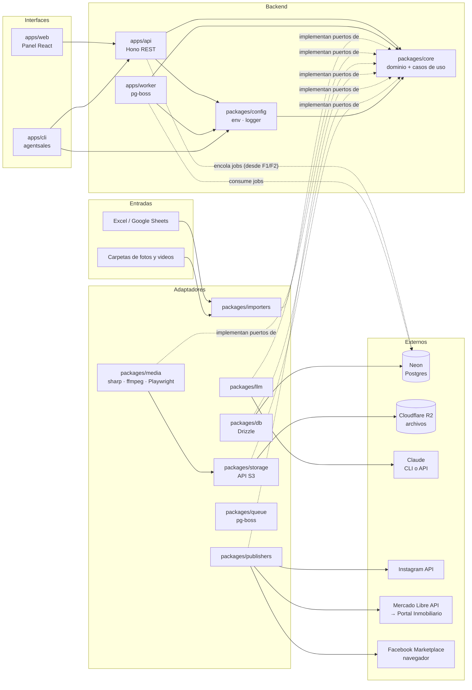
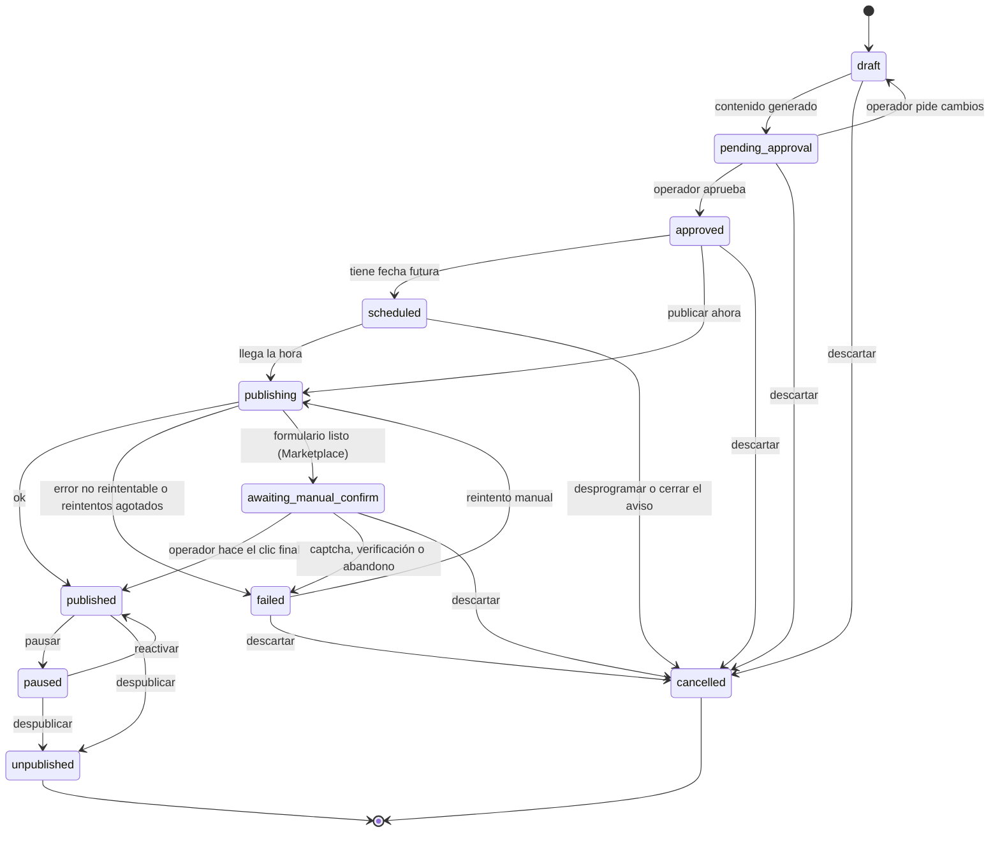

# 01 · Arquitectura

## Vista general



## Estilo: puertos y adaptadores

- `packages/core` contiene el **dominio**: entidades, esquemas zod, máquina de estados y casos de uso. No importa librerías de infraestructura.
- Core define **puertos** (interfaces): repositorios (`ListingRepository` y compañía), `MediaStorage`, `MediaFileSource`, `JobQueue`, `LLMProvider` y `Publisher`. Hoy existen `MediaStorage`, `MediaFileSource`, `MediaRepository`, `JobQueue`, `FieldDefinitionRepository`, `BrokerRepository`, `ListingRepository` e `ImportRunRepository` (`packages/core/src/ports/`); el resto llega en su fase.
- Cola (ADR-0005): el adaptador de pg-boss vive en `packages/queue` desde F1-T08 (en F0 estaba en el worker). Implementa `JobQueue` e incluye `QUEUE_SCHEMA` y `checkQueueSchema`. La API, como `producer`, arranca pg-boss de forma diferida en el primer `enqueue`, y su check de `/health` solo consulta que exista el esquema `pgboss`. Ver "Cola de trabajos" más abajo.
- Los demás paquetes son **adaptadores** que implementan esos puertos.
- Las apps (`api`, `worker`, `cli`, `web`) solo **componen** adaptadores y llaman casos de uso.

Esto permite cambiar Claude CLI por la API de Anthropic, o agregar una plataforma nueva, sin tocar el dominio.

## Estructura del monorepo

```
agentsales/
├── apps/
│   ├── api/          Hono REST API; tipos exportados para el cliente RPC
│   ├── web/          React + Vite + Tailwind + TanStack Query + React Router; panel de operación
│   ├── cli/          CLI `agentsales` (commander); usa el cliente RPC de la API
│   └── worker/       Procesa jobs: medios, contenido, publicación, sincronización
├── packages/
│   ├── core/         Dominio, esquemas zod, estados, casos de uso, puertos
│   ├── db/           Esquema Drizzle, migraciones y (desde F1) repositorios
│   ├── storage/      Archivos en Cloudflare R2 (API S3): subir, leer, borrar, URLs prefirmadas
│   ├── importers/    xlsx, google-sheets, carpetas de medios, zip y staging de cargas (`./staging`)
│   ├── queue/        Cola de trabajos (pg-boss): productor `JobQueue`, `createBoss` y check de `/health`
│   ├── llm/          Proveedores: claude-cli, anthropic-api, fake
│   ├── media/        Procesamiento de imagen/video y render de plantillas
│   ├── templates/    Plantillas HTML/CSS de posts (portada, ficha, etc.)
│   ├── publishers/   instagram, mercadolibre, fb-marketplace
│   └── config/       Variables de entorno validadas (zod), logger pino, redactor de secretos y resumen de errores repetidos
├── .github/          CI (GitHub Actions)
├── docs/             Documentación (esta carpeta)
├── data/             Plantillas y datos de prueba (los datos reales no van a git)
└── .claude/          Configuración de Claude Code: skills y subagentes
```

Los paquetes se crean **cuando la fase que los necesita comienza**, no antes (ver `06-roadmap.md`).

## Flujos principales

### 1. Carga

```
Excel + carpetas → xlsx-reader (importers) lee la planilla, sin validar ni filtrar
  → importListings (core) filtra EJEMPLO/Borrador y valida contra field_definitions
  → upsert de listings (idempotente por broker + external_ref)
  → ingestMedia (core): por carpeta, deduplica por sha256, sube a R2 → registra media,
    ordena, elige portada y pasa a ready (solo desde draft)
  → import_run con reporte de errores y advertencias por fila
```

### 2. Preparación de contenido (job `content.prepare`)

```
listing → media: normaliza, recorta por formato, elige portada
        → templates: renderiza portada y ficha técnica (PNG)
        → video: reel 9:16 (recorte + tope 90 s)
        → llm: genera textos por plataforma (JSON validado con zod)
        → crea contents y publications en estado pending_approval
          (o approved si el corredor tiene auto_publish)
```

### 3. Publicación (job `publication.publish`)

```
publication approved/scheduled → worker toma el job
  → publisher.validate() → publisher.publish()   (o dry-run)
  → guarda external_id/url → estado published
  → error reintentable: pg-boss reintenta con backoff; la publicación sigue en
    publishing (sube attempts y se registra un publish_attempt)
  → error no reintentable o reintentos agotados: failed
  → cada transición queda en publication_events
```

### 4. Seguimiento (job `publication.sync`, periódico)

```
publicaciones activas → publisher.getStatus() → actualiza estado
listing cerrado (vendido/arrendado) → publisher.unpublish() en todas
```

## Máquina de estados de una publicación



Para Marketplace (semiautomático) existe además `awaiting_manual_confirm` entre `publishing` y `published`: el formulario queda listo y el operador hace el clic final. Si aparece un captcha o una verificación, el sistema se detiene y la publicación pasa a `failed` (ADR-0004).

Estados iniciales (`INITIAL_PUBLICATION_STATUSES`): una publicación se crea en `draft`, en `pending_approval` (flujo normal: el contenido ya está generado) o en `approved` (corredor con `auto_publish`).

Estados terminales (`TERMINAL_PUBLICATION_STATUSES`): `unpublished` (estuvo en la plataforma y se bajó) y `cancelled` (nunca llegó a la plataforma). Todos los demás cuentan como **activos** (`ACTIVE_PUBLICATION_STATUSES`), incluido `failed`; por eso un `failed` se reintenta o se cancela antes de crear otra publicación del mismo aviso en la misma cuenta.

`transition()` no conoce la plataforma: el caso de uso solo lleva a `awaiting_manual_confirm` a publishers con `capabilities.manualStep`, y solo pausa en plataformas que lo soportan.

La máquina de estados vive en `packages/core` (`PUBLICATION_TRANSITIONS`, `canTransition`, `transition`) como función pura con tests: toda transición inválida lanza `AppError("INVALID_TRANSITION")`.

## Contrato de un Publisher

```ts
interface Publisher {
  platform: Platform;
  capabilities: { carousel: boolean; video: boolean; unpublish: boolean; statusSync: boolean; manualStep: boolean };
  validate(input: PublishInput): ValidationResult;          // requisitos de la plataforma
  publish(input: PublishInput, account: PlatformAccount): Promise<PublishResult>;
  unpublish(ref: ExternalRef, account: PlatformAccount): Promise<void>;
  getStatus(ref: ExternalRef, account: PlatformAccount): Promise<ExternalStatus>;
}
```

Con `PUBLISH_MODE=dry-run`, un decorador envuelve cualquier publisher: ejecuta `validate()`, registra lo que *habría* enviado y devuelve un resultado simulado.

## Cola de trabajos

Los jobs del worker (`apps/worker/src/jobs/`):
- Cada job se declara con `defineJob({ name, queue, handler })`, con `name` de `JOB_NAMES` (core):
  - **Datos:** se validan con `JOB_PAYLOADS[name]`, el mismo esquema que usa quien encola. Los datos vienen de la base, escritos por otro proceso, así que son un borde. Si son inválidos, lanza `JOB_PAYLOAD_INVALID`, que no se reintenta.
  - **`queue`:** política de la cola (`policy`, `retryLimit`, `retryDelay`, `retryBackoff`, `expireInSeconds`). Solo el worker la aplica al arrancar, así que el código es la fuente de verdad. Los productores no crean colas.
    - `createQueue` recibe todo.
    - `updateQueue` recibe todo **menos `policy`**, que es inmutable.
  - **Contexto:** el handler recibe `isLastAttempt` (`retryCount >= retryLimit`, de `work` con `includeMetadata`), para dejar el estado de dominio en `failed` antes del último error.
- **Payloads con solo ids** (`publicationId`, `mediaId`…), nunca secretos ni estado. El handler recarga el estado desde la base y verifica `external_id` y `status` antes de actuar, lo que lo hace idempotente (ADR-0005).
- **Errores:**
  - Un `AppError` no reintentable se registra y el job se da por cerrado. El caso de uso ya dejó el estado de dominio, por ejemplo la publicación en `failed`.
  - Cualquier otro error se propaga y pg-boss reintenta según la política.
  - `batchSize: 1`: un fallo nunca repite jobs ajenos.
- Los handlers son delgados: validan, arman dependencias y llaman un caso de uso de `core`. `buildJobs(deps)` arma la lista con las dependencias que compone `worker.ts` (db, R2, lector de xlsx y staging).
- **El log de cada intento** lleva los datos del job, que son solo ids: así cada error queda con, por ejemplo, su `importRunId`.

### Job `import.run` (F1-T09)
- **Cola:** `exclusive` (un solo job por `singletonKey = importRunId`), 2 reintentos con backoff desde 30 s, y expira a las 2 h.
- **`requestImport` (core):** crea el run en `queued` y encola.
  - Si la cola no está disponible (`QUEUE_UNAVAILABLE`), deja el run en `failed` y borra su staging.
  - Cualquier otro error se propaga sin tocar el run.
- **`runImport` (core), el handler:**
  1. Un run terminal no hace nada.
  2. `markRunning`, lee el xlsx, corre `importListings`, prepara los medios (`openMedia`), corre `ingestMedia` y deja el run en `succeeded`.
  3. Con un error no reintentable, o en el último intento, `markFailed` **antes** de relanzar. Si `markFailed` falla, se lanza ese error con el original como `cause`.
  4. Los medios se liberan siempre, y el staging se borra al llegar a un estado terminal.
  5. Si `markSucceeded` no cambia nada (otro intento ya lo dejó terminal), informa `skipped`.
  - Un error que no es `AppError` se normaliza a `INTERNAL_ERROR`, no reintentable y con un mensaje genérico: el run queda en `failed` y el job se cierra.
- **Runs abandonados:** al arrancar, el worker cierra como `failed` (`IMPORT_ABANDONED`) los runs en `running` de hace más de 7 h (`failAbandoned`). Cubre un proceso que murió, o una base caída en el último intento. Los `queued` no se tocan.
- **Política de la cola:** al arrancar, el worker compara la política guardada con la del código, y avisa en el log si difiere (`createQueue` no cambia una cola existente).
- **Staging (`@agentsales/importers/staging`, compartido por la API y el worker), en `<workspace>/tmp/imports/{runId}/`:**
  - `input/` lo escribe la API (T11) y se conserva hasta el estado terminal.
  - `extracted-{uuid}/` es el zip de **un** intento: se crea al empezar y se borra al terminar, falle o no. Dos intentos solapados no se pisan.
  - **Zip con una sola carpeta en la raíz** (macOS → Comprimir "medios"): si ninguna de las carpetas que la carga pide está en la raíz, pero sí dentro de esa única carpeta, la raíz pasa a ser esa carpeta. Un zip con una sola propiedad en su raíz no se desenvuelve.
  - **Al arrancar,** el worker borra:
    - los directorios de más de 24 h, antes de conectarse a la base;
    - ya conectado, los de runs terminados, y los sin run de más de 10 minutos (la API escribe `input/` antes de crear el run, T11).

    Solo toca directorios con nombre de uuid, y un error en uno no corta el barrido.
  - La API guarda los archivos subidos con `saveInput` (solo el último tramo del nombre, dentro de `input/`), y la raíz se compone igual en las dos apps. La subruta no carga exceljs.
  - **Los medios de la CLI** (`--media <dir>`) se leen en su lugar: el staging nunca borra archivos del operador.

Para encolar (`packages/queue`, desde F1-T08):
- **Contrato compartido en `core/src/jobs.ts`:** `JOB_NAMES` como tupla `as const` (`system.ping`, `import.run`) y `JOB_PAYLOADS`, esquemas zod por nombre. Así la API, los scripts y el worker comparten el contrato sin repetir literales.
- **Puerto `JobQueue`** en `core/src/ports/job-queue.ts`: `enqueue<N extends JobName>(name: N, data: JobPayload<N>, opts?: { startAfter?: Date; singletonKey?: string }): Promise<string | null>`. Devuelve `null` si ya había un job activo con el mismo `singletonKey`.
- **Adaptador `createJobQueue({ connectionString, onError })`**, sobre pg-boss en rol `producer`:
  - Arranca pg-boss recién en el primer `enqueue`, así la API levanta aunque el esquema `pgboss` no exista. Si el arranque falla, el siguiente `enqueue` lo reintenta.
  - Valida los datos con `JOB_PAYLOADS` antes de conectar (`JOB_PAYLOAD_INVALID`).
  - Cualquier falla de la cola (sin conexión, sin esquema, o una cola que el worker todavía no creó) es `QUEUE_UNAVAILABLE`, reintentable: la API responde 503. Antes, el esquema faltante era `QUEUE_NOT_INITIALIZED`. El mensaje "arranca el worker" solo sale con los errores exactos de pg-boss (sin esquema, esquema viejo, cola inexistente), no con un `database "x" does not exist`.
  - Refresca su caché de colas una vez al día, no cada 60 s, para no mantener Neon despierto (ADR-0007).
  - `stop()` cierra la conexión, también si el arranque está en curso. Después, `enqueue` da `QUEUE_UNAVAILABLE`.
  - Los errores de fondo de pg-boss van a `onError`. La API los resume con `createErrorThrottle` (`@agentsales/config`, el mismo del worker) y llama a `stop()` al apagarse.
- **Deduplicación con `singletonKey`:** depende de la **política de la cola**. En pg-boss 12 solo deduplican `singleton`, `stately`, `exclusive`, `short` y `key_strict_fifo`; con la estándar, `singletonKey` es solo una etiqueta. La política **no se puede cambiar después de crear la cola**: `updateQueue` falla si recibe `policy`, y cambiarla exige borrar la cola. T09 agrega `policy` a `QueuePolicy`, que solo se pasa a `createQueue`, y le da `exclusive` a `import.run`.
- **También en `packages/queue`:**
  - `createBoss({ connectionString, role })`, que usa el worker;
  - `QUEUE_SCHEMA`;
  - `checkQueueSchema`, el check de `/health`, que solo lee el catálogo.
- **Conexión:** el paquete no depende de `@agentsales/db`, porque los adaptadores no dependen entre sí. Quien lo usa pasa la conexión ya convertida con `toPgConnectionString`.

Política objetivo por cola (cada fase la confirma en su spec):

| Cola | Unicidad | Reintentos | Backoff | Expira |
|---|---|---|---|---|
| `system.ping` (F0) | — | 0 | no | 60 s |
| `import.run` (F1) | `singletonKey = importRunId`; en el último intento deja el run en `failed` | 2 | sí, desde 30 s | 2 h (videos grandes) |
| `media.process` | `singletonKey = mediaId` | 3 | sí, desde 30 s | ~15 min (ffmpeg) |
| `content.prepare` | `singletonKey = listingId` | 2 | sí, desde 60 s | ~10 min (LLM) |
| `publication.publish` | `singletonKey = publicationId`; dead-letter que lleva a `failed` | 3 | sí, desde 60 s | ~5 min (Marketplace termina en `awaiting_manual_confirm`) |
| `publication.sync` | cron, sin solaparse | 1 | no | ~10 min |
| `tokens.refresh` | cron | 3 | sí | ~5 min |

Con el worker apagado (ADR-0007), los jobs con `startAfter` vencido corren al arrancar y los cron del período apagado se pierden. Eso afecta al calendario de F6.

`queue: ok` en `/health` significa que la cola se inicializó alguna vez, **no** que el worker esté corriendo.

## Contratos HTTP compartidos (ADR-0011)

- **Entidades de dominio** (`listing`, `media`, `broker`, `importRun`, `importReport`) y `healthReportSchema`: en `packages/core`.
- **Contratos HTTP:** en la salida `@agentsales/api/contracts` (`apps/api/src/contracts/`). Incluye:
  - el cuerpo de error (`errorBodySchema`);
  - los parámetros (`idParamSchema`: uuid);
  - los filtros (`listingQuerySchema`);
  - los cuerpos (`listingStatusBodySchema`);
  - los formularios y cuerpos de importación (`importUploadFormSchema`, `localImportBodySchema`);
  - los sobres de respuesta (`listingListResponseSchema`, `listingDetailResponseSchema`, `brokerListResponseSchema`, `importRunResponseSchema` e `importRunListResponseSchema`). Las fechas llegan como texto ISO y se vuelven `Date` (`z.coerce.date`).
- **Frontera:** Biome la limita a `zod`, `@agentsales/core` e imports de `./` (no `../`, que sale al código del servidor), y un test (`apps/api/test/contracts-boundary.test.ts`) prueba que rechaza `@agentsales/config`, `node:*` y `hono`.
- **Validación de entrada:** `validated(target, schema)` (`apps/api/src/validation.ts`, sobre `hono/validator`). Un valor inválido es `REQUEST_INVALID` (400), con los campos en el mensaje.
- **Importación (F1-T11, `apps/api/src/routes/imports.ts`):** la API solo crea el run y encola (`requestImport`, ADR-0005), y responde `202`.
  - **`POST /imports` (panel):**
    - multipart con `file` (.xlsx de hasta 10 MB, si no `REQUEST_INVALID`), `media` (.zip, opcional), `broker` y `dryRun`;
    - todo el cuerpo tiene un tope, `MAX_IMPORT_UPLOAD_MB` (`bodyLimit`): si lo pasa, `413 REQUEST_TOO_LARGE`;
    - el id del run lo genera la API (`newId`), para guardar los archivos en `input/` antes de crear el run;
    - si algo falla después de guardar, borra lo guardado. Con la cola caída, `503 QUEUE_UNAVAILABLE` y el run queda en `failed`.
  - **`POST /imports/local` (la CLI):** recibe rutas absolutas del disco del operador. Solo existe con `localImports` (`NODE_ENV=development`): si no, `404`, aunque el cuerpo sea inválido.
  - **`GET /imports` y `/imports/:id`:** muestran `input` solo con nombres de archivo (`importRunViewSchema`), nunca las rutas completas. La lista va sin `report` (`importRunSummarySchema`), y en el detalle `report` puede ser `null`.
  - **Memoria:** Hono lee el multipart completo, y los archivos se escriben a disco en streaming (`File.stream()`). El pico ronda las 2 veces el cuerpo, de ahí el default de `MAX_IMPORT_UPLOAD_MB` en 512. En F7 se cambia por la subida directa a R2.
  - **Formulario del panel:** un campo de archivo vacío o un corredor vacío cuentan como no enviados.
  - **`AppDeps`:** recibe `importRuns`, `queue`, `uploads` (`save` y `discard`, que `server.ts` compone con el staging), `newId`, `localImports` y `maxUploadBytes`.
- **Rutas (F1-T10):**
  - `GET /listings` (filtros exactos, con la portada como URL firmada);
  - `GET /listings/:id` (con sus medios en orden y URLs firmadas);
  - `PATCH /listings/:id/status` (`changeListingStatus`);
  - `GET /brokers`.

  Van en `apps/api/src/routes/`, montadas con `.route()`. `AppDeps` recibe puertos de core (`listings`, `brokers`, `media` y `storage.signedReadUrl`), no adaptadores.
- **Cambios manuales de estado (`LISTING_MANUAL_TRANSITIONS`, core):**
  - `draft` → `ready` o `archived`;
  - `ready` → `paused` o `archived`;
  - `paused` → `ready` o `archived`;
  - `archived` → `ready`.

  `ready` exige al menos una foto, y el cambio es condicional (`ListingRepository.changeStatus`). `active` y `closed` no se cambian a mano en F1. Una transición no permitida es `409 INVALID_TRANSITION`, también pasar al mismo estado (la tabla no tiene `x → x`). `LISTING_MANUAL_TARGETS` (core) son los destinos, y la API valida con ellos.
  - **Provisional:** en F3 la tabla se redefine con su diagrama, como la de las publicaciones, y `changeListingStatus` pasa a orquestar las publicaciones: pausar al pasar a `paused`, despublicar al archivar, `active` ↔ `paused` y `closed` con `close_reason`.
- La API tipa sus respuestas y valida su entrada con esos esquemas. La CLI y el panel validan con los mismos esquemas lo que reciben.
- **Lo único que el panel importa de la API en tiempo de ejecución es `@agentsales/api/contracts`.** De la raíz de `@agentsales/api` solo importa `import type { AppType }`, porque en tiempo de ejecución arrastraría el servidor.

## Tipos alcanzables desde `AppType`

La CLI y el panel importan `type AppType = ReturnType<typeof createApp>`, que arrastra la firma de `createApp(deps: AppDeps)` y todo tipo que se alcance desde ahí. Por eso:
- En esos tipos no puede aparecer pino, drizzle, pg-boss, `@hono/node-server` ni `NodeJS.*`.
- Se usan los puertos de `core` o tipos mínimos locales. Por ejemplo, `AppLogger` en vez del `Logger` de pino.
- TypeScript puede compilar el panel contra el **código fuente** de la API, no solo contra sus `.d.ts`; pasa, por ejemplo, en un clon limpio. Por eso la regla vale para todo módulo de `apps/api/src` alcanzable desde `index.ts`: no puede importar `@agentsales/config`, `node:*` ni usar `NodeJS.*`. Solo `server.ts`, el punto de entrada, compone lo que depende de Node. La excepción es `src/testing/` (`@agentsales/api/testing`): es una salida aparte, solo para tests, que `index.ts` no importa. Las utilidades puras que comparten, como `redactText`, viven en `core`.
- El panel tiene una guardia (`apps/web/src/no-node-types.ts`): si se filtran los tipos de Node, `tsc -b` falla. La CI la ejerce en un clon limpio.

## Contrato de repositorios

- El puerto vive en `packages/core/src/ports/` y devuelve **entidades de core**, validadas con su esquema zod (ADR-0011). Una fila que no calza con el esquema, por ejemplo un jsonb corrupto, es un `AppError` no reintentable (`FIELD_DEFINITION_INVALID`…), no un `ZodError`.
- La implementación Drizzle vive en `packages/db/src/repositories/` y recibe `SchemaDatabase`: sirve con node-postgres en las apps y con PGlite en los tests. No usa nada propio del driver.
- **Errores (`withDbErrors`):**
  - Un fallo de conexión es `AppError("DB_UNAVAILABLE", { retriable: true })`: la API responde 503 y el job reintenta.
  - Otro error de una consulta es `DB_QUERY_FAILED`, no reintentable, con el SQLSTATE en `details`.
  - En los dos casos, `cause` es un **resumen sin datos** del error del driver (`safeDriverError`): un mensaje fijo y solo `code`, `constraint`, `table`, `column` y `schema`. El `DrizzleQueryError` lleva los parámetros de la consulta, y el error de pg lleva la fila en `detail`; los dos terminarían en los logs con datos de clientes.
  - `sqlStateOf` lee el SQLSTATE a través de la cadena de `cause`.
- **Conflictos:** un `create` que choca con un único (`slug`, `(broker_id, external_ref)`, o los de `media`: `media_original_listing_checksum_unique` y `media_storage_path_unique`) es `BROKER_CONFLICT`, `LISTING_CONFLICT` o `MEDIA_CONFLICT`, **reintentable**, porque dos intentos del job pueden solaparse y el reintento reclasifica la fila o encuentra el medio. Un `update` de un id que no existe es `*_NOT_FOUND`.
- **`MediaRepository.arrange`:**
  - `checkArrangement` (core) rechaza ids repetidos, más de una portada o un `sortOrder` inválido (`MEDIA_ARRANGE_INVALID`), y un id que no es original del aviso da `MEDIA_NOT_FOUND`. En los dos casos no cambia nada.
  - En Postgres va en una transacción que bloquea el aviso (`FOR NO KEY UPDATE`): dos `arrange` del mismo aviso se serializan, y queda una sola portada sin deadlocks. PGlite no puede probar la concurrencia, porque tiene una sola conexión; el rollback sí está probado.
- **`BrokerRepository.setLogo`:** valida que el medio sea un original sin aviso del mismo corredor (`MEDIA_NOT_FOUND`); la base solo tiene la FK.
- **Proyecciones:** `ListingImportRecord` (id, `external_ref`, `status` y `source_hash`) es una proyección para la carga, sin esquema. La entidad completa es `listingSchema`, que devuelven `ListingRepository.list` y `get`. `MediaRecord` también es una proyección sin esquema: la API expone `mediaItemSchema` (sin `storagePath` ni `checksum`, con la URL firmada), definido en `contracts`. En F1, `media` no tiene esquema zod en core (excepción a §4.1 del spec F1).
- **Ids:** son uuid. La API los valida con zod antes de llamar al repositorio; con otro formato, el adaptador de Postgres da `DB_QUERY_FAILED` (22P02) y los dobles en memoria, `null` o `*_NOT_FOUND`.
- Hay un doble en memoria con la misma semántica en `@agentsales/core/testing`, que solo se importa desde tests. Los dos se prueban con los mismos fixtures, por ejemplo `fieldDefinitionOrderFixture`.
- `FieldDefinitionRepository.list` devuelve las definiciones activas e inactivas. La precedencia (la del corredor sobre la global) y el filtro de `active` los resuelve `buildListingValidator` en core (`resolveEffectiveDefinitions`).

## Importación de propiedades (`importListings`, core)

- `importListings(deps, { runId, input })` recibe la hoja ya leída (`ListingSheetInput`) y un `import_run` ya creado. `dry_run`, el origen (`source`) y el `--broker` (`input.broker`) salen **del run**: es una sola fuente de verdad, así un run de simulación nunca escribe. Los pasos:
  1. Resuelve el corredor con `parseBrokerSheet` (hoja Corredor) o con `--broker`. `--broker` gana sobre el slug de la hoja, y la hoja actualiza ese corredor. Los errores son `BROKER_INVALID` (el detalle queda en el reporte, con `headers: null`) y `BROKER_NOT_FOUND`.
  2. Arma el validador con las definiciones del corredor.
  3. Por fila, `ignored`, `failed`, `created`, `updated` o `skipped`, comparando `source_hash`: el sha256 del JSON canónico de `{ core, attributes, control }`. `sha256` se inyecta, porque core no usa `node:crypto`. Si cambia esa composición, o un valor por defecto del validador, cada aviso sale `updated` una vez.
- **Estado:** un aviso nuevo nace en `draft` y la importación nunca cambia `status`. El paso a `ready` lo hace la ingesta de medios (F1-T07), con el `control` que devuelve cada fila.
- **Registro:** los contadores y el reporte (`importReportSchema`) se guardan en el run, también con `dry_run`, que solo lee y reporta lo que pasaría.
- **Errores de escritura:** un error no reintentable al escribir una fila la deja `failed`, con un motivo genérico, y la carga sigue. Uno reintentable (`DB_UNAVAILABLE`, `*_CONFLICT`) se propaga para que el job reintente.
- **Reintentos:** reintentar es seguro, porque todo se escribe por `external_ref`: lo ya creado sale `skipped`.

## Ingesta de medios (`ingestMedia`, core)

- `ingestMedia(deps, { runId, imported, source })` corre después de `importListings`, en el mismo run, con su resultado (`imported`).
  - `source` es el `MediaFileSource` de la carga, o `null` si no se pasaron medios; lo compone el job.
  - `dry_run` sale del run: solo lee y reporta lo que se subiría.
- **Logo:**
  - `_marca/<logo>` se sube a `brokers/{brokerId}/brand/{sha256}.{extension}`.
  - No se resube si ya existe (`findByStoragePath`), y se asigna con `setLogo`.
  - Las advertencias van a `broker.warnings`.
- **Por fila** `created`, `updated` y `skipped` (así, agregar fotos sin tocar el Excel las sube):
  1. **Carpeta y deduplicación:** lista `carpeta_medios`, o `id_propiedad` si viene vacía. Deduplica por sha256 contra los originales del aviso y dentro de la carpeta.
  2. **Subida:** sube a `brokers/{b}/listings/{l}/original/{sha256}.{extension}`, con el sha256 para que R2 verifique el contenido, y después inserta en `media`. Si falla entre medio, el reintento sobrescribe la misma clave.
  3. **Orden y portada:** fija orden y portada con `arrange`, solo si algo cambió.
     - El orden es el natural de la carpeta, y lo que ya no está se conserva al final.
     - La portada es `foto_portada` si es una foto de la carpeta; si no, la primera foto de la carpeta.
     - Si la carpeta no trae fotos, se conserva la portada guardada. `media` no guarda el nombre original, así que `foto_portada` solo se resuelve contra la carpeta.
     - **Sin carpeta legible** (no se pasaron medios, o `MEDIA_FOLDER_*`): no toca orden ni portada. Solo cuentan las fotos que el aviso ya tenía, para el estado.
  4. **Estado:** con `estado_carga = Listo` y al menos una foto, `promoteToReady`, que solo pasa de `draft` a `ready`. Con `Listo`, sin fotos y en `draft`, deja una advertencia. En `dry_run`, un aviso nuevo cuenta como `draft`.
- **Errores:**
  - Un problema de una carpeta (`MEDIA_FOLDER_*`) o de un archivo es una advertencia de su fila. De un archivo: `MEDIA_FILE_UNREADABLE`, o `STORAGE_CONTENT_MISMATCH` si cambió mientras se subía.
  - Lo demás se propaga para que el job reintente: `STORAGE_UNAVAILABLE`, `DB_UNAVAILABLE`, `MEDIA_CONFLICT`, y también `STORAGE_ERROR` de credenciales.
  - No hay reintentos por archivo: la deduplicación evita volver a subir lo que ya terminó.
- **Advertencias:** usan un texto fijo por código, por ejemplo "el archivo cambió mientras se subía", nunca el mensaje del error, que puede traer la clave interna en R2.
- **Reporte:** el de `importListings` más `media` (`filesUploaded`, `filesExisting`, `filesSkipped`, `filesFailed`, sin el logo) y las advertencias. Se guarda con `recordMediaResult`, que no toca contadores ni estado.

## Lector de Excel (`packages/importers`)

- `readListingsWorkbook(ruta | bytes)` lee la hoja **Propiedades** (encabezados en la fila 1) y la hoja **Corredor** (vertical, con las columnas `Campo` y `Tu valor`). Busca las hojas y las columnas sin mayúsculas ni tildes.
- Devuelve `{ headers, rows: [{ rowNumber, raw }], broker }`, con **todas** las filas no vacías y su número real de fila en Excel. **No valida ni filtra:** eso es del validador y de `importListings`.
- **Celdas:** aplana las de exceljs cuando puede: fórmula → su resultado guardado, hipervínculo → el texto visible (no la URL), texto enriquecido → texto plano. Lo que no sabe aplanar, incluidos los errores de Excel (`#REF!`), pasa tal cual y el validador lo marca `FIELD_VALUE_INVALID` en cualquier campo.
- **Casos especiales:**
  - las celdas combinadas que no son la principal se leen vacías;
  - una fórmula sin resultado guardado (un Excel generado por script) se lee vacía;
  - en `link_video`, un hipervínculo con el texto "Ver video" no sirve, porque se lee el texto: hay que escribir la URL.
- **Contrato:** entrega `ListingSheetInput` (core) y las claves de cada fila son propiedades propias, así que un encabezado como `constructor` o `__proto__` no se pierde.
- **Mensajes de error:** llevan solo el **nombre** del archivo, nunca la ruta.
- Topes: 10 MB y 1000 filas de datos. Los errores son `IMPORT_FILE_NOT_FOUND` o `IMPORT_FILE_INVALID` (no es xlsx, excede un tope, falta la hoja Propiedades o la hoja Corredor no tiene sus columnas).

## Lectores de medios (`packages/importers`)

- **`createMediaFolderSource(rootDir, { maxVideoBytes })`** implementa `MediaFileSource` (core). `list(folder)` recibe la carpeta **relativa** a la raíz (`carpeta_medios`, `id_propiedad` o `_marca`) y devuelve `{ files, skipped }`.
  - **Carpeta:**
    - Si sale de la raíz o viene vacía, `MEDIA_FOLDER_INVALID`: `carpeta_medios` viene del Excel.
      - Se verifica en el texto de la ruta y después con `realpath`, así una carpeta enlazada (`root/link -> ../afuera`) tampoco sale.
      - Un enlace que apunta dentro de la raíz sí vale.
    - Si no existe, `MEDIA_FOLDER_NOT_FOUND`.
    - Si no se puede leer, o el disco falla con un archivo (`EIO`, `EMFILE`), `MEDIA_FOLDER_UNREADABLE`. Un archivo sin permiso, o que desapareció, solo se omite (`unreadable`).
    - Ninguno de los tres es reintentable.
  - **Archivos:**
    - No recorre subcarpetas ni sigue enlaces simbólicos (`O_NOFOLLOW`).
    - Ignora sin advertencia los ocultos, `__MACOSX`, `Thumbs.db` y `desktop.ini`.
  - **Tipo:**
    - Se decide por la extensión, sin mayúsculas: jpg, jpeg, png, webp, heic, mp4 y mov.
    - Se verifica con la firma de los primeros 16 bytes.
    - HEIC, mp4 y mov comparten la caja `ftyp`. Se distinguen por la marca: las de HEIF son HEIC, las de AVIF y audio (`avif`, `M4A `…) no son video, y cualquier otra es video.
    - `extension` es la canónica (`jpeg` → `jpg`), para la clave en R2.
  - **Omitidos:** cada archivo omitido va a `skipped` con su motivo (`MEDIA_SKIP_REASONS`). Un video sobre `maxVideoBytes` se omite sin calcular su hash.
  - **Aceptados:**
    - El sha256 se calcula en streaming.
    - El orden es natural (`naturalOrder`: `Intl.Collator("es", { numeric: true })`). Con empate, decide la comparación binaria, para no depender del orden del sistema de archivos.
    - `open()` vuelve a leer el archivo, y un fallo es `MEDIA_FILE_UNREADABLE`, que `putStream` deja pasar.
    - Si el archivo cambia entre `list` y `open`, `putStream` lo detecta: el cambio de largo lo ve el adaptador, y un contenido distinto del mismo largo lo rechaza R2 con el sha256 (`ChecksumSHA256`, F1-T07b).
- **`extractZip(zipPath, destDir, { maxEntries, maxTotalBytes })`**, con yauzl, entrada por entrada:
  - **Topes:** 2000 entradas (leídas del directorio central, antes de escribir) y 4 GB descomprimidos. Los bytes se suman con lo declarado antes de escribir cada entrada, y `validateEntrySizes` corta si una entrada trae más de lo que declara.
  - **Zip-slip:** yauzl rechaza los nombres absolutos o con `..` (también con `\`), y además `entryTargetPath` verifica que el destino quede dentro de `destDir`, antes de decidir si la entrada se omite. Un zip con una entrada así se rechaza completo.
  - **Se omiten**, y se cuentan en `skipped`: los enlaces simbólicos y otras entradas especiales, `__MACOSX/` y los ocultos. `.` y `..` no cuentan como ocultos: `./p/foto.jpg` se extrae.
  - **Conflictos del propio zip:** se detectan antes de escribir, sin distinguir mayúsculas. Son nombres repetidos, o un archivo y una carpeta con el mismo nombre.
  - **Escritura:** con `wx`, así que no pisa archivos ni escribe a través de un enlace.
  - **Errores:**
    - `IMPORT_FILE_NOT_FOUND`;
    - `IMPORT_FILE_INVALID`: no es zip, corrupto, cifrado, tope superado, ruta hostil, nombres demasiado largos, repetidos o en conflicto;
    - `IMPORT_EXTRACT_FAILED`: el disco, o un `destDir` que ya tenía esos archivos.

    Ninguno es reintentable, y llevan el nombre del zip, no la ruta.
  - **Limpieza:** lo que alcanzó a escribir antes de un error lo borra quien llama.

## Validador de filas (`buildListingValidator`, core)

- Se construye desde las definiciones (ADR-0006): agregar un campo es insertar una fila, sin cambiar código.
- **Configuración inválida:** si con las definiciones no se puede armar un `listing`, lanza `FIELD_CONFIG_INVALID` al construirse, una vez por carga. Pasa en estos casos:
  - falta `id_propiedad`, `precio` o `moneda`;
  - una `key` no está en snake_case (`_extra` queda reservada);
  - un `is_core` no tiene destino en `CORE_FIELD_TARGETS`, o una `key` de destino fijo no es `is_core` (así `notas_internas` nunca termina en `attributes`);
  - un destino tiene otro tipo;
  - una opción de un campo mapeado (`operacion`, `moneda`, `estado_carga`) no tiene equivalente;
  - hay un enum sin opciones;
  - dos campos leen la misma columna.
- **Por fila:** `validate(row)` empareja los encabezados sin mayúsculas, tildes ni espacios extra, y normaliza cada celda según su tipo.
  - Una columna opcional ausente no hace fallar la fila, y una obligatoria ausente es `FIELD_REQUIRED`.
  - Acumula los errores (`FieldIssue`: columna, `key`, código y motivo) sin detenerse en el primero. La fila la agrega quien llama.
  - `fieldIssueSchema` es el contrato zod de ese error, porque viaja en el reporte y por HTTP.
- **Salida:** `core` (columnas de `listings`), `control` (`estado_carga`, `carpeta_medios`, `foto_portada`) y `attributes` (con `_extra` para las columnas desconocidas).
- **Encabezados y filas ignoradas:**
  - `checkHeaders(headers)` revisa los encabezados una vez por hoja: desconocidos, obligatorios faltantes y repetidos. Ignora los vacíos.
  - `isIgnored(row)` marca la fila `EJEMPLO` y las de `Borrador`.
- **`schema`:** es el esquema zod por `key` que usa `validate`. No lo reemplaza, porque no empareja columnas ni arma `_extra`.
- Es código puro: sin red, base ni archivos.

## Contrato de almacenamiento de archivos

```ts
interface MediaStorage {
  put(path: string, body: Uint8Array, contentType: string): Promise<void>;   // sobrescribe
  putStream(path: string, body: AsyncIterable<Uint8Array>,
            options: { contentType: string; contentLength: number; sha256?: string }): Promise<void>; // sobrescribe
  get(path: string): Promise<Uint8Array>;                                     // STORAGE_NOT_FOUND si no existe
  head(path: string): Promise<{ size: number; contentType: string | undefined } | null>; // null si no existe
  delete(path: string): Promise<void>;                                        // idempotente
  signedReadUrl(path: string, ttlSeconds?: number): Promise<string>;
}
```

- Implementación: `packages/storage` (Cloudflare R2 vía API S3, ADR-0007).
- Errores como `AppError`: `STORAGE_NOT_FOUND`, `STORAGE_UNAVAILABLE` (reintentable), `STORAGE_ERROR` y `STORAGE_CONTENT_MISMATCH` (solo `putStream`; del archivo, no de R2).
- `put` trabaja con el archivo completo en memoria. `putStream` lo sube **en streaming, en un solo PUT** (no multiparte), para videos de hasta `MAX_VIDEO_MB`, con tipos de ES2023 y nada de Node en core (spec F1, D3):
  - Es un solo `PutObject` con `Content-Length`, sin `@aws-sdk/lib-storage`, porque R2 acepta hasta unos 5 GB en un PUT.
  - Usa un cliente S3 aparte, **sin reintentos**: un stream no se puede rebobinar. Reintenta el job, que vuelve a abrir el archivo. La versión actual del SDK ya no reintenta streams, así que `maxAttempts: 1` es defensivo.
  - Sin el checksum por defecto del SDK: con él, el stream viaja en `aws-chunked`, con un CRC32 al final y sin `Content-Length`. La integridad en tránsito la da TLS.
  - **Verificación del contenido (F1-T07b):** con `sha256` (hex), el adaptador lo manda como `ChecksumSHA256` en base64, sin `ChecksumAlgorithm`. El SDK deja el header tal cual, sin `aws-chunked`, y R2 recalcula el sha256 de lo recibido. Si no calza, responde `BadDigest` sin guardar el objeto (`STORAGE_CONTENT_MISMATCH`). Un `sha256` mal formado es `STORAGE_ERROR`. Detalle en `docs/integraciones/r2-checksums.md`.
  - Si el stream trae más o menos bytes que `contentLength`, es `STORAGE_CONTENT_MISMATCH`, no reintentable: se aborta la petición, sin dejarla colgada. Un `contentLength` inválido es `STORAGE_ERROR` (un bug de quien llama).
  - Si falla la lectura del origen, un `AppError` del lector pasa tal cual, con su código y si es reintentable; cualquier otro error es `STORAGE_ERROR`.
  - `pnpm storage:check` lo verifica contra R2: 1 MB en trozos de 64 KB, con el sha256 correcto y con el de otro contenido, que debe rechazarse sin dejar el objeto.

## Contrato del proveedor de IA

```ts
interface LLMProvider {
  generateStructured<T>(req: { system: string; prompt: string; images?: ImageRef[]; schema: ZodSchema<T> }): Promise<T>;
}
```

- `claude-cli`: invoca `claude -p ... --output-format json` como subproceso. Usa el plan Max. **Solo para uso propio.**
- `anthropic-api`: SDK oficial con `ANTHROPIC_API_KEY`. Obligatorio cuando el sistema lo usen terceros.
- `fake`: respuestas fijas para tests.

Los prompts viven versionados en `packages/llm/prompts/` y cada `content` guarda `prompt_version`.

## Seguridad

- Tokens de plataformas cifrados en reposo con AES-256-GCM. La clave de 32 bytes se deriva de `APP_ENCRYPTION_KEY` con HKDF-SHA256 (se implementa en F3).
- Nunca se loguean tokens, contraseñas ni `.env`.
- El bucket de R2 es privado; se usan URLs prefirmadas de corta duración para que Instagram descargue los medios.
- La base de datos solo acepta conexiones con credenciales y TLS. `.env` usa `sslmode=require` y el cliente lo convierte en `verify-full`, que además verifica el certificado (`toPgConnectionString`, también para pg-boss). No se expone ninguna API HTTP de datos.
- Marketplace: la sesión del corredor vive en un perfil de navegador local por corredor; el sistema nunca guarda su contraseña.
- La API no tiene autenticación hasta F7, así que solo escucha en `127.0.0.1`. Como eso no protege del navegador del propio operador (cualquier página abierta puede apuntar a `127.0.0.1:8787`):
  - rechaza cualquier `Host` que no sea local (defensa contra DNS rebinding): `127.0.0.1` o `localhost` en `API_PORT` o `WEB_PORT`;
  - aplica `csrf()` de Hono: formularios y `multipart` solo desde el origen del panel.

## Decisiones

Las decisiones de arquitectura están en `docs/adr/`. Antes de cambiar algo de esta página, se escribe o actualiza un ADR.
