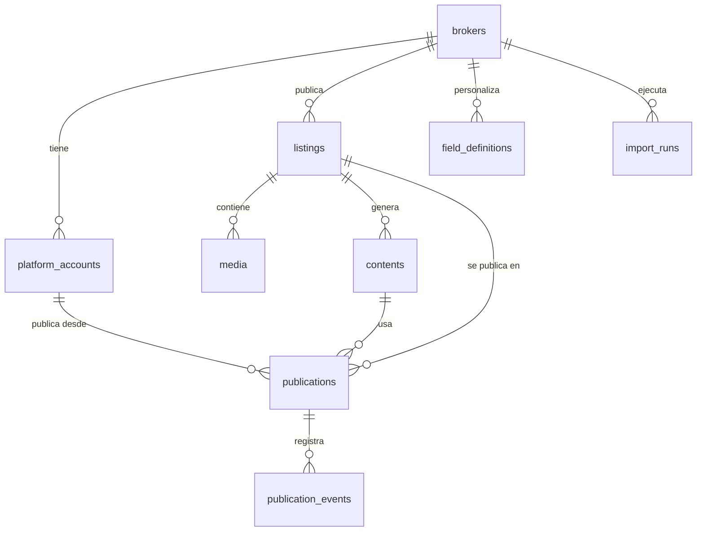

# 02 · Modelo de datos

Base de datos: Postgres en Supabase. Esquema en `packages/db` con Drizzle; este documento es la referencia conceptual. Si difieren, **manda el código** y este documento se actualiza en la misma tarea.

Convenciones: tablas y columnas en inglés `snake_case`; `id uuid default gen_random_uuid()`; `created_at` y `updated_at` en `timestamptz` (UTC); enums de Postgres para estados.

## Diagrama

## Tablas

### brokers — corredor o vendedor
| Columna | Tipo | Notas |
|---|---|---|
| id | uuid PK | |
| slug | text unique | ej. `vp-propiedades` |
| name | text | Nombre de la persona |
| brand_name | text | Aparece en los posts |
| logo_media_id | uuid null | FK a `media` |
| primary_color, secondary_color | text | HEX |
| whatsapp, email, instagram_handle, website | text null | |
| tone | text null | Guía de tono para la IA |
| fixed_hashtags | text[] | |
| auto_publish | boolean default false | Si es true, se omite la aprobación manual |

### platform_accounts — cuentas conectadas de cada corredor
| Columna | Tipo | Notas |
|---|---|---|
| id | uuid PK | |
| broker_id | uuid FK | |
| platform | enum `platform` | `instagram`, `portal_inmobiliario`, `fb_marketplace` (luego `yapo`, `tiktok`) |
| external_account_id | text | ID en la plataforma |
| display_name | text | |
| credentials_encrypted | text null | JSON de tokens cifrado |
| token_expires_at | timestamptz null | |
| status | enum | `connected`, `expired`, `revoked`, `error` |
| meta | jsonb | Datos propios de la plataforma |

Único: `(broker_id, platform, external_account_id)`.

### field_definitions — campos configurables
| Columna | Tipo | Notas |
|---|---|---|
| id | uuid PK | |
| broker_id | uuid null | `null` = definición global |
| category | text | `real_estate` (luego `product`) |
| key | text | ej. `dormitorios` |
| label | text | Texto visible |
| type | enum | `text`, `number`, `enum`, `boolean`, `date`, `url`, `list` |
| required | boolean | |
| options | jsonb null | Opciones de `enum` |
| source_column | text | Encabezado en el Excel |
| is_core | boolean | Mapea a una columna fija de `listings` en vez de `attributes` |
| sort_order | int | |
| active | boolean | |

Una definición del corredor con el mismo `key` **sobrescribe** la global. Agregar un campo = insertar una fila; no requiere migración.

### listings — aviso (propiedad o producto)
| Columna | Tipo | Notas |
|---|---|---|
| id | uuid PK | |
| broker_id | uuid FK | |
| external_ref | text | `id_propiedad` del Excel |
| category | text | `real_estate` |
| operation | enum null | `sale`, `rent` |
| property_type | text null | Departamento, Casa… |
| status | enum `listing_status` | `draft`, `ready`, `active`, `paused`, `closed`, `archived` |
| close_reason | text null | `sold`, `rented`, `withdrawn` |
| price_amount | numeric(14,2) | |
| price_currency | enum | `UF`, `CLP` |
| region, comuna, address, unit_number | text | |
| show_exact_address | boolean | |
| attributes | jsonb | Resto de campos, validados con `field_definitions` |
| highlights | text null | Lo que el corredor quiere destacar |
| internal_notes | text null | Nunca se publica |
| source | enum | `xlsx`, `google_sheets`, `manual`, `chat` |
| source_hash | text | Hash de la fila para detectar cambios |

Único: `(broker_id, external_ref)`. Ese par es la llave de la **importación idempotente**.

### media — fotos, videos y derivados
| Columna | Tipo | Notas |
|---|---|---|
| id | uuid PK | |
| listing_id | uuid FK null | `null` para medios del corredor (logo) |
| broker_id | uuid FK | |
| kind | enum | `image`, `video` |
| role | enum | `original`, `processed`, `rendered` |
| variant | text null | ej. `ig_4x5`, `ig_reel`, `pi_4x3`, `cover`, `spec_sheet` |
| parent_media_id | uuid null | Derivado de qué original |
| storage_path | text | Ruta en el bucket |
| mime, width, height, duration_s, bytes | | |
| checksum | text | sha256; evita duplicados |
| sort_order | int | Orden del carrusel |
| is_cover | boolean | |
| ai_metadata | jsonb | Descripción y puntaje de la IA |

### contents — textos generados por plataforma
| Columna | Tipo | Notas |
|---|---|---|
| id | uuid PK | |
| listing_id | uuid FK | |
| platform | enum `platform` | |
| title | text null | Portal y Marketplace |
| body | text | Caption o descripción |
| hashtags | text[] | |
| status | enum | `draft`, `edited`, `approved` |
| llm_provider, llm_model, prompt_version | text | Trazabilidad |
| raw_output | jsonb | Salida validada de la IA |

### publications — un aviso en una plataforma
| Columna | Tipo | Notas |
|---|---|---|
| id | uuid PK | |
| listing_id | uuid FK | |
| platform_account_id | uuid FK | |
| platform | enum `platform` | Denormalizado para consultas |
| content_id | uuid FK | |
| media_ids | uuid[] | Medios usados, en orden |
| status | enum `publication_status` | Ver máquina de estados en `01-arquitectura.md` |
| scheduled_at | timestamptz null | |
| published_at | timestamptz null | |
| external_id, external_url | text null | |
| attempts | int default 0 | |
| last_error | jsonb null | `{ code, message, retriable }` |
| dry_run | boolean | Publicado en modo simulación |

Único parcial: una publicación activa por `(listing_id, platform_account_id)`.

### publication_events — bitácora
| Columna | Tipo | Notas |
|---|---|---|
| id | uuid PK | |
| publication_id | uuid FK | |
| type | text | `status_changed`, `publish_attempt`, `sync`, `manual_edit` |
| from_status, to_status | text null | |
| actor | text | `system`, `operator`, `cli` |
| payload | jsonb | Sin secretos |
| created_at | timestamptz | |

### import_runs — historial de cargas
| Columna | Tipo | Notas |
|---|---|---|
| id | uuid PK | |
| broker_id | uuid FK | |
| source | enum | |
| file_name | text | |
| rows_total, rows_created, rows_updated, rows_skipped, rows_failed | int | |
| report | jsonb | Errores por fila y columna |
| started_at, finished_at | timestamptz | |

### Cola de trabajos

`pg-boss` crea y administra su propio esquema (`pgboss`). No se modela aquí.

## Reglas de datos

- Precios: se guardan tal cual en su moneda; **no** se convierte UF↔CLP.
- Fechas: UTC en la base; se muestran en `America/Santiago`.
- Borrado: los listings no se borran; pasan a `archived`.
- `internal_notes` nunca se envía a la IA ni a las plataformas.
