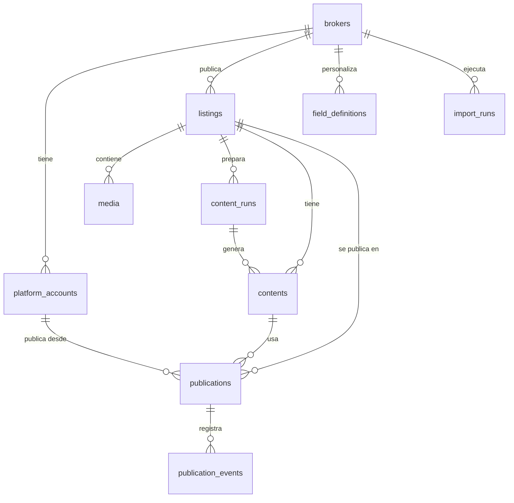

# 02 · Modelo de datos

Base de datos: Postgres en Neon (plan gratis, conexión directa). Esquema en `packages/db` con Drizzle; este documento es la referencia conceptual. Si difieren, **manda el código** y este documento se actualiza en la misma tarea.

Convenciones: tablas y columnas en inglés `snake_case`; `id uuid default gen_random_uuid()`; `created_at` y `updated_at` en `timestamptz` (UTC); enums de Postgres para estados. Los valores de cada enum salen de las tuplas de `packages/core` (`PLATFORMS`, `PUBLICATION_STATUSES`…); el tipo de Postgres se llama como la columna en singular y con prefijo de la tabla cuando es ambiguo (`platform`, `listing_status`, `publication_status`, `platform_account_status`, `field_type`, `operation`, `currency`, `media_kind`, `media_role`, `content_status`, `listing_source`, `close_reason`, `import_run_status`, `content_run_status`). Las columnas son `NOT NULL` salvo las marcadas `null`. Todas las tablas tienen `created_at` y `updated_at`, salvo `publication_events` (inmutable: solo `created_at`). `updated_at` lo fija la base (`now()`, la hora de inicio de la transacción) al crear y en cada `update` de Drizzle (`$onUpdate`); un SQL crudo o un `onConflictDoUpdate` lo fija explícitamente (como `seed.ts`). Las claves foráneas no borran en cascada (los avisos se archivan), salvo `publication_events → publications`. Valores por defecto relevantes: `listings.status = draft`, `listings.show_exact_address = false`, `publications.attempts = 0`, `brokers.auto_publish = false`, `field_definitions.active = true` (`required` e `is_core` en `false`, `sort_order` en `0`), `media.sort_order = 0`, `media.is_cover = false`, `contents.status = draft`, `import_runs.status = queued`, `import_runs.dry_run = false`, `content_runs.status = queued`, `content_runs.texts = true`, `import_runs.rows_* = 0`; los arreglos (`fixed_hashtags`, `hashtags`, `media_ids`) y los jsonb `meta`, `attributes`, `payload` e `input` empiezan vacíos, e `import_runs.report` y `content_runs.report` empiezan en `null`. `publications.status` no tiene default: se crea con uno de `INITIAL_PUBLICATION_STATUSES`.

## Diagrama

## Tablas

### brokers — corredor o vendedor
| Columna | Tipo | Notas |
|---|---|---|
| id | uuid PK | |
| slug | text unique | ej. `vp-propiedades` |
| name | text | Nombre de la persona |
| brand_name | text | Aparece en los posts |
| logo_media_id | uuid null | FK a `media` |
| primary_color, secondary_color | text | HEX |
| whatsapp, email, instagram_handle, website | text null | |
| tone | text null | Guía de tono para la IA |
| fixed_hashtags | text[] | |
| auto_publish | boolean default false | Si es true, se omite la aprobación manual |

### platform_accounts — cuentas conectadas de cada corredor
| Columna | Tipo | Notas |
|---|---|---|
| id | uuid PK | |
| broker_id | uuid FK | |
| platform | enum `platform` | `instagram`, `portal_inmobiliario`, `fb_marketplace` (luego `yapo`, `tiktok`) |
| external_account_id | text | ID en la plataforma |
| display_name | text | |
| credentials_encrypted | text null | JSON de tokens cifrado |
| token_expires_at | timestamptz null | |
| status | enum `platform_account_status` | `connected`, `expired`, `revoked`, `error` |
| meta | jsonb | Datos propios de la plataforma |

Único: `(broker_id, platform, external_account_id)`.

### field_definitions — campos configurables
| Columna | Tipo | Notas |
|---|---|---|
| id | uuid PK | |
| broker_id | uuid null | `null` = definición global |
| category | text | `real_estate` (luego `product`) |
| key | text | ej. `dormitorios` |
| label | text | Texto visible |
| type | enum `field_type` | `text`, `number`, `enum`, `boolean`, `date`, `url`, `list` |
| required | boolean | |
| options | jsonb null | Opciones de `enum`, o de cada elemento de un `list` (ej. `publicar_en`) |
| source_column | text | Encabezado en el Excel |
| min_value, max_value | numeric null | Rango de un campo `number`, con los extremos incluidos; `null` = sin tope de ese lado (migración `0003`, F2-T01). Fuera de rango es `FIELD_NUMBER_INVALID`. Solo vale en `number`: en otro tipo, o con el mínimo mayor que el máximo, el validador da `FIELD_CONFIG_INVALID` |
| is_core | boolean | Mapea a una columna fija de `listings`, o es una columna de control de la carga que no se guarda (`estado_carga`, `carpeta_medios`, `foto_portada`). En los dos casos, nunca va a `attributes` |
| sort_order | int | |
| active | boolean | |

Una definición del corredor con el mismo `key` **sobrescribe** la global. Único `UNIQUE NULLS NOT DISTINCT (broker_id, category, key)` (migración `0001`): dos globales con el mismo `key` chocan, y es el destino del upsert del seed. El seed crea las 36 globales de `real_estate` desde la plantilla (`TEMPLATE_COLUMNS` en `packages/db/src/seed-data.ts`), con los rangos de los campos numéricos (spec F2 §4.3: por ejemplo, `dormitorios` y `banos` de 0 a 50, superficies de 1 a 1.000.000 m², `piso` de -10 a 200), y pisa los cambios hechos a mano en ellas: para personalizar un campo se crea una definición del corredor. Un corredor también puede **desactivar** un campo global con una definición propia `active = false`: el repositorio devuelve las inactivas, y el validador aplica la precedencia antes de filtrarlas. Agregar un campo = insertar una fila; no requiere migración.

### listings — aviso (propiedad o producto)
| Columna | Tipo | Notas |
|---|---|---|
| id | uuid PK | |
| broker_id | uuid FK | |
| external_ref | text | `id_propiedad` del Excel |
| category | text | `real_estate` |
| operation | enum `operation` null | `sale`, `rent` |
| property_type | text null | Departamento, Casa… |
| status | enum `listing_status` | `draft`, `ready`, `active`, `paused`, `closed`, `archived` |
| close_reason | enum `close_reason` null | `sold`, `rented`, `withdrawn` |
| price_amount | numeric(14,2) | |
| price_currency | enum `currency` | `UF`, `CLP` |
| region, comuna, address, unit_number | text null | Un borrador o un producto (ADR-0006) puede no tenerlos |
| show_exact_address | boolean default false | Privacidad: por defecto no se publica la dirección exacta |
| attributes | jsonb | Resto de campos, validados con `field_definitions` |
| highlights | text null | Lo que el corredor quiere destacar |
| internal_notes | text null | Nunca se publica |
| source | enum `listing_source` | `xlsx`, `google_sheets`, `manual`, `chat` |
| source_hash | text | Hash de la fila para detectar cambios |

Único: `(broker_id, external_ref)`. Ese par es la llave de la **importación idempotente**.

### media — fotos, videos y derivados
| Columna | Tipo | Notas |
|---|---|---|
| id | uuid PK | |
| listing_id | uuid FK null | `null` para medios del corredor (logo) |
| broker_id | uuid FK | |
| kind | enum `media_kind` | `image`, `video` |
| role | enum `media_role` | `original`, `processed`, `rendered` |
| variant | text null | ej. `ig_4x5`, `ig_reel`, `pi_4x3`, `cover`, `spec_sheet` |
| parent_media_id | uuid null | Derivado de qué original |
| storage_path | text | Ruta en el bucket |
| mime | text | |
| width, height | int null | |
| duration_s | numeric(10,3) null | Solo videos |
| bytes | bigint | |
| checksum | text | sha256; evita duplicados |
| sort_order | int | Orden del carrusel |
| is_cover | boolean | |
| ai_metadata | jsonb null | Descripción y puntaje de la IA |

Únicos (migración `0001`): `(listing_id, checksum) WHERE role = 'original'` (el mismo archivo no se sube dos veces a una propiedad) y `UNIQUE (storage_path)`, que también cubre el logo (`listing_id` null). El logo es un medio `original` sin aviso (`listing_id` null), en `brokers/{brokerId}/brand/{sha256}.{ext}`; `brokers.logo_media_id` apunta a él. Que sea un original sin aviso y del mismo corredor lo valida `BrokerRepository.setLogo`, no la base (solo hay FK). En F1, `width`, `height` y `duration_s` quedan en `null`; los mide la etapa `media` del job `content.prepare` en F2 (ADR-0012).

### content_runs — corridas de contenido (F2, ADR-0012)
| Columna | Tipo | Notas |
|---|---|---|
| id | uuid PK | |
| listing_id | uuid FK | El corredor sale del aviso |
| status | enum `content_run_status` | `queued`, `running`, `succeeded`, `failed` (`CONTENT_RUN_STATUSES`) |
| texts | boolean default true | Si la corrida genera textos; `false` solo rehace medios y renders |
| stage | text null | Etapa en curso: `media`, `renders`, `reel` o `texts` (`CONTENT_RUN_STAGES`) |
| report | jsonb null | `contentRunReportSchema` (core): una sección por etapa y advertencias; `null` hasta que la corrida termina |
| error | jsonb null | `{ code, message }` cuando `status = failed` |
| started_at | timestamptz null | Se fija al pasar a `running` (el primer intento) |
| finished_at | timestamptz null | |

Único parcial `content_runs_one_active_per_listing`: `(listing_id) WHERE status IN ('queued', 'running')` (`ACTIVE_CONTENT_RUN_STATUSES`), una sola corrida activa por aviso; un segundo `create` es `CONTENT_RUN_CONFLICT`, reintentable. Índice `(listing_id, created_at)` para la última corrida. Los cambios de estado son condicionales, como los de `import_runs`, y `markSucceeded` guarda el estado y las filas de `contents` en una sola transacción (migración `0004`, F2-T02).

### contents — textos generados por plataforma
| Columna | Tipo | Notas |
|---|---|---|
| id | uuid PK | |
| listing_id | uuid FK | |
| content_run_id | uuid FK | Corrida que lo generó (ADR-0012). `NOT NULL` desde la migración `0004`, que falla a propósito si la tabla ya tenía filas |
| platform | enum `platform` | |
| title | text null | Portal y Marketplace |
| body | text | Caption o descripción |
| hashtags | text[] | |
| status | enum `content_status` | `draft`, `edited`, `approved` |
| llm_provider, llm_model, prompt_version | text | Trazabilidad |
| raw_output | jsonb | Salida validada de la IA |

Único `contents_run_platform_unique` `(content_run_id, platform)`: un texto por canal y corrida, así un intento solapado del job no duplica. El **vigente** de un aviso en un canal es su fila más reciente (`created_at` y después `id`; índice `(listing_id, platform, created_at)`); las anteriores quedan como historial. En F2 no hay `approved`: lo usa F3.

### publications — un aviso en una plataforma
| Columna | Tipo | Notas |
|---|---|---|
| id | uuid PK | |
| listing_id | uuid FK | |
| platform_account_id | uuid FK | |
| platform | enum `platform` | Denormalizado para consultas |
| content_id | uuid FK | |
| media_ids | uuid[] | Medios usados, en orden |
| status | enum `publication_status` | `draft`, `pending_approval`, `approved`, `scheduled`, `publishing`, `awaiting_manual_confirm`, `published`, `failed`, `paused`, `unpublished`, `cancelled`. Transiciones en `01-arquitectura.md` |
| scheduled_at | timestamptz null | |
| published_at | timestamptz null | |
| external_id, external_url | text null | |
| attempts | int default 0 | |
| last_error | jsonb null | `{ code, message, retriable }` |
| dry_run | boolean | Publicado en modo simulación |

Único parcial: una publicación activa por `(listing_id, platform_account_id)`, con `WHERE status NOT IN ('unpublished', 'cancelled')` (los estados de `ACTIVE_PUBLICATION_STATUSES` en `core`).

### publication_events — bitácora
| Columna | Tipo | Notas |
|---|---|---|
| id | uuid PK | |
| publication_id | uuid FK | `ON DELETE CASCADE` |
| type | text | `status_changed`, `publish_attempt`, `sync`, `manual_edit` |
| from_status, to_status | text null | |
| actor | text | `system`, `operator`, `cli` |
| payload | jsonb | Sin secretos |
| created_at | timestamptz | |

### import_runs — historial de cargas
| Columna | Tipo | Notas |
|---|---|---|
| id | uuid PK | |
| broker_id | uuid FK null | `null` hasta que el job lee la hoja Corredor |
| status | enum `import_run_status` | `queued`, `running`, `succeeded`, `failed` |
| dry_run | boolean | Valida y reporta sin escribir listings ni medios |
| input | jsonb | `{ xlsxPath, mediaDir, broker }` (`importRunInputSchema`): rutas absolutas de entrada y broker pedido; sin secretos. El job `import.run` solo recibe el id |
| error | jsonb null | `{ code, message }` cuando `status = failed` |
| source | enum `listing_source` | Mismos valores que `listings.source` |
| file_name | text | |
| rows_total, rows_created, rows_updated, rows_skipped, rows_failed | int | |
| report | jsonb null | `importReportSchema` (core): encabezados, corredor y resultado de cada fila, con sus errores por columna y sus advertencias. `null` hasta que `importListings` registra su resultado (migración `0002`). La ingesta de medios suma `media` (subidos, existentes, omitidos y fallidos), que falta si la carga no llegó a esa etapa o es anterior a F1-T07 |
| started_at | timestamptz null | Se fija al pasar a `running` |
| finished_at | timestamptz null | `null` mientras la carga está en curso |

Los únicos `brokers.slug`, `listings (broker_id, external_ref)` y los dos de `media` se traducen en los repositorios a `BROKER_CONFLICT`, `LISTING_CONFLICT` y `MEDIA_CONFLICT`, reintentables: dos intentos del job `import.run` pueden solaparse, y el reintento reclasifica la fila o encuentra el medio ya registrado.

### Cola de trabajos

`pg-boss` crea y administra su propio esquema (`pgboss`). No se modela aquí:
- Lo crea y migra **solo el worker** al arrancar (`migrate: true`). La API solo consulta que exista, y los productores (scripts) no migran.
- Sus migraciones son de pg-boss, no de drizzle: la versión va fijada (`pg-boss@12.35.0`) y se sube a propósito.
- `drizzle.config.ts` usa `schemaFilter: ["public"]` para que drizzle-kit nunca toque `pgboss`.

## Reglas de datos

- Precios: se guardan tal cual en su moneda; **no** se convierte UF↔CLP.
- Fechas: UTC en la base; se muestran en `America/Santiago`.
- Borrado: los listings no se borran; pasan a `archived`.
- `internal_notes` nunca se envía a la IA ni a las plataformas.
